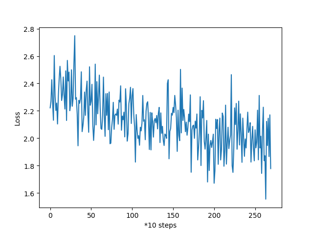

# 第12周周报

## 本周计划

- 使用Encoder的hidden state作为context (Decoder的input)
- Encoder的hidden state作为Decoder的initial hidden

## 实践

### 将Encoder的hidden state作为context vector

从简化的角度考虑，暂时直接使用encoder的最后一个hidden state作为context vector

原始Encoder的hidden state的size为(num_layers, batch_size, hidden_dim)，考虑使用一个Linear层将hidden state转化为context vector (seq_len, batch_size)，Decoder的initial hidden暂时设为None

```python
class Seq2Seq(nn.Module):   # still some problems
    def __init__(self, voc_size, hidden_dim):
        super(Seq2Seq, self).__init__()
        self.encoder = Encoder.EncoderRNN(input_size=voc_size,
                                          hidden_size=hidden_dim)
        # try to map hidden_dim to 1 dim (may be problem here)
        self.fc = nn.Linear(Config.num_layers * hidden_dim, Config.seq_len)
        self.decoder = Decoder.DecoderRNN(hidden_size=hidden_dim,
                                          output_size=voc_size)

    def forward(self, in_seq, hidden=None):
        # last hidden state of encoder used as the context vector (how? & why?)
        # in_seq: [seq_len, batch_size]
        output, (hidden, cell) = self.encoder(in_seq, hidden)
        # output: [seq_len, batch_size, hidden_dim]
        # h_n/c_n: [num_layers, batch_size, hidden_dim]
        hidden = hidden.view(-1, Config.num_layers * Config.hidden_dim)
        # hidden: [batch_size, num_layers * hidden_dim]
        hidden = self.fc(hidden).long()
        # hidden: [batch_size, seq_len]
        hidden = hidden.view(Config.seq_len, -1)
        # hidden: [seq_len, batch_size]
        context = hidden
        output, hidden = self.decoder(context, None)
        return output, hidden
```

训练出来的结果仍然是空白的

```python
横轴侧畔千帆过</s></s></s></s></s></s></s></s></s></s></s></s></s></s></s></s></s></s></s></s></s></s></s></s></s></s></s></s></s></s></s></s></s></s></s></s></s></s></s></s></s></s></s></s></s></s></s></s></s></s></s></s></s></s></s></s></s></s></s></s></s></s></s>
```

如果在Linear层的前后将hidden输出，会发现hidden在经过类型转换为long之后，其元素几乎全为0，此时训练Decoder是几乎无效的，所以hidden state不能作为Decoder的input

```python
# 类型转换前
tensor([[-0.1649, -0.0802,  0.0033,  ...,  0.0036, -0.1512,  0.1084],
        [-0.1561,  0.0339, -0.1919,  ..., -0.0381, -0.1796,  0.1202],
        [-0.1671, -0.0242,  0.0162,  ..., -0.0312, -0.1617,  0.0702],
        ...,
        [ 0.0029,  0.0025,  0.0175,  ..., -0.0163,  0.0292,  0.0094],
        [ 0.0085,  0.0074, -0.0011,  ..., -0.0171,  0.0278,  0.0164],
        [ 0.0011,  0.0050,  0.0057,  ..., -0.0260,  0.0265,  0.0176]],
       device='cuda:0', grad_fn=<ViewBackward>)
# 类型转换后
tensor([[0, 0, 0,  ..., 0, 0, 0],
        [0, 0, 0,  ..., 0, 0, 0],
        [0, 0, 0,  ..., 0, 0, 0],
        ...,
        [0, 0, 0,  ..., 0, 0, 0],
        [0, 0, 0,  ..., 0, 0, 0],
        [0, 0, 0,  ..., 0, 0, 0]], device='cuda:0')
```

### 将Encoder的hidden state作为Decoder的initial hidden

Decoder的hidden state来自于Encoder，认为Encoder的final hidden里面存储了in_seq的相关信息。再次将in_seq作为Decoder的输入，期望Decoder能通过Encoder传来的hidden和in_seq预测出target

```python
class Seq2Seq(nn.Module):
    def __init__(self, voc_size, hidden_dim):
        super(Seq2Seq, self).__init__()
        self.encoder = Encoder.EncoderRNN(input_size=voc_size,
                                          hidden_size=hidden_dim)
        self.decoder = Decoder.DecoderRNN(hidden_size=hidden_dim,
                                          output_size=voc_size)

    def forward(self, in_seq, hidden=None):
        seq_len, batch_size = in_seq.size()
        # last hidden state of Encoder used as Decoder's initial hidden
        # in_seq: [seq_len, batch_size]
        output, hidden = self.encoder(in_seq, hidden)
        # output: [seq_len, batch_size, hidden_dim]
        # h_n/c_n: [num_layers, batch_size, hidden_dim]
        context = in_seq
        output, hidden = self.decoder(context, hidden)
        return output, hidden
```

经过数个Epoch后，Loss最终稳定在2附近，不再下降



此时写出来的诗句仍然不成样子：

```python
峰回路转不见君长汉。汉。汉。汉。汉。汉。汉。汉。汉。汉。汉。汉。汉。汉。汉。汉。汉。汉。汉。汉。汉。汉。汉。汉。汉。汉。汉。汉。汉。汉。汉。汉。汉。汉。汉。汉。汉。汉。汉。汉。汉。汉。汉。汉。汉。汉。汉。汉。汉。汉。汉。汉。汉。汉。汉。汉。汉。汉。汉。汉。汉。汉。汉。汉。
雪上空留马行处。汉。汉。汉。汉。汉。汉。汉。汉。汉。汉。汉。汉。汉。汉。汉。汉。汉。汉。汉。汉。汉。汉。汉。汉。汉。汉。汉。汉。汉。汉。汉。汉。汉。汉。汉。汉。汉。汉。汉。汉。汉。汉。汉。汉。汉。汉。汉。汉。汉。汉。汉。汉。汉。汉。汉。汉。汉。汉。汉。汉。汉。汉。汉。汉。
```

### 将target作为input而hidden state作为initial hidden

重新读了一遍seq2seq的原论文，这一种思路是我认为最符合论文描述的思路，下面把它具体实现然后测试一下

与CharRNN不同，Seq2Seq是序列到序列的训练，因此需要对输入和目标数据进行一些处理，训练的代码也与CharRNN不同，这次不再将Encoder和Decoder整合到一个Seq2Seq类中，而是分开来训练，通过循环来给Decoder输入target，此时相当于是进行batch_size = 1的训练，牺牲了训练速度

查阅资料发现，将target直接当作Decoder的input是一种teacher forcing的做法。还有一种做法是直接给Decoder输入`<START>`，然后将Decoder的每次输出当作下一次的输入，直到生成`<EOS>`或达到长度限制

每次的input为诗的第一句，target为整首诗，对数据进行一些处理，输入末尾加上`<EOS>`，Decoder的第一个输入为`<SOS>`

Encoder-Decoder的一次输出：

```python
def train_step(input_tensor, target_tensor, encoder, decoder,
               encoder_optimizer, decoder_optimizer, criterion, word2ix, max_length=Config.max_gen_len):
    encoder_hidden = encoder.init_hidden()

    encoder_optimizer.zero_grad()
    decoder_optimizer.zero_grad()

    input_length = input_tensor.size(0)
    target_length = target_tensor.size(0)

    encoder_outputs = torch.zeros(max_length, encoder.hidden_size, device=Config.device)

    loss = 0

    # encoder -> hidden
    for ei in range(input_length):
        encoder_output, encoder_hidden = encoder(input_tensor[ei], encoder_hidden)
        encoder_outputs[ei] = encoder_output[0, 0]

    decoder_input = torch.tensor([[word2ix['<START>']]], device=Config.device)
    decoder_hidden = encoder_hidden

    # decoder -> target : no teacher forcing
    for di in range(target_length):
        decoder_output, decoder_hidden = decoder(decoder_input, decoder_hidden)
        topv, topi = decoder_output.topk(1)
        decoder_input = topi.squeeze().detach()     # detach from history as input (?)

        loss += criterion(decoder_output, target_tensor[di])
        if decoder_input.item() == word2ix['<EOP>']:
            break
    loss.backward()

    encoder_optimizer.step()
    decoder_optimizer.step()

    return loss.item() / target_length
```

#### TODO

将原有的诗词数据拆分成input(首句)和target(全诗)

## 困难/疑惑

1. 最新的一种尝试的代码还没写完
2. 没有进行批训练，预测训练速度会比较慢，还没有找到批训练的方法
3. 为了训练方便，encoder和decoder暂时都只使用了一层lstm，如果使用多层，训练的方式可能会有些不同
4. 目前还没有加入attention机制
