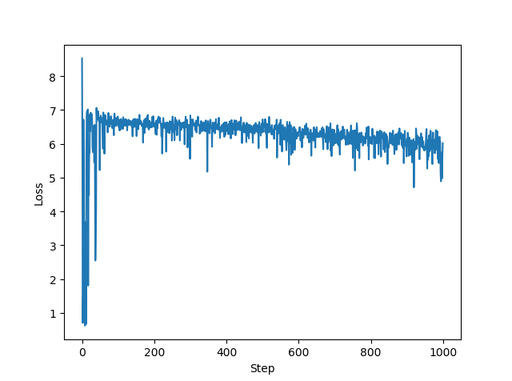
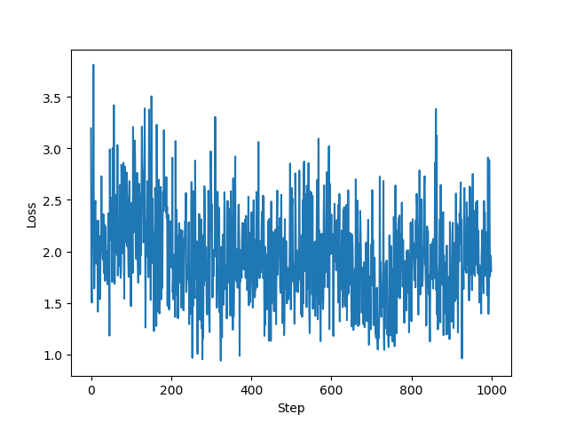

# 第13周周报

## 本周计划

- 诗词数据的预处理（拆分首句）
- encoder-decoder训练
- 结果分析

## 代码实践

### 数据预处理

将一首诗拆分成首句和整首诗，分别作为input和target（相当于是利用首句里包含的信息来续写整首诗）

```python
def poem2input(in_poem):
    start_ix = 0
    while ix2word[in_poem[start_ix]] != '<START>':
        start_ix += 1
    end = start_ix
    while end < len(in_poem) and ix2word[in_poem[end]] != '。':
        end += 1
    in_arr = in_poem[start_ix + 1: end + 1]
    in_arr = in_arr.tolist()
    in_arr.append(word2ix['<EOP>'])
    # 根据论文的说法，将input反转将更容易训练出结果
    in_arr.reverse()
    in_tensor = torch.tensor(in_arr)
    in_tensor = in_tensor.view(-1, 1)
    return in_tensor.long().to(Config.device)


def poem2target(in_poem):
    start_ix = 0
    while ix2word[in_poem[start_ix]] != '<START>':
        start_ix += 1
    target_arr = in_poem[start_ix + 1:]
    target_tensor = torch.from_numpy(target_arr)
    # target不需要反转（否则相当于没有反转）
    target_tensor = target_tensor.view(-1, 1)
    return target_tensor.long().to(Config.device)


# 将input和target组合在一起
def get_pair(in_poem):
    return poem2input(in_poem), poem2target(in_poem)
```

### 训练

每次训练将当前训练出的模型保存下来，下次运行再载入模型继续训练

```python
# load model
print('Loading pre-trained model...')
encoder.load_state_dict(torch.load('%s_%s.pth' % (Config.model_prefix, 'encoder')))
decoder.load_state_dict(torch.load('%s_%s.pth' % (Config.model_prefix, 'decoder')))
print('Done!')
```

与CharRNN的训练不同，这次的训练相当于是batch_size=1的训练，没有使用DataLoader

```python
# training iterations
print('Start training...')
n_iters = 10000     # 在所有诗的数据中随机选取n_iters首进行训练
print_every = 100
plot_every = 10
start = time.time()
plot_losses = []
print_loss_total = 0    # reset every print_every
plot_loss_total = 0     # reset every plot_every

encoder_optimizer = optim.SGD(encoder.parameters(), lr=Config.learning_rate)
decoder_optimizer = optim.SGD(decoder.parameters(), lr=Config.learning_rate)

data = data.numpy()
training_pairs = [get_pair(random.choice(data)) for it in range(n_iters)]
criterion = nn.NLLLoss()

for iter in range(1, n_iters + 1):
    training_pair = training_pairs[iter - 1]
    input_tensor = training_pair[0]
    target_tensor = training_pair[1]

    loss = train_step(input_tensor, target_tensor, encoder, decoder, encoder_optimizer, decoder_optimizer,
                          criterion, word2ix)
    print_loss_total += loss
    plot_loss_total += loss

    if iter % print_every == 0:
        print_loss_ave = print_loss_total / print_every
        print_loss_total = 0
        print('%s (%d %d%%) %.4f' % (timeSince(start, iter / n_iters), iter, iter / n_iters * 100, print_loss_ave))
        # print the current poem
        print('target')
        print(''.join([ix2word[ta.item()] for ta in target_tensor]))
        in_poem = ''
        for pr in input_tensor[1:]:
            in_poem += ix2word[pr.item()]
        print('input')
        print(''.join(in_poem))
        print('predict')
        print(''.join(evaluate(encoder, decoder, in_poem, word2ix, ix2word)))

    if iter % plot_every == 0:
        plot_loss_ave = plot_loss_total / plot_every
        plot_losses.append(plot_loss_ave)
        plot_loss_total = 0

# save model
torch.save(encoder.state_dict(), '%s_%s.pth' % (Config.model_prefix, 'encoder'))
torch.save(decoder.state_dict(), '%s_%s.pth' % (Config.model_prefix, 'decoder'))
print('Finished Training')

# plot
plt.figure('Learning Route')
plt.plot(plot_losses)
plt.xlabel('Step')
plt.ylabel('Loss')
plt.show()

# evaluate
sentence = input()
poem_out = evaluate(encoder, decoder, sentence, word2ix, ix2word)
print(poem_out)


def evaluate(encoder, decoder, sentence, word2ix, ix2word, max_length=Config.max_gen_len):
    with torch.no_grad():
        indexes = [word2ix[w] for w in sentence]
        indexes.insert(0, word2ix['<EOP>']) # 仅在训练过程中使用
        # indexes.append(word2ix['<EOP>'])
        # indexes.reverse()
        input_tensor = torch.tensor(indexes, dtype=torch.long, device=Config.device).view(-1, 1)
        input_length = input_tensor.size()[0]
        encoder_hidden = encoder.init_hidden()

        encoder_outputs = torch.zeros(max_length, encoder.hidden_size, device=Config.device)

        for ei in range(input_length):
            encoder_output, encoder_hidden = encoder(input_tensor[ei], encoder_hidden)
            encoder_outputs[ei] += encoder_output[0, 0]

        decoder_input = torch.tensor([[word2ix['<START>']]], device=Config.device)
        decoder_hidden = encoder_hidden
        decoded_words = []

        for di in range(max_length):
            decoder_output, decoder_hidden = decoder(decoder_input, decoder_hidden)
            topv, topi = decoder_output.data.topk(1)
            if topi.item() == word2ix['<EOP>']:
                decoded_words.append('<EOP>')
                break
            else:
                decoded_words.append(ix2word[topi.item()])
            decoder_input = topi.squeeze().detach()
        return decoded_words
```

在训练过程中，每经过print_every次迭代，就把当前训练的诗句以及机器写的诗输出。可以看到，随着训练时间和数据量的增大，loss确实表现出了下降的趋势，所生成的诗句也逐渐有了诗句的样子，但是目前还不能生成完整的诗句和`<EOP>`，而且生成的诗句也杂乱无章，跟target相差甚远。



```python
target
风华已眇然，独立思江天。凫鴈野塘水，牛羊春草烟。秦原晓重叠，灞浪夜潺湲。今日思归客，愁容在镜悬。<EOP>
input
。天江思立独，然眇已华风
predict
华华已然然，独江独江思。无风无，，，无。。。。。<EOP>

target
画阁余寒在，新年旧燕归。梅花犹带雪，未得试春衣。<EOP>
input
。归燕旧年新，在寒余阁画
predict
画画画余新，新门旧门旧。今年无，日，山，不。。。<EOP>

target
善价千金未可论，燕王新寄小龙孙。逐将白日驰青汉，衔得流星入画门。步骤最能随手转，性灵多恐会人言。桃花雪点多虽贵，全假当场一顾恩。<EOP>
input
。孙龙小寄新王燕，论可未金千价善
predict
千千千千金千金，龙王龙王龙王小。今年不日不，，，不得人。<EOP>

target
未明东上阁门开，排仗声从后殿来。阿监两边相对立，遥闻索马一时回。<EOP>
input
。来殿后从声仗排，开门阁上东明未
predict
未门从门开门开，从来从来从来来。一来不人无，去，不人不。人。<EOP>
```

经过更长时间的训练后，loss在降到2左右就基本不变了，但此时生成的诗句仍然不能让人满意



### 分析

上面训练的结果并不大好，经过分析后，觉得可能的原因如下：

1. 相对于整首诗，首句所包含的信息很少，光凭首句并不能写出整首诗（导致训练困难）
2. 训练的时间比较短，模型可能还没训练好
3. 1层lstm构成的encoder-decoder结构过于简单

## 困难/疑惑

1. 从目前结果来看，不能确定是模型写挂了还是训练不到位
2. 还没加入attention机制
