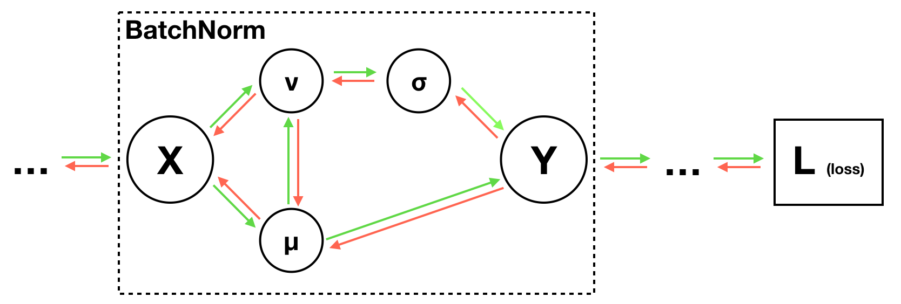

# 第18周周报

## 学习内容

- cs231n assignment

## 学习收获

### Assignment 2

#### Fully-connected NN

multi-layer neural network

```python
# initialize
layer_in_dim = input_dim
for i, hd in enumerate(hidden_dims):
    self.params['W%d'%(i+1)] = weight_scale * np.random.randn(layer_in_dim, hd)
    self.params['b%d'%(i+1)] = np.zeros(hd)
    layer_in_dim = hd
self.params['W%d' % self.num_layers] = weight_scale * np.random.randn(layer_in_dim, num_classes)
self.params['b%d' % self.num_layers] = np.zeros(num_classes)

# forward
layer_input = X
in_cache = {}
for lay in range(self.num_layers-1):
    layer_input, in_cache[lay+1] = affine_relu_forward(layer_input, self.params['W%d'%(lay+1)], self.params['b%d'%(lay+1)])
scores, in_cache[self.num_layers] = affine_forward(layer_input, self.params['W%d'%(self.num_layers)], self.params['b%d'%(self.num_layers)])

# compute loss and grad
loss, dscores = softmax_loss(scores, y)
dhout = dscores
loss += 0.5 * self.reg * np.sum(self.params['W%d' % self.num_layers] ** 2)
dx, dw, db = affine_backward(dhout, in_cache[self.num_layers])
grads['W%d' % self.num_layers] = dw + self.reg * self.params['W%d' % self.num_layers]
grads['b%d' % self.num_layers] = db
dhout = dx
for idx in range(self.num_layers-1):
    lay_idx = self.num_layers - idx - 1
    loss += 0.5 * self.reg * np.sum(self.params['W%d' % lay_idx] ** 2)
    dx, dw, db = affine_relu_backward(dhout, in_cache[lay_idx])
    grads['W%d' % lay_idx] = dw + self.reg * self.params['W%d' % lay_idx]
    grads['b%d' % lay_idx] = db
    dhout = dx
```

Optimize:

常见的update rule: SGD, SGD+momentum, RMSprop, Adam

```python
# SGD
w -= config['learning_rate'] * dw

# SGD + momentum
v = config['momentum'] * v - config['learning_rate'] * dw
next_w = w + v

# RMSprop
config['cache'] = config['decay_rate'] * config['cache'] + (1 - config['decay_rate']) * (dw ** 2)
next_w = w - config['learning_rate'] * dw / (np.sqrt(config['cache']) + config['epsilon'])

# Adam
config['t'] += 1
config['m'] = config['beta1'] * config['m'] + (1 - config['beta1']) * dw
mt = config['m'] / (1 - config['beta1'] ** config['t'])
config['v'] = config['beta2'] * config['v'] + (1 - config['beta2']) * (dw ** 2)
vt = config['v'] / (1 - config['beta2'] ** config['t'])
next_w = w - config['learning_rate'] * mt / (np.sqrt(vt) + config['epsilon'])
```

Train (Optimize):

```python
opconf = {}
opconf['learning_rate'] = 1e-3
weight_scale = 1e-2

# model
model = FullyConnectedNet([512, 256, 128, 64, 32], weight_scale=weight_scale, reg=1e-4)
# optimizer
solver = Solver(model, data, print_every=200, num_epochs=20, batch_size=100, update_rule='adam',
               optim_config=opconf, lr_decay=0.9)
# train
solver.train()
```

#### Batch Normalization

参考论文：[Batch Normalization: Accelerating Deep Network Training by Reducing Internal Covariate Shift](https://arxiv.org/abs/1502.03167)

通过batch normalization加快训练速度（将layer之间的数据标准化）

$$
\hat{X} = \frac{X - \mu}{\sigma}
$$

Computation graph



两个learnable parameters：$\gamma, \beta$

$$
Y = \gamma X + \beta
$$

Forward

```python
# train
sample_mean = np.mean(x, axis=0)    # (D,)
sample_var = np.var(x, axis=0)      # (D,)
x_norm = (x - sample_mean) / np.sqrt(sample_var + eps)
out = gamma * x_norm + beta
cache = (gamma, x, sample_mean, sample_var, eps, x_norm)
running_mean = momentum * running_mean + (1 - momentum) * sample_mean
running_var = momentum * running_var + (1 - momentum) * sample_var

# test
scale = gamma / np.sqrt(running_var + eps)
out = x * scale + (beta - running_mean * scale)
```

Backward

```python
gamma, x, sample_mean, sample_var, eps, x_norm = cache
N = x.shape[0]
dx_norm = dout * gamma  # (N, D)
dvar = np.sum(-0.5 * dx_norm * (x - sample_mean) * ((sample_var + eps) ** -1.5), axis=0)
dmu = np.sum(-dx_norm / np.sqrt(sample_var + eps), axis=0)
dmu += np.dot(dvar, np.sum(-2 * (x - sample_mean), axis=0) / N)
dx = dx_norm / np.sqrt(sample_var + eps)    # (N, D)
dx += dvar * 2 * ((x - sample_mean) / N) + dmu / N
dgamma = np.sum(dout * x_norm, axis=0)
dbeta = np.sum(dout, axis=0)
```

#### Layer Normalization

参考论文：[Layer Normalization](https://arxiv.org/pdf/1607.06450.pdf)

与batch normalization不同，layer normalization将每一个的data point分别进行各个feature的normalization，其余的思想和计算方法与batch normalization相同，同样引入两个learnable parameters: $\gamma, \beta$

实现方法几乎与batch normalization相同，只需要更改一下参与计算的dimension

Forward

```python
l_mean = np.mean(x, axis=1).reshape(-1, 1)
l_var = np.var(x, axis=1).reshape(-1, 1)
x_norm = (x - l_mean) / np.sqrt(l_var + eps)
cache = (x, gamma, beta, x_norm, l_mean, l_var, eps)
out = gamma * x_norm + beta
```

Backward

```python
x, gamma, beta, x_norm, l_mean, l_var, eps = cache
D = x.shape[1]
dx_norm = dout * gamma  # (N, D)
dvar = np.sum(-0.5 * dx_norm * (x - l_mean) * ((l_var + eps) ** -1.5), axis=1)
dmu = np.sum(-dx_norm / np.sqrt(l_var + eps), axis=1)
dmu += dvar * np.sum(-2 * (x - l_mean), axis=1) / D
dx = dx_norm / np.sqrt(l_var + eps)    # (N, D)
dx += dvar.reshape(-1, 1) * 2 * (x - l_mean) / D + dmu.reshape(-1, 1) / D
dgamma = np.sum(dout * x_norm, axis=0)
dbeta = np.sum(dout, axis=0)
```

#### Dropout

train时每层只选取一部分参数进行update，而test时使用所有的参数，加快训练速度，减少over fitting

参考论文：[Improving neural networks by preventing co-adaptation of feature detectors](https://arxiv.org/abs/1207.0580)

forward时将输入按概率 $p$ 设置为0

backward时直接滤掉那些被设置为0的输入（由函数求导可知）

```python
# forward
# mode == train
mask = (np.random.rand(*x.shape) < p) / p
out = x * mask

# mode == test
out = x

# backward
dx = dout * mask
```

#### Convolutional Neural Networks

采用convolution的方式进行scores的计算，对于每一个filter分别计算，每次截取相应的数据与weight相乘再加上bias（这部分操作与fc相同）

```python
# forward
def conv_forward_naive(x, w, b, conv_param):
    out = None

    N, C, H, W = x.shape
    F, _, HH, WW = w.shape
    stride, pad = conv_param['stride'], conv_param['pad']
    H_prime = 1 + (H + 2 * pad - HH) / stride
    W_prime = 1 + (W + 2 * pad - WW) / stride
    assert H_prime == int(H_prime)
    assert W_prime == int(W_prime)
    H_prime = int(H_prime)
    W_prime = int(W_prime)
    out = np.zeros((N, F, H_prime, W_prime))
    x_pad = np.pad(x, ((0,), (0,), (pad,), (pad,)), mode='constant', constant_values=0)
    for i in range(H_prime):
        for j in range(W_prime):
            x_pad_conv = x_pad[:, :, i * stride: i * stride + HH, j * stride: j * stride + WW]  # (N, C, HH, WW)
            for f in range(F):
                out[:, f, i, j] = np.sum(x_pad_conv * w[f, :, :, :], axis=(1, 2, 3))    # out: (N, C, H_prime, W_prime)

    # add bias
    out = out + b[None, :, None, None]

    cache = (x, w, b, conv_param)
    return out, cache
```

Backward的计算与fully-connected NN类似，把每一个截取下来的块当作fc处理，计算gradient，加到相应的元素上。

```python
# backward
def conv_backward_naive(dout, cache):
    dx, dw, db = None, None, None

    x, w, b, conv_param = cache
    N, C, H, W = x.shape
    F, _, HH, WW = w.shape
    stride, pad = conv_param['stride'], conv_param['pad']

    # H_out, W_out == HH, WW (assume)
    H_out = 1 + (H + 2 * pad - HH) / stride
    W_out = 1 + (W + 2 * pad - WW) / stride
    assert H_out == int(H_out)
    assert W_out == int(W_out)
    H_out = int(H_out)
    W_out = int(W_out)

    x_pad = np.pad(x, ((0,), (0,), (pad,), (pad,)), mode='constant', constant_values=0)

    dx = np.zeros_like(x)
    dw = np.zeros_like(w)
    db = np.zeros_like(b)
    dx_pad = np.zeros_like(x_pad)

    # dout: (N, F, H_out, W_out)
    # db: (F,)
    db = np.sum(dout, axis=(0, 2, 3))

    for i in range(H_out):
        for j in range(W_out):
            x_pad_conv = x_pad[:, :, i * stride: i * stride + HH, j * stride: j * stride + WW]  # (N, C, HH, WW)
            for f in range(F):
                # dw[f, :, :, :] (C, HH/H_out, WW/W_out)
                dw[f, :, :, :] += np.sum(x_pad_conv * (dout[:, f, i, j])[:, None, None, None], axis=0)
            for n in range(N):
                # dx_pad[...] (C, HH, WW)
                # w (F, C, HH, WW)
                # dout (N, F, H_out/HH, W_out/WW)
                dx_pad[n, :, i * stride: i * stride + HH, j * stride: j * stride + WW] +=\
                    np.sum(w * (dout[n, :, i, j])[:, None, None, None], axis=0)
    dx = dx_pad[:, :, pad: -pad, pad: -pad]

    return dx, dw, db
```

Max-Pooling

类似convolution的操作，只是将线性运算改为取最大值

```python
# forward
x_pool = x[:, :, i * stride: i * stride + pool_height, j * stride: j * stride + pool_width]
out[:, :, i, j] = np.max(x_pool, axis=(2, 3))

# backward
x_pool = x[:, :, i * stride: i * stride + pool_height, j * stride: j * stride + pool_width]
# only the max values will make change to dout
max_x_pool = np.max(x_pool, axis=(2, 3))
# binary max mask
mask_max_x_pool = (x_pool == max_x_pool[:, :, None, None])
dx[:, :, i * stride: i * stride + pool_height, j * stride: j * stride + pool_width] +=\
    mask_max_x_pool * (dout[:, :, i, j])[:, :, None, None]
```

python的计算可以通过C进行底层优化，提高运算速度，需要添加`cython`包，由`.pyx`文件生成`.c`，再编译生成`.so`(Linux)或`.pyd`(Windows)。

#### Spatial Batch Normalization

Spatial Batch Normalization的操作很像普通的Batch Normalization，只不过这次把channel当作原来的D进行标准化，其余的维度可以放在一起当作N。

```python
# forward
N, C, H, W = x.shape
bn_output, cache = batchnorm_forward(x.transpose(0, 2, 3, 1).reshape(-1, C), gamma, beta, bn_param)
out = bn_output.reshape(N, H, W, C).transpose(0, 3, 1, 2)

# backward
N, C, H, W = dout.shape
dx_bn, dgamma, dbeta = batchnorm_backward_alt(dout.transpose(0, 2, 3, 1).reshape(-1, C), cache)
dx = dx_bn.reshape(N, H, W, C).transpose(0, 3, 1, 2)
```

#### Group Normalization

参考论文：[Group Normalization](https://arxiv.org/abs/1803.08494)

不同normalization之间的对比：


可以看出，group norm是在channel上分组之后进行了layer norm，因此可以用跟layer norm类似的方式来实现。

```python
# forward
def spatial_groupnorm_forward(x, gamma, beta, G, gn_param):
    out, cache = None, None
    eps = gn_param.get('eps', 1e-5)

    N, C, H, W = x.shape
    x_reshaped = x.reshape(N, G, C // G, H, W)

    g_mean = np.mean(x_reshaped, axis=(2, 3, 4), keepdims=True)
    g_var = np.var(x_reshaped, axis=(2, 3, 4), keepdims=True)
    x_norm = (x_reshaped - g_mean) / np.sqrt(g_var + eps)
    x_norm = x_norm.reshape(N, C, H, W)
    cache = (x, G, gamma, beta, x_norm, g_mean, g_var, eps)
    out = gamma * x_norm + beta

    return out, cache

# backward
def spatial_groupnorm_backward(dout, cache):
    dx, dgamma, dbeta = None, None, None

    x, G, gamma, beta, x_norm, g_mean, g_var, eps = cache
    N, C, H, W = x.shape
    # D is an analogy to the D in layer norm
    D = H * W * C // G
    dx_norm = dout * gamma  # (N, C, H, W)
    dx_norm_reshaped = dx_norm.reshape(N, G, C // G, H, W)
    x_reshaped = x.reshape(N, G, C // G, H, W)

    # g_mean: (N, G, 1, 1, 1)
    # g_var: (N, G, 1, 1, 1)
    # dvar: (N, G, 1, 1, 1)
    dvar = np.sum(-0.5 * dx_norm_reshaped * (x_reshaped - g_mean) * ((g_var + eps) ** -1.5),
                  axis=(2, 3, 4), keepdims=True)
    # dmu: (N, G, 1, 1, 1)
    dmu = np.sum(-dx_norm_reshaped / np.sqrt(g_var + eps),
                 axis=(2, 3, 4), keepdims=True)
    dmu += dvar * np.sum(-2 * (x_reshaped - g_mean), axis=(2, 3, 4), keepdims=True) / D

    # dx (before reshaping): (N, G, C // G, H, W)
    dx = dx_norm_reshaped / np.sqrt(g_var + eps)    # (N, G, C // G, H, W)
    dx += dvar * 2 * (x_reshaped - g_mean) / D + dmu / D
    dx = dx.reshape(N, C, H, W)
    # dout: (N, C, H, W)
    dgamma = np.sum(dout * x_norm, axis=(0, 2, 3))[None, :, None, None]
    dbeta = np.sum(dout, axis=(0, 2, 3))[None, :, None, None]

    return dx, dgamma, dbeta
```

#### PyTorch

上述所有代码的实现，在PyTorch中均有现成的封装API可用。

PyTorch API: [PyTorch Docs](https://pytorch.org/docs/stable/index.html)

一些常用的pytorch包

```python
import torch
import torch.nn as nn
import torch.optim as optim
from torch.utils.data import DataLoader, sampler

import torchvision.dataset as dset
import torchvision.transform as T

import torch.nn.functional as F
```

transforms的使用

```python
# Normalize中的参数是hard coded
transform = T.Compose([
    T.ToTensor(),
    T.Normalize((0.4914, 0.4822, 0.4465), (0.2023, 0.1994, 0.2010))
])
```

DataLoader

```python
cifar10_train = dset.CIFAR10('./cs231n/datasets', train=True, download=True, transform=transform)
loader_train = DataLoader(cifar10_train, batch_size=64, sampler=sampler.SubsetRandomSampler(range(NUM_TRAIN)))
loader_val = DataLoader(cifar10_train, batch_size=64, sampler=sampler.SubsetRandomSampler(range(NUM_TRAIN, 50000)))

cifar_test = dset.CIFAR10('/cs231n/datasets', train=False, download=True, transform=transform)
loader_test = DataLoader(cifar10_test, batch_size=64)
```

Use GPU

```python
if torch.cuda.is_available():
    device = torch.device('cuda')
else:
    device = torch.device('cpu')
```

torch Tensor的基础操作跟numpy类似

```python
# fc
def two_layer_fc(x, params):
    # first we flatten the image
    x = flatten(x)  # shape: [batch_size, C x H x W]

    w1, w2 = params

    x = F.relu(x.mm(w1))
    x = x.mm(w2)    # mat mul
    return x

# cnn
scores = F.relu(F.conv2d(x, conv_w1, conv_b1, padding=2))
scores = F.relu(F.conv2d(scores, conv_w2, conv_b2, padding=1))
# scores = torch.mm(flatten(scores), fc_w) + fc_b
scores = F.linear(flatten(scores), fc_w.T, fc_b)
```

计算accuracy时，不需要更新grad，放在`no_grad()`中

```python
with torch.no_grad():
    for x, y in loader:
        scores = model(x, params)
        # ...
```

train

```python
for t, (x, y) in enumerate(loader):
    scores = model(x, params)
    loss = F.cross_entropy(scores, y)

    loss.backward()

    # update params
    with torch.no_grad():
        for w in params:
            w -= lr * w.grad
            w.grad.zero_()
```

将weight和bias封装后的PyTorch API:

```python
# fc
class TwoLayerFC(nn.Module):
    def __init__(self, input_size, hidden_size, num_classes)
        super().__init__()
        self.fc1 = nn.Linear(input_size, hidden_size)
        nn.init.kaiming_normal_(self.fc1.weight)
        self.fc2 = nn.Linear(hidden_size, num_classes)
        nn.init.kaiming_normal_(self.fc2.weight)

    def forward(self, x):
        x = flatten(x)
        scores = self.fc2(F.relu(self.fc1(x)))
        return scores

# train
for e in range(epochs):
    for t, (x, y) in enumerate(loader):
        model.train()   # put model to training mode

        scores = model(x)
        loss = F.cross_entropy(scores, y)

        optimizer.zero_grad()
        loss.backward()
        optimizer.step()
```

Sequential API

```python
# wrap flatten to use nn.Module
class Flatten(nn.Module):
    def forward(self, x):
        return flatten(x)

# sequential model
model = nn.Sequantial(
    Flatten(),
    nn.Linear(3 * 32 * 32, hidden_size),
    nn.ReLU(),
    nn.Linear(hidden_size, num_classes)
)

# sequential cnn model
model = nn.Sequential(
    nn.Conv2d(3, 64, 7, padding=3),
    # spatial norm
    nn.BatchNorm2d(64),
    nn.ReLU(),
    nn.Conv2d(64, 128, 7, padding=3),
    # spatial norm
    nn.BatchNorm2d(128),
    nn.ReLU(),
    nn.Dropout2d(0.1),
    nn.MaxPool2d(2),
    nn.Conv2d(128, 32, 5, padding=2),
    nn.GroupNorm(8, 32),
    nn.ReLU(),
    nn.Dropout2d(0.2),
    nn.MaxPool2d(2),
    Flatten(),
    nn.Linear(32 * 8 * 8, 64),
    nn.Dropout(0.2),
    nn.Linear(64, 10)
)
```

### Assignment 3

#### Image Caption with RNN

使用Microsoft COCO数据集训练

对于RNN，之前有学过，有一个hidden state，对于每一个time step，RNN将通过Wx，Wh和b计算出下一个hidden state，tanh作为activation function。

$$
h_t = \tanh (W_x \cdot x_t + W_h \cdot h_{t-1} + b)
$$

```python
# rnn forward step
before_act = np.dot(prev_h, Wh) + np.dot(x, Wx) + b     # (N, H)
next_h = np.tanh(before_act)
cache = (x, prev_h, Wx, Wh, b, next_h)

# rnn backward step
x, prev_h, Wx, Wh, b, next_h = cache
dbefore_act = dnext_h * (1 - next_h ** 2)   # (N, H)
dx = np.dot(dbefore_act, Wx.T)              # (N, D)
dprev_h = np.dot(dbefore_act, Wh.T)         # (N, H)
dWx = np.dot(x.T, dbefore_act)              # (D, H)
dWh = np.dot(prev_h.T, dbefore_act)         # (H, H)
db = np.sum(dbefore_act, axis=0)
```

一个step处理一个time step，用for循环将所有time step逐个输入rnn进行forward和backward

```python
# rnn forward
N, T, D = x.shape
H = b.shape[0]
h = np.zeros((N, T, H))
prev_h = h0
for t in range(T):
    xt = x[:, t, :]
    next_h, _ = rnn_step_forward(xt, prev_h, Wx, Wh, b)
    h[:, t, :] = next_h
    prev_h = next_h
cache = (x, h0, Wx, Wh, b, h)

# rnn backward
x, h0, Wx, Wh, b, h = cache

N, T, D = x.shape
H = b.shape[0]

next_h = h[:, T-1, :]

dprev_h = np.zeros((N, H))
dx = np.zeros((N, T, D))
dh0 = np.zeros((N, H))
dWx = np.zeros((D, H))
dWh = np.zeros((H, H))
db = np.zeros(H)

for t in range(T):
    t = T - t - 1
    xt = x[:, t, :]
    if t == 0:
        prev_h = h0
    else:
        prev_h = h[:, t-1, :]
    step_cache = (xt, prev_h, Wx, Wh, b, next_h)
    dnext_h = dh[:, t, :] + dprev_h
    dx[:, t, :], dprev_h, dWxt, dWht, dbt = rnn_step_backward(dnext_h, step_cache)
    next_h = prev_h
    dWx, dWh, db = dWx+dWxt, dWh+dWht, db+dbt

dh0 = dprev_h
```

Word Embedding

将一个长为T的序列中的每个word转化为一个vector，输入为(N, T)，输出为(N, T, D)

设总共词汇数量为V，则从词语到向量的weigh为W，shape为(V, D)

```python
# forward
# naive edition
# N, T = x.shape
# V, D = W.shape
# out = np.zeros((N, T, D))

# for i in range(N):
#     for j in range(T):
#         out[i, j] = W[x[i, j]]

# simplified edition
out = W[x]

cache = (x, W)

# backward
# x: (N, T)
# dout: (N, T, D)
x, W = cache
dW = np.zeros_like(W)
# ???
np.add.at(dW, x, dout)
# alternatively:
# np.add.at(dW, x.flatten(), dout.reshape(-1, dout.shape[2]))
```

然后使用fc层将hidden state进行映射，计算loss

#### Image Caption with LSTM

LSTM在RNN基础上增加了cell state，用四个gate控制LSTM的记忆和遗忘。

$$
a = W_x \cdot x_t + W_h \cdot h_{t-1} + b
\\
a \in \mathbb{R}^{4H}
\\
a_i,\ a_f,\ a_o,\ a_g \in \mathbb{R}^H
\\
i = \sigma(a_i),\ f = \sigma(a_f),\ o = \sigma(a_o),\ g = \tanh(a_g)
\\
c_t = f \odot c_{t-1} + i \odot g \qquad h_t = o \odot \tanh(c_t)
$$

```python
# lstm step forward
N, D = x.shape
_, H = prev_h.shape
# (N, 4H)
a = np.dot(x, Wx) + np.dot(prev_h, Wh) + b
i = sigmoid(a[:, : H])
f = sigmoid(a[:, H: 2 * H])
o = sigmoid(a[:, 2 * H: 3 * H])
g = np.tanh(a[:, 3 * H:])

next_c = f * prev_c + i * g
next_h = o * np.tanh(next_c)

cache = (x, prev_h, prev_c, next_c, Wx, Wh, b, i, f, o, g)

# lstm step backward
x, prev_h, prev_c, next_c, Wx, Wh, b, i, f, o, g = cache

do = dnext_h * np.tanh(next_c)
# dtanh_next_c = dnext_h * o
# dnext_c = dtanh_next_c / (1 + next_c ** 2)
dnext_c = dnext_h * o * (1 - (np.tanh(next_c) ** 2)) + dnext_c
dprev_c = dnext_c * f

df = dnext_c * prev_c
di = dnext_c * g
dg = dnext_c * i

# back prop of sigmoid
da_i = (1 - i) * i * di
da_f = (1 - f) * f * df
da_o = (1 - o) * o * do

# back prop of tanh here!
da_g = (1 - g * g) * dg

da = np.hstack((da_i, da_f, da_o, da_g))

dx = np.dot(da, Wx.T)
dWx = np.dot(x.T, da)
db = np.sum(da, axis=0)
dprev_h = np.dot(da, Wh.T)
dWh = np.dot(prev_h.T, da)
```

与RNN相同，也是通过for循环将词语一个个输入到lstm中

```python
# lstm forward
N, T, D = x.shape
_, H = h0.shape
h = np.zeros((N, T, H))
cache = {}
prev_h = h0
prev_c = np.zeros((N, H))

for t in range(T):
    xt = x[:, t, :]
    next_h, next_c, cache[t] = lstm_step_forward(xt, prev_h, prev_c, Wx, Wh, b)
    prev_h = next_h
    prev_c = next_c
    h[:, t, :] = next_h

# lstm backward
N, T, H = dh.shape
x, prev_h, prev_c, next_c, Wx, Wh, b, i, f, o, g = cache[T-1]

D = x.shape[1]

dprev_h = np.zeros((N, H))
dprev_c = np.zeros((N, H))
dx = np.zeros((N, T, D))
dh0 = np.zeros((N, H))
dWx = np.zeros((D, 4 * H))
dWh = np.zeros((H, 4 * H))
db = np.zeros((4 * H,))

for t in range(T):
    t = T - 1 - t
    step_cache = cache[t]
    dnext_h = dh[:, t, :] +dprev_h
    dnext_c = dprev_c
    dx[:, t, :], dprev_h, dprev_c, dWxt, dWht, dbt = lstm_step_backward(dnext_h, dnext_c, step_cache)
    dWx, dWh, db = dWx+dWxt, dWh+dWht, db+dbt

dh0 = dprev_h
```

将前面实现的rnn层和lstm层组合起来，构成整个RNN/LSTM网络，计算loss和gradient，注意在sample的时候并没有backward的过程。

```python
class CaptioningRNN(object):
    # def __init__(self, ...): ...

    def loss(self, features, captions):
        # ...

        loss, grads = 0.0, {}

        # (1)
        affine_out, affine_cache = affine_forward(features, W_proj, b_proj)
        # (2)
        word_embedding_out, word_embedding_cache = word_embedding_forward(captions_in, W_embed)
        # (3)
        if self.cell_type == 'rnn':
            rnn_lstm_out, rnn_lstm_cache = rnn_forward(word_embedding_out, affine_out, Wx, Wh, b)
        elif self.cell_type == 'lstm':
            rnn_lstm_out, rnn_lstm_cache = lstm_forward(word_embedding_out, affine_out, Wx, Wh, b)
        # (4)
        temporal_affine_out, temporal_affine_cache = temporal_affine_forward(rnn_lstm_out, W_vocab, b_vocab)
        # (5)
        loss, dtemporal_affine_out = temporal_softmax_loss(temporal_affine_out, captions_out, mask)
        # (4)
        drnn_lstm_out, grads['W_vocab'], grads['b_vocab'] = temporal_affine_backward(dtemporal_affine_out,
                                                                                     temporal_affine_cache)
        # (3)
        if self.cell_type == 'rnn':
            dword_embedding_out, daffine_out, grads['Wx'], grads['Wh'], grads['b'] = \
                rnn_backward(drnn_lstm_out, rnn_lstm_cache)
        elif self.cell_type == 'lstm':
            dword_embedding_out, daffine_out, grads['Wx'], grads['Wh'], grads['b'] = \
                lstm_backward(drnn_lstm_out, rnn_lstm_cache)
        # (2)
        grads['W_embed'] = word_embedding_backward(dword_embedding_out, word_embedding_cache)
        # (1)
        dfeatures, grads['W_proj'], grads['b_proj'] = affine_backward(daffine_out, affine_cache)

        return loss, grads

    def sample(self, features, max_length=30):
        # ...

        N, D = features.shape
        affine_out, affine_cache = affine_forward(features, W_proj, b_proj)

        prev_word_idx = [self._start] * N   # [start, start, start, ...]
        prev_h = affine_out
        prev_c = np.zeros(prev_h.shape)

        captions[:, 0] = self._start
        for i in range(1, max_length):
            # (1)
            prev_word_embed = W_embed[prev_word_idx]
            # (2)
            if self.cell_type == 'rnn':
                next_h, rnn_lstm_step_cache = rnn_step_forward(prev_word_embed, prev_h, Wx, Wh, b)
            elif self.cell_type == 'lstm':
                next_h, next_c, rnn_lstm_step_cache = lstm_step_forward(prev_word_embed, prev_h, prev_c, Wx, Wh, b)
                prev_c = next_c
            # (3)
            vocab_affine_out, vocab_affine_cache = affine_forward(next_h, W_vocab, b_vocab)
            # (4)
            captions[:, i] = list(np.argmax(vocab_affine_out, axis=1))
            prev_word_idx = captions[:, i]
            prev_h = next_h

        return captions
```

#### Network Visualization

一个很有趣的想法，同样是梯度下降，这次是固定模型参数，反而修改image的pixel，用一个pretrained CNN来定义loss，对image进行gradient descent

##### Saliency Map

Saliency maps are a quick way to tell which part of the image influenced the classification decision made by the network.

通过固定model对X进行backward得到X的gradient，然后进行取绝对值，最大值，标准化等方式得到saliency map

```python
# important
model.eval()

# Make input tensor require gradient
X.requires_grad_()

saliency = None

scores = model(X)
scores = scores.gather(1, y.view(-1, 1)).squeeze()
# ??? (batch_size=5?)
scores.backward(torch.FloatTensor([1.0, 1.0, 1.0, 1.0, 1.0]))
saliency = X.grad.data
saliency = saliency.abs()
# get the maximum of 3 channels
saliency, i = torch.max(saliency, dim=1)
saliency = saliency.squeeze()
```

##### Fooling Images

We can perturb an input image so that it appears the same to humans, but will be misclassified by the pretrained network.

通过gradient ascent的方式对X进行upgrade，使得目标class的score上升，最终达到fool一个model的效果，得到fooling image

```python
num_iter = 100

for i in range(num_iter):
    scores = model(X_fooling)
    _, idx = scores.max(dim=1)
    if idx == target_y:
        break
    # scores: (1, num_classes)
    target_score = scores[0, target_y]
    target_score.backward()
    X_fooling.data += learning_rate * (X_fooling.grad / X_fooling.grad.norm())
    X_fooling.grad.zero_()
print('Fooled in iter %d.' % i)
```

##### Class Visualization

We can synthesize an image to maximize the classification score of a particular class; this can give us some sense of what the network is looking for when it classifies images of that class.

从一个噪音作为初始image来进行gradient ascent，得到model在class中抽出的特性

为了让生成的图像更“平滑”，添加一些regularization

$$
I^* = \arg \max_I (s_y(I) - R(I))
\\
R(I) = \lambda||I||_2^2
$$

```python
# Randomly initialize the image as a PyTorch Tensor, and make it requires gradient.
img = torch.randn(1, 3, 224, 224).mul_(1.0).type(dtype).requires_grad_()

# in a for loop
scores = model(img)
target_score = scores[0, target_y]
target_score.backward()
img.grad -= 2 * l2_reg * img
img.data += learning_rate * img.grad / img.grad.norm()
img.grad.zero_()
```

#### Style Transfer

参考论文：[Image Style Transfer Using Convolutional Neural Networks](https://www.cv-foundation.org/openaccess/content_cvpr_2016/papers/Gatys_Image_Style_Transfer_CVPR_2016_paper.pdf)

将loss定义为image与style的feature map之间的差距，通过对image进行gradient descent达到style transfor的效果

##### Content loss

One Layer $\ell$ , feature map $A^{\ell} \in \mathbb{R}^{1 \times C_{\ell} \times H_{\ell} \times W_{\ell}}$ , reshaped as $F^{\ell} \in \mathbb{R}^{C_{\ell} \times M_{\ell}}$ being the feature map for the current image and $P^{\ell} \in \mathbb{R}^{C_{\ell} \times M_{\ell}}$ being the feature map for the content source image.

Content loss

$$
L_c = w_c \times \sum_{i, j}(F^{\ell}_{ij} - P^{\ell}_{ij})^2
$$

```python
_, C, H, W = content_current.shape

reshaped_current = content_current.view(-1, H * W)
reshaped_original = content_original.view(-1, H * W)
L = content_weight * torch.sum((reshaped_current - reshaped_original) ** 2)
```

##### Style loss

$$
G^{\ell}_{ij} = \sum_k F_{ik}^{\ell} F_{jk}^{\ell}
\\
L^{\ell}_s = w_{\ell}\sum_{i, j}(G^{\ell}_{ij} - A^{\ell}_{ij})^2
\\
L_s = \sum_{\ell \in \mathcal{L}} L_s^{\ell}
$$

```python
# gram matrix
def gram_matrix(features, normalize=True):
    N, C, H, W = features.shape
    reshaped_features = features.view(N, -1, H * W)
    gram = reshaped_features.new_zeros((N, C, C))
    for i in range(N):
        gram[i] += reshaped_features[i] @ reshaped_features[i].T
    if normalize:
        gram[i] /= H * W * C
    return gram

# style loss
def style_loss(feats, style_layers, style_targets, style_weights):
    loss = feats[0].new_zeros(1)
    for l in range(len(style_layers)):
        gram = gram_matrix(feats[style_layers[l]])
        loss += style_weights[l] * torch.sum((gram - style_targets[l]) ** 2)
    return loss
```

定义好loss后对image进行gradient descent即可实现style transfer

#### Generative Adversarial Network

训练一个discriminator $D$ 来判断image是real或fake

训练一个generator $G$ 从随机噪声生成image来骗discriminator

$$
\min_G \max_D \mathbb{E}_{x \sim p_{data}}[\log D(x)] + \mathbb{E}_{z \sim p(z)}[\log (1 - D(G(z)))]
$$

1. update $G$ to maximize the probability of the discriminator making the incorrect choice on generated data
2. update $D$ to maximize the probability of the discriminator making the correct choice on real and generated data

Discriminator

```python
def discriminator():
    model = nn.Sequential(
            nn.Linear(784, 256),
            nn.LeakyReLU(),
            nn.Linear(256, 256),
            nn.LeakyReLU(),
            nn.Linear(256, 1),
    )
    return model
```

Generator

```python
def generator(noise_dim=NOISE_DIM):
    model = nn.Sequential(
            nn.Linear(noise_dim, 1024),
            nn.ReLU(),
            nn.Linear(1024, 1024),
            nn.ReLU(),
            nn.Linear(1024, 784),
            nn.Tanh()
    )
    return model
```

##### GAN Loss

generator loss

$$
\ell_G = - \mathbb{E}_{z \sim p(z)}[\log D(G(z))]
$$

discriminator loss

$$
\ell_D = - \mathbb{E}_{x \sim p_{data}}[\log D(x)] - \mathbb{E}_{z \sim p(z)}[\log (1 - D(G(z)))]
$$

###### DCGAN

Deeply Convolutional GANs

用CNN来代替FC构建discriminator和generator

```python
# discriminator
def build_dc_classifier():
    return nn.Sequential(
        Unflatten(batch_size, 1, 28, 28),
        nn.Conv2d(1, 32, 5),
        nn.LeakyReLU(),
        nn.MaxPool2d(2),
        nn.Conv2d(32, 64, 5),
        nn.LeakyReLU(),
        nn.MaxPool2d(2),
        nn.Flatten(),
        nn.Linear(64 * 4 * 4, 4 * 4 * 64),
        nn.LeakyReLU(),
        nn.Linear(4 * 4 * 64, 1)
    )

# generator
def build_dc_generator(noise_dim=NOISE_DIM):
    return nn.Sequential(
        nn.Linear(noise_dim, 1024),
        nn.ReLU(),
        nn.BatchNorm1d(1024),
        nn.Linear(1024, 7 * 7 * 128),
        nn.ReLU(),
        nn.BatchNorm1d(7 * 7 * 128),
        Unflatten(batch_size, 128, 7, 7),
        nn.ConvTranspose2d(128, 64, 4, 2, 1),
        nn.ReLU(),
        nn.BatchNorm2d(64),
        nn.ConvTranspose2d(64, 1, 4, 2, 1),
        nn.Tanh(),
        nn.Flatten()
    )
```

## 疑问和困难

1. 在用numpy计算backward方面有些困难（尽管pytorch中一般不需要写backward）
2. numpy和pytorch中的一些函数，能看懂使用的代码，但是写代码的时候想不到怎么用
3. 关于下标的索引的简写方法，高维Tensor的运算还有些不习惯
