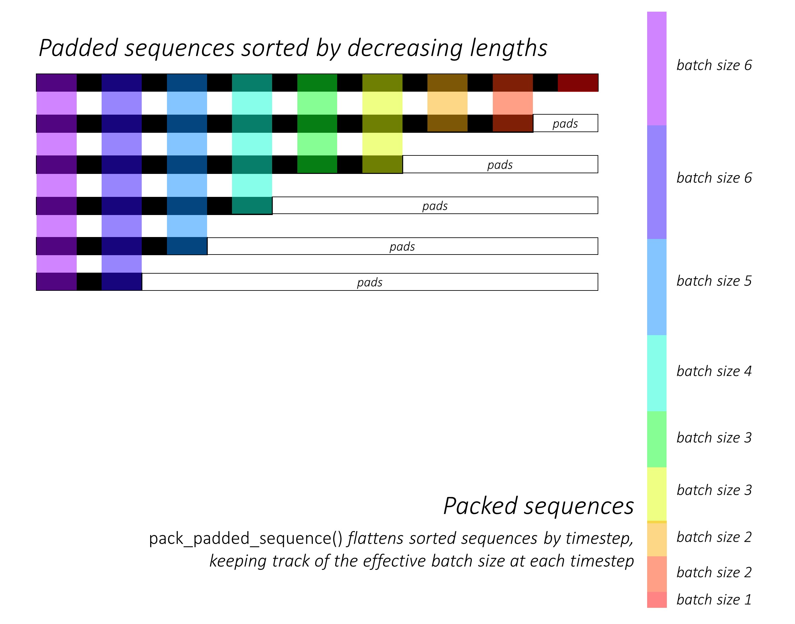

# 第19周周报

## 学习内容

- PyTorch Tutorial
- Image Caption

## 学习收获

### Translation with Seq2Seq and Attention

复习一下之前写过的Seq2Seq模型，以及把之前写Attention时留的一些坑填了。

写过cs231n的练习之后，原来的seq2seq代码就更好懂了

encoder将输入进行embedding，词语转化成词向量，经过lstm得到hidden state

decoder的初始输入为`<START>`，hidden state来自于encoder，根据embedding和hidden state计算attention weight，再与encoder outputs相乘得到attention的结果，与embedding拼接到一起再输入到lstm中，产生输出序列。

完善后的代码如下：

```python
# encoder
# inp: [1]
embedded = self.embedding(inp).view(1, 1, -1)
# embedded: [1, 1, embedding_dim]
output = embedded
output, hidden = self.gru(output, hidden)
# output: [1, 1, hidden_dim]

# attn_decoder
embedded = self.embedding(inp).view(1, 1, -1)
# embedded: [1, 1, embedding_dim]
# hidden: [1, 1, hidden_dim]

attn_weights = F.softmax(self.attn(torch.cat((embedded[0], hidden[0]), 1)), dim=1)
# attn_weights: [1, max_length]
attn_applied = torch.bmm(attn_weights.unsqueeze(0), encoder_outputs.unsqueeze(0))
# attn_applied: [1, 1, hidden_dim]

output = torch.cat((embedded[0], attn_applied[0]), 1)
output = self.attn_combine(output).unsqueeze(0)
# output: [1, 1, hidden_size]

output = F.relu(output)
output, hidden = self.gru(output, hidden)

output = F.log_softmax(self.out(output[0]), dim=1)
```

### Seq2Seq ChatBot

作为seq2seq的一个练习，看了一下用seq2seq模型实现聊天机器人的tutorial

训练数据使用[Cornell Movie Dialogs](https://www.cs.cornell.edu/~cristian/Cornell_Movie-Dialogs_Corpus.html)

前期的数据预处理与translator类似，将conversation分为query和response，给每个单词分配index，添加SOS和EOS的token，除去出现频率较小的单词，缩减词向量的大小。

上面translate中进行的其实是batch_size为1的training，为了利用GPU提升速度，需要采用mini-batch training

给每个sequence添加padding，使之具有相同的长度，将原本的输入(batch_size, max_length)进行transpose: (max_length, batch_size)，使得取出第一个维度的数据时，得到的是batch_size个time step的数据，encoder一次性接受所有time step，而decoder每次接受一个time step。

与translation时的attention机制略有不同，这次采用的是global attention，即将encoder每个time step的hidden state都考虑进去

```python
# encoder
class EncoderRNN(nn.Module):
    def __init__(self, hidden_size, embedding, n_layers=1, dropout=0):
        super(EncoderRNN, self).__init__()
        self.n_layers = n_layers
        self.hidden_size = hidden_size
        self.embedding = embedding

        self.gru = nn.GRU(hidden_size, hidden_size, n_layers,
                          dropout=(0 if n_layers == 1 else dropout), bidirectional=True)

    def forward(self, input_seq, input_lengths, hidden=None):
        # input_seq: [max_length, batch_size]
        # input_lengths: [batch_size]
        # Convert word indexes to embeddings
        embedded = self.embedding(input_seq)
        # embedded: [max_length, batch_size, hidden_dim]
        # Pack padded batch of sequences for RNN module
        packed = nn.utils.rnn.pack_padded_sequence(embedded, input_lengths)
        # Forward pass through GRU
        # packed: [max_length, batch_size, hidden_dim]
        outputs, hidden = self.gru(packed, hidden)
        # outputs: [max_length, batch_size, 2 * hidden_dim]
        # Unpack padding
        outputs, _ = nn.utils.rnn.pad_packed_sequence(outputs)
        # Sum bidirectional GRU outputs
        # outputs: [max_length, batch_size, 2 * hidden_dim]
        outputs = outputs[:, :, :self.hidden_size] + outputs[:, :, self.hidden_size:]
        # Return output and final hidden state
        return outputs, hidden
```

由于在进行forward的过程中，添加了padding使得length相同，这些padding并不算在loss里面

gradient clipping: 限制gradient的大小，防止gradient exploding和overflow

### 自动写诗

完善了一下之前写的不太好的自动写诗模型，使用 lstm + seq2seq + attention

```python
# decoder with attention
class AttnDecoderRNN(nn.Module):
    def __init__(self, hidden_size, output_size, max_length=Config.max_gen_len):
        super(AttnDecoderRNN, self).__init__()
        self.hidden_size = hidden_size
        self.output_size = output_size
        self.max_length = max_length
        self.embedding = nn.Embedding(self.output_size, self.hidden_size)
        self.attn = nn.Linear(2 * self.hidden_size, self.max_length)
        self.attn_combine = nn.Linear(2 * self.hidden_size, self.hidden_size)
        self.lstm = nn.LSTM(self.hidden_size, self.hidden_size)
        self.out = nn.Linear(self.hidden_size, self.output_size)

    def forward(self, in_seq, hidden, encoder_outputs):
        # in_seq: [1, 1]
        embedded = self.embedding(in_seq).view(1, 1, -1)
        # embedded: [1, 1, hidden_size (embedding_dim)]
        attn_weights = F.softmax(self.attn(torch.cat((embedded[0], hidden[0][0]), dim=1)), dim=1)
        # attn_weights: [1, max_length]
        # encoder_outputs: [max_length, hidden_size]
        attn_applied = torch.bmm(attn_weights.unsqueeze(0),
                                 encoder_outputs.unsqueeze(0))
        # attn_applied: [1, 1, hidden_size]
        output = self.attn_combine(torch.cat((embedded[0], attn_applied[0]), dim=1))
        output = F.relu(output.unsqueeze(0))
        # output: [1, 1, hidden_size]
        output, hidden = self.lstm(output, hidden)
        output = F.log_softmax(self.out(output[0]), dim=1)
        return output, hidden, attn_weights

    def initHidden(self):
        return torch.zeros(1, 1, self.hidden_size, device=Config.device)

```

训练方式与原来有所不同，之前将首句作为输入，整首诗作为目标，训练的结果并不好，这次将每句诗拆成前半句和后半句，由前半句预测后半句的情况，再将后半句当作新的前半句输入，以此类推写完整首诗。

模型本身能跑，运行几个iteration没有报错，但训练比较花时间，就没有完整地训练。

### Image Caption

参考链接：

1. [PyTorch Tutorial](https://github.com/yunjey/pytorch-tutorial)
2. [A PyTorch Tutorial to Image Caption](https://github.com/sgrvinod/a-PyTorch-Tutorial-to-Image-Captioning)
3. [Slow, Attention and Tell](https://arxiv.org/pdf/1502.03044.pdf)

将输入的图像转化为自然语言的描述

#### Model Architecture

##### Encoder-Decoder

经常采用encoder-decoder的结构，encoder使用CNN提取图像的feature map，decoder使用LSTM由feature map生成序列化的描述


将feature vector作为LSTM的hidden state，一般使用pre-trained CNN提取feature map，input的开头添加`<START>`作为开始标志，target的结尾添加`<END>`作为结束标志（可以选择是否采用teacher forcing）。

在testing的时候，将`<START>`作为初始输入，输出直接作为下一次输入。

##### Attention

Consider some pixels more important than others

加入Attention机制，在caption的过程中给图像加权。


##### Transfer Learning

对pre-trained model (Encoder) 进行fine-tune以达成其它目的

Beam Search

与greedy search不同，beam search寻找的是最优序列而不是当前最优单词。

第一次选取score最高的k个词语，第二次对于k个词语分别生成k个second word，从 $k^2$ 种组合中选取出score最高的k个组合，继续对每个组合生成k个third word，以此类推，所有k个组合全部生成完毕后，选取总score最高的序列作为输出。


##### Loss Function

可以使用`CrossEntropyLoss`或者`double stochastic regularization`: **minimize the difference between 1 and the sum of a pixel's weights across all time steps**
$$
\sum_t^T \alpha_{p, t} = 1
$$
pad的部分并不计算在loss里面，可以通过PyTorch的`pack_padded_sequence()`实现



#### 代码分析 (1)

在实现的时候，先根据所有词汇建立词语库Vocabulary，词语库中含有每个词语到序号以及序号到词语以及特殊标志`<start>`, `<pad>`, `<end>`与序号之间的字典，为了减少运算时间，应当让词语库中的词语数量尽可能小，于是将出现频率较小的单词删除，标记为`<unk>`。

##### build_vocab.py

创建Vocabulary对象，实现加词和添加特殊标签的操作，将处理好的词语库保存在文件里

add_word判断单词是否在词语库里，如果不在则分配标签，添加单词

build_vocab则将所有出现次数高于threshold的单词添加到词语库里

##### data_loader.py

使用COCO数据集创建与torch.utils.data.DataLoader兼容的DataSet

\_\_getitem\_\_返回编号为index的image和target（即caption）

collate_fn用于获取mini_batch的data，输入data（image，caption），输出images，targets，lengths

get_loader构建一个data loader（torch.utils.data.DataLoader）

##### model.py

模型的构建

Encoder：使用pre-trained resnet-152，去掉最后一层fc层，再另外添加一层fc层用于提取feature vector，添加一层batch norm。进行forward的时候注意resnet并不需要训练，所以resnet的计算放在torch.no_grad()里。

Decoder：

- 对caption进行embedding，与feature vector拼接后进行padding，使得不定长的序列具有相同的长度（不足的末尾补`<pad>`），输入到lstm中，将lstm的输出通过fc层得到输出序列
- 采用greedy search的方法由feature vector生成caption，每次挑选score最高的那个单词作为输出

##### resize.py

将文件夹中的images进行resize后存储到文件夹里

#### 代码分析 (2)

##### utils.py

1. 从文件夹中读取image和caption（一张image可能有多个caption），将出现次数低于threshold的单词替换为`<unk>`

2. 将training set分割成training data和validation data两部分，training data用于train，validation data用于评价某一组hyper parameter的训练效果（可以用于计算BLEU score进行early stopping），test data用于评估最终训练好的模型。

3. 创建word map，给每个单词以及`<start>`, `<end>`, `<pad>`和`<unk>`标号，建立word2idx和idx2word字典

4. 对gradient进行clipping以防gradient explosion

##### datasets.py

读取utils.py生成的文件并进行transform，继承Dataset类，用于DataLoader产生batch (实现\_\_init()\_\_, \_\_getitem()\_\_和\_\_len()\_\_)

##### models.py

###### Encoder

Encoder使用pretrained ResNet101，去掉最后两层（linear和pool），添加adaptive pooling层，使得不同大小的图像，得到的encode的size是相同的，设置fine_tune参数选择是否对resnet的CNN部分进行微调

###### Attention

接受encoder outputs和decoder hidden，通过linear层计算attention，返回经过attention加权的encode map和attention weight

###### Decoder

通过linear层得到decoder lstm的initial hidden state和initial cell state

可以导入pretrained embedding以及对embedding进行fine-tuning

decoder的step通过调用LSTMCell实现

有趣的是，decoder在操作前将batch按照seq_len从大到小排了序，这样既可以按照matrix的方式编写代码，又可以避免处理pad，节约了时间，每个time step中参与运算的N将根据seq_len而变化。

1. Flatten
2. Sorting
3. Embedding
4. Initialize hidden state
5. LSTM with attention (用for循环进行每一个time step)

##### train.py

读取checkpoint，设置DataLoader，mode，Loss和optimizer，计算BLEU4 score (validation，此时代码需放在`torch.no_grad()`中)

## 疑问和困难

1. 看代码的时候发现attention的实现各不相同，输入和输出也不同，现在还没有理清楚它们之间的关系（在不同的文献中，对attention的描述也不一样）
2. 在构建NN结构时，不同的代码使用的激活函数来源也不同（如torch.nn.ReLU和torch.nn.functional.relu）
