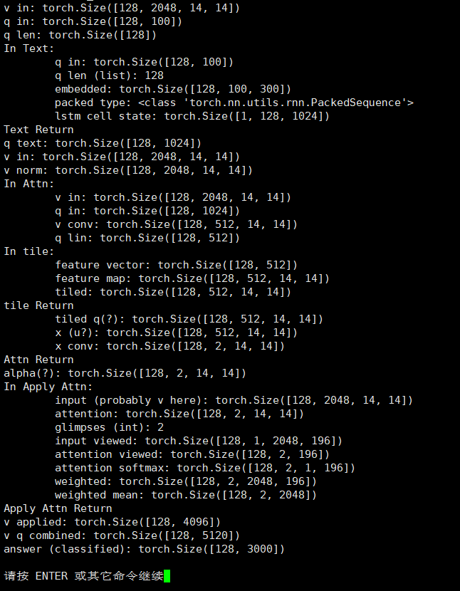

# 第22周周报

## 学习内容

- VQA Attention

## 学习收获

### 理论

把相关的论文思路梳理一下

#### Paper: Show, Ask, Attend, and Answer

将VQA问题当作classification问题处理，输入image $I$ 和 question $q$ ，根据图像的内容，从一个固定的答案集合中估计一个最大可能性的answer $\hat{a}$ 。

$$
\hat a = \argmax_a P(a|I, q), \quad a \in \{a_1, a_2, \cdots, a_M\}
$$

##### Image Embedding

用一个基于CNN的ResNet对image进行embedding，$\phi = CNN(I)$

$\phi$ 是ResNet除去最后一个Pooling层的输出，是三维tensor (14, 14, 2048)，然后对第三维进行 $l_2$ 的normalization

##### Question Embedding

对question加标签后进行word embedding，得到 $E_q$

$$
E_q = \{\bold{e}_1, \bold{e}_2, \cdots, \bold{e}_P\}, \quad \bold{e}_i \in \mathcal{R}^D
$$

$D$ 是整个词语库的长度，$P$ 是question的词语个数，将embedding放入LSTM

$$
s = LSTM(E_q)
$$

使用LSTM的final state作为question的representation

##### Stacked Attention

采用了和下文Stacked Attention Networks (SAN) 类似的方法

$$
\alpha_{c, l} \propto \exp F_c(s,\ \phi_l)\quad \ni \quad \sum_{l=1}^L \alpha_{c, l} = 1\\
\mathbf{x}_c = \sum_l \alpha_{c, l}\phi_l
$$

$\mathbf{x}_c$ 是image feature glimpse，由image feature $\phi$ 通过空间上 (14, 14) 的维度加权得到，$l = \{1, 2, \dots, L\}$ 。$\alpha_{c, l}$ 是attention weight，对于每一个glimpse $c = \{1, 2, \dots, C\}$ 分别做normalization。( 这里个人理解是 $L = 14 \times 14,\ C = 2048$ )

$F = \{F_1, F_2, \dots, F_C\}$ 则通过两层CNN获得，论文中提到第一层layer是share parameters的，仅通过不同的初始化来得到多样的attention分布 (?)

#### Paper: Stacked Attention Networks

通过question的semantic representation在image中寻找与答案相关的区域，采用多层Attention

下面只讨论模型的attention部分

将image的feature vector $v_I$ 和question vector $v_Q$ 作为输入，得到一个image的attention分布

$$
h_A = \tanh (W_{I, A} v_I \oplus (W_{Q, A} v_Q + b_A))\\
p_I = \text{softmax}(W_P h_A + b_P)\\
v_I \in R^{d \times m}\\
v_Q \in R^d\\
W_{I, A},\ W_{Q, A} \in R^{k \times d}\\
W_P \in R^{1 \times k}, \quad p_I \in R^m\\
\Rightarrow h_A \in R^{k \times m}
$$

将feature vector进行各个pixel的加权和，得到 $\tilde{v}_I$ ，再与question vector $v_Q$ 相加得到 $u$ 来作为提炼后的query vector

$$
\tilde{v}_I = \sum_i p_i v_i\\
u = \tilde{v}_I + v_Q\\
u \in R^d
$$

上述操作构成了attention的一层，对于较为复杂的问题，使用多层attention

$$
u^0 = v_Q\\
h_A^k = \tanh (W_{I, A}^k v_I \oplus (W_{Q, A}^k u^{k-1} + b_A^k))\\
p_I^k = \text{softmax}(W_P^k h_A^k + b_P^k)\\
\tilde{v}_I^k = \sum_i p_i^k v_i\\
u^k = \tilde{v}_I^k + u^{k-1}
$$

在每一层，使用组合后的向量 $u^{k-1}$ 作为image的query，每层进行image的区域选择和query的更新 $u^k = \tilde{v}_I^k + u^{k-1}$ ，使用最终的 $u^K$ 来推断answer

$$
p_{ans} = \text{softmax}(W_uu^K + b_u)
$$

### 实践

#### 代码实现

参考源代码和论文，把Attention写一遍

```python
class Attn(nn.Module):
    def __init__(self, v_features, q_features, mid_features, glimpses, drop=0.0):
        super(Attn, self).__init__()
        self.v_conv = nn.Conv2d(v_features, mid_features, 1, bias=False)
        self.q_lin = nn.Linear(q_features, mid_features)

        self.x_conv = nn.Conv2d(mid_features, glimpses, 1)
        self.drop = nn.Dropout(drop)
        self.relu = nn.ReLU(inplace=True)

    def forward(self, v, q):
        print('In homemade Attn:')
        print('\tv in:', v.shape)
        print('\tq in:', q.shape)
        # v: [128, 2048, 14, 14]
        # q: [128, 1024]
        # 这里貌似没有使用weight sharing
        v = self.v_conv(self.drop(v))
        print('\tv conv:', v.shape)
        # v: [128, 512, 14, 14]
        q = self.q_lin(self.drop(q))
        print('\tq lin:', q.shape)
        # q: [128, 512]
        q = tile_2d_over_nd(q, v)
        print('\ttiled q(?):', q.shape)
        # q: [128, 512, 14, 14]
        x = self.relu(v + q)
        print('\tx (u?):', x.shape)
        # x: [128, 512, 14, 14]
        x = self.x_conv(self.drop(x))
        print('\tx conv:', x.shape)
        # x: [128, 2, 14, 14]
        print('homemade Attn Return')
        return x
```

#### 模型测试

由于本地机器运算较慢，而且数据集太大，在虚拟机里下载不下来，这里只是用自己造的随机数据把模型跑通，确认一下各个部分的运算 (sanity check) ，没有训练

```python
# 测试代码
import model
import torch

# just random data
num_tokens = 12345
batch_size = 128
vision_features = 2048
question_features = 1024
max_len = 100

v = torch.rand(batch_size, vision_features, 14, 14)
q = torch.randint(1, num_tokens, (batch_size, max_len)).long()
q_len = torch.randint(1, max_len+1, (batch_size,)).long()
# descending order (as the Net requires)
q_len = q_len.sort(descending=True)[0]

# original model
net = model.Net(num_tokens)
out = net(v, q, q_len)

# homemade attn
attn = model.Attn(v_features=vision_features, q_features=question_features, mid_features=512, glimpses=2, drop=0.5)

print()
# similar to net.forward()
print('v in:', v.shape)
print('q in:', q.shape)
print('q len:', q_len.shape)
q = net.text(q, list(q_len.data))
print('q text:', q.shape)

print('v in:', v.shape)
v = v / (v.norm(p=2, dim=1, keepdim=True).expand_as(v) + 1e-8)
print('v norm:', v.shape)
a = attn(v, q)
print('alpha(?):', a.shape)
v = model.apply_attention(v, a)
print('v applied:', v.shape)

combined = torch.cat([v, q], dim=1)
print('v q combined:', combined.shape)
answer = net.classifier(combined)
print('answer (classified):', answer.shape)
```

在model中某些地方输出中间结果，得到输出如下：



## 疑问和困难

1. 有些论文里的数据操作，在pytorch中提供了现成的函数，对于pytorch的使用，需要达到多么底层？（仅从抽象角度搭建model class，或者是像numpy那样用矩阵计算实现train的过程）
