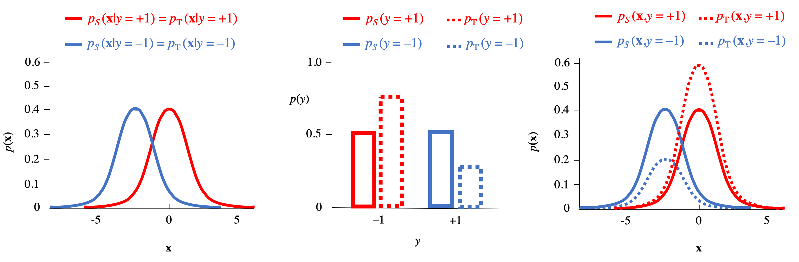
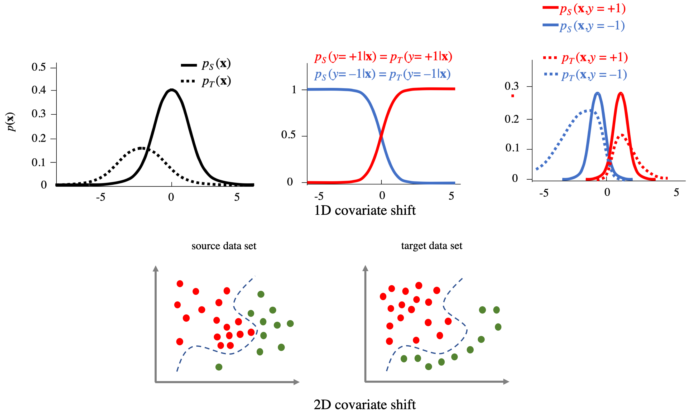
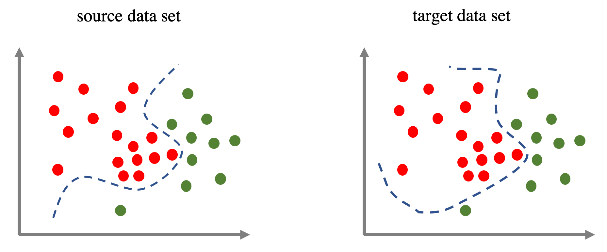
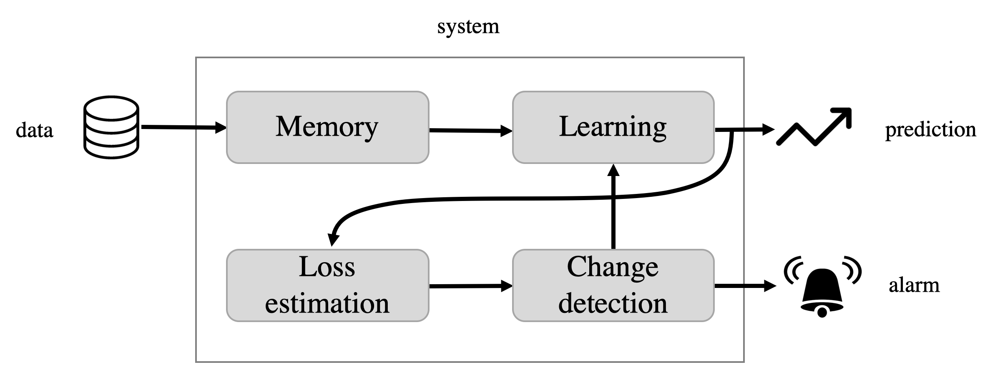
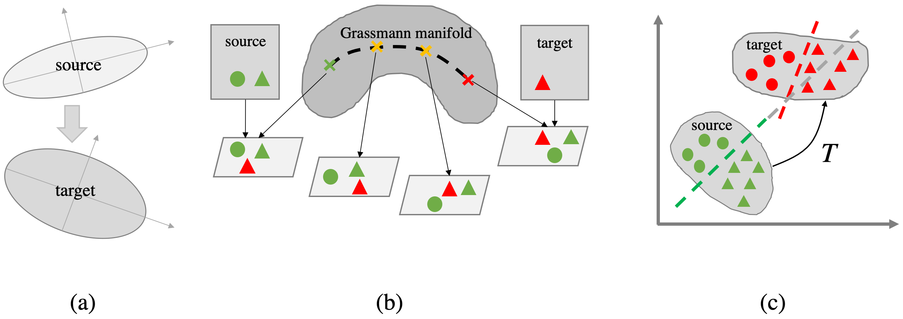
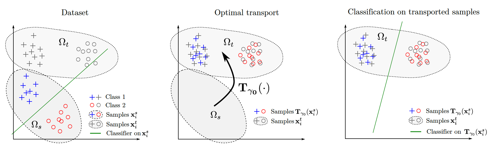
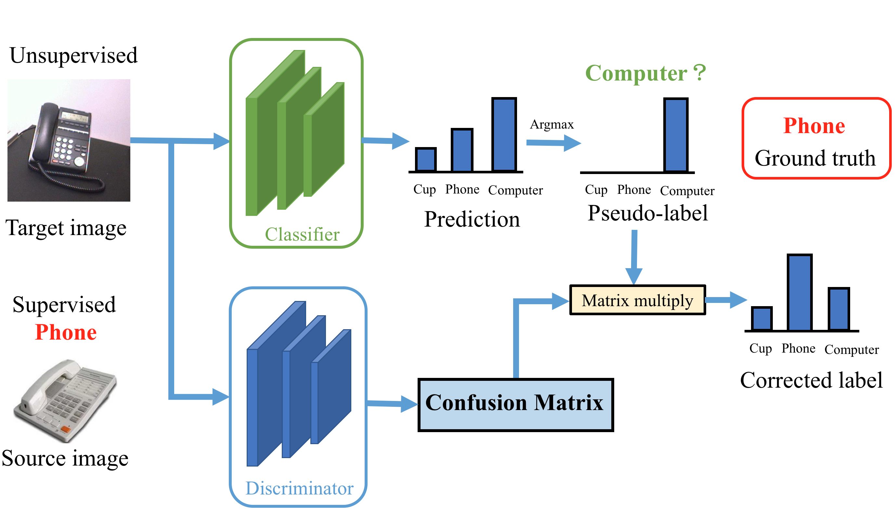
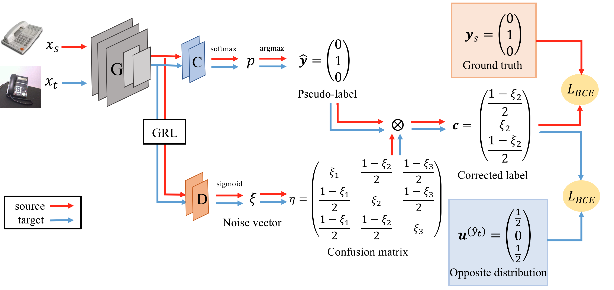

# 第25周周报

## 学习内容

- 领域自适应相关论文阅读

## 学习收获

在论文列表中找了一些领域自适应的文章看

### A Primer on Domain Adaptation

这是一篇入门引导类型的文章，主要讨论了以下几类问题：

1. prior shift
2. covariate shift
3. concept shift
4. subspace mapping

#### 前置知识

##### Probably Approximately Correct (PAC)

PAC是统计学习的经典数学框架

假设把每次观测定义为一个pair $(\bold{x}, y)$ ，$\bold{x}$ 是在特征空间 $\mathcal{X} \in \mathbb{R}^p$ 中的特征，标签 $y \in \mathcal{Y}$ ，可以认为是回归问题或者分类问题。假设 $\bold{x}$ 和 $y$ 的关系满足概率分布 $p(\bold{x}, y)$ ，通过观测取得一些样本 $S = \left\{(\bold{x_1}, y_1), \dots, (\bold{x_m}, y_m)\right\}$ ，则所需完成的事情是从函数集 $\mathcal{H}$ 中选取合适的函数作为映射

用loss function $\ell : \mathcal{Y} \times \mathcal{Y} \rightarrow \mathbb{R}$ 测量误差 $\ell(y, \hat{y})$

方法概述：一个函数集 $\mathcal{H}$ 是可学习的，存在一个算法 $A$ ，输入样本 $S$ ，当 $m$ 足够大时， $A$ 能输出一个有最大概率产生最小loss的预测器 $h_S = A(S) \in \mathcal{H}$

即对 $\forall \epsilon > 0, \delta > 0$ ，输出一个 $h_S = A(S) \in \mathcal{H}$ ，使得有 $1-\delta$ 的置信度满足 $R[h_s] \leq \min\limits_{h\in\mathcal{H}} R[h] + \epsilon$

如果给定 $m, \delta$ ，有如下关系式：
$$
\epsilon \leq \text{const}\sqrt{\frac{d[\mathcal{H}] + \log(1/\delta)}{m}}
$$
$d[\mathcal H]$ 衡量了 $\mathcal H$ 的复杂程度

文中提到的极大似然估计在概率论中有相关知识

#### Prior shift

源域和目标域的标签分布不同，假设两个域的类特征的条件概率分布是相同的

基本假设：$p_S(y) \neq p_T(y), p_S(\bold{x}|y) = p_T(\bold{x}|y)$

目的是寻找目标域的条件分布 $p_T(y|\bold{x})$ ，然后定义一个分类器 $h(\bold{x})$ 。假设已经通过统计方式找到了近似的 $\hat{p}_S(y|\bold{x})$ ，需要寻找近似的 $\hat{p}_T(y|\bold{x})$

利用如下关系式（参考全概率公式）：
$$
\hat{p}_D(\bold{x}|y) = \frac{\hat{p}_D(y|\bold{x})\hat{p}_D(\bold{x})}{\hat{p}_D(y)}\\
\hat{p}_T(\omega_k|\bold x)=\frac{\hat{w}(\omega_k)\hat{p}_S(\omega_k|\bold x)}{\sum\limits_{k'=1}^K \hat{w}(\omega_{k'})\hat{p}_S(\omega_{k'}|\bold x)}\text{ where } \hat{w}(\omega_k):=\frac{\hat{p}_T(\omega_{k})}{\hat{p}_S(\omega_k)}
$$
由全概率公式：
$$
\hat{p}_T(\omega_k) = \sum_{i=1}^m \hat{p}_T(\omega_k|\bold x'_i)\hat{p}_T(\bold x'_i)=\frac{1}{m}\sum_{i=1}^m \hat{p}_T(\omega_k|\bold x'_i)\\
\text{ where }\hat{p}_T(\omega_k|\bold x'_i) = \frac{\frac{\hat{p}_T(\omega_k)}{\hat{p}_S(\omega_k)}\hat{p}_S(\omega_k|\bold x'_i)}{\sum\limits_{k'=1}^K \frac{\hat{p}_T(\omega_{k'})}{\hat{p}_S(\omega_{k'})}\hat{p}_S(\omega_{k'}|\bold x'_i)}
$$

如果从数列的角度考虑，上式可以写成递推的形式：

$$
\hat{p}_T^{s+1}(\omega_k)=\frac{1}{m}\sum_{i=1}^m \hat{p}_T^s(\omega_k|\bold x'_i)\\
\text{ where }\hat{p}_T^s(\omega_k|\bold x'_i) = \frac{\frac{\hat{p}_T^s(\omega_k)}{\hat{p}_S(\omega_k)}\hat{p}_S(\omega_k|\bold x'_i)}{\sum\limits_{k'=1}^K \frac{\hat{p}_T^s(\omega_{k'})}{\hat{p}_S(\omega_{k'})}\hat{p}_S(\omega_{k'}|\bold x'_i)}
$$

可以把 $\hat{p}_T^0:=\hat{p}_S(\omega)$ 作为初始值，用迭代的方式得到近似的 $\hat{p}_T(\omega)$

#### Covariate shift

源域和目标域的特征的概率分布不同但是已知，类的标签相同

源分布是biased的，因为 $p_S(\bold x)$ 和 $p_T(\bold x)$ 并不匹配

即源域和目标域的分类标准相同，而输入的概率分布不同

当某些类的个体很难被sample到时，出现covariate shift的问题

基本假设：$p_S(\bold x) \neq p_T(\bold x), p_S(y|\bold x) = p_T(y|\bold x)$

通常使用PAC方法：
$$
R_T[h]:=\mathbb{E}_{p_T}[\ell(h(\bold x), y)]
$$
从数据中只能得到 $p_S(\bold x, y)$ ，则：
$$
R_T[h] = \mathbb E_{p_S}\left[\frac{p_T(\bold x, y)}{p_S(\bold x, y)}\ell(h(\bold x), y)\right] = \mathbb E_{p_S}\left[\frac{p_T(\bold x)}{p_S(\bold x)}\ell(h(\bold x), y)\right] = \mathbb E_{p_S}[w(\bold x)\ell(h(\bold x), y)]
$$
其中 $w(\bold x):=\frac{p_T(\bold x)}{p_S(\bold x)}$

由极大似然估计：
$$
\hat R_{S, w}[h]:=\frac{1}{m}\sum_{i=1}^m w(\bold x)\ell(h(\bold x_i), y_i)
$$
当样本量足够大时， $\hat R_{S, w}[h]$ 是 $R_T[h]$ 的一个优良近似

需要找到一个 $\hat w(\bold x)$ ，使得 $\hat p_T(\bold x) = \hat w(\bold x)\hat p_S(\bold x)$ 向 $p_T(\bold x)$ 接近，两者的差异可以用前面提到过的差异函数来定义：

- square error: $\mathbb E_{p_S} \left[(\hat w - p_T / p_S)^2\right]$
- KL divergence: $KL(p_T \| \hat w p_S) := \mathbb E_{p_T}\left[\log \frac{p_T}{\hat w p_S}\right]$
- Maximum Mean Discrepancy: $MMD[p_T, \hat w p_S]$

对MMD的最小化涉及到一个叫做KMM (Kernel Mean Matching)的方法：

在希尔伯特空间 $H$ 中，将特征向量 $\bold x \in \mathcal{X}$ 映射到另一个向量 $\Phi_{\bold x} \in H$ ，这个映射是一个标量积，表示为 $K(\bold x, \bold y) := \langle \Phi_{\bold x}, \Phi_{\bold y} \rangle$

把上面定义的 $K$ 称为原始特征空间 $\mathcal X$ 上的 kernel function

后面的推导过程即为MMD的核变换

#### Concept shift

源域和目标域的输入的概率相同，而分类出的结果不同

即：$p_S(\bold x) = p_T(\bold x), p_S(y|\bold x) \neq p_T(y|\bold x)$

图中的曲线表示了分类的分界线，初始的分布相同，而分类的标准不同

解决 concept shift 的常见方法：

1. 定期地使用新数据重新训练模型
2. 定期地使用新数据更新模型（保留一部分旧数据）
3. 给不同时期的数据加权
4. 使用迭代的方式，新的模型去校正最近的模型
5. 检测漂移现象并选择合适的新模型

在一个自适应系统中所包含的模块：

- Learning Algorithm Module: 被训练的部分
- Memory Module: 定义了哪些数据会被拿去训练
- Loss Estimation Module: 跟踪学习算法的表现
- Change Detection Module: 处理从 Loss Estimation Module 得到的信息，需要的时候更新 Learning Algorithm

#### Subspace mapping

相似的对象，但是存在一个未知的扭转(twist)或者是坐标系的变换，即目标域的 $\bold x' = T(\bold x)$

假设：$p_T(T(\bold x), y) = p_S(\bold x)\quad T : \mathcal X \rightarrow \mathcal X$

有如下关系：
$$
p_T(T(\bold x)) = p_S(\bold x)\\
p_T(y|T(\bold x)) = p_S(y|\bold x)
$$
三种处理subspace mapping的方法：

- Principal Component Analysis (PCA): 寻找一个将源域的 $n$ 个主成分映射到目标域的 $n$ 个主成分的仿射变换（ $\mathcal X \in \mathbb R^d, n < d$ ）
- Geodesics on Grassmann Manifolds: 基于流形的方法，找到一连串的中间状态的 $n$ 维表示，平滑地从源域变换到目标域
- Optimal transport (OT): 寻找从源域的分布到目标域的分布的映射

Optimal Transport

论文对于OT部分进行了很多数学形式上的推导，中间的过程比较复杂，没有弄懂，但是最终得到的数学形式是熟悉的：
$$
\arg \min_{h \in \mathcal H} \left(\sum_{i, j}\gamma_{ij}\ell(y_{i}, h(\bold x_j')) + \varepsilon \text{reg}[h]\right)
$$
如果对其中的相关函数进行特殊化，则有如下更为熟悉的形式：
$$
\arg \min_{h\in\mathcal H}\frac{1}{m_T}\sum_{j=1}^{m_T}|\hat y'_j - h(\bold x'_j)|^2 + \varepsilon\|\bold w\|^2\quad \text{where }\hat y'_j:=m_T\sum_{i=1}^{m_S}\gamma_{ij}y_i
$$

### Adversarial-Learned Loss for Domain Adaptation

这篇论文的关注点在于，原始的domain-adversarial training之关注了源域和目标域的feature match，而没有考虑目标域的feature是否可区分，self-training则相反。这篇论文提出了一个叫做adversarial-learned loss for domain adaptation (ALDA)的方法，把前面两种方法的优点结合起来。

如果单独使用伪标签（pseudo-label）的方法，需要考虑伪标签和实际标签可能存在的差异，论文采用对抗性的方法从ALDA中训练得到confusion matrix，从confusion matrix中可以生成loss function，用来评估没有标签的目标域样本

ALDA模型结构如下：

与原先的domain-adversarial learning不同，这里的对抗网络是为了生成confusion matrix来矫正分类器的输出

如果用 $K$ 表示类别的个数，Loss可以定义成如下形式：
$$
\mathcal L_T(x) = \sum_{k=1}^K -p(y=k|x)\log(\hat y = k|x) = \sum_{k=1}^K\sum_{l=1}^K-p(y = k|\hat y=l, x)p(\hat y=l|x)\log p(\hat y=k|x)
$$
其中 $y$ 表示样本 $x$ 的真实标签，$\hat y$ 是模型的预测标签（伪标签），$p(y=k|\hat y=l, x)$ 是confusion matrix中第 $k$ 行第 $l$ 列的元素（感觉上这部分就是一个矩阵乘法）

论文采用了一种叫做noise-correcting domain discrimination的方法来作为discriminator，通过训练得到confusion matrix。在论文的设计中，discriminator需要为不同的域产生不同的矫正标签，而特征提取器需要骗过discriminator

按文中的说法，论文的主要贡献如下：

- 通过confusion matrix分析伪标签，提出ALDA方法（即通过对抗训练预估confusion matrix）
- 从理论上证明ALDA可以完成特征对齐，矫正分类器的错误
- 在现有的四个标准非监督领域自适应数据集上取得当前最好结果

#### 方法介绍

##### 预备（符号约定）

带标签的源域：$\mathcal D_S = \{(x_s^i, y_s^i)\}_{i=1}^{n_s}$

不带标签的目标域：$\mathcal D_T = \{x_t^j\}_{j=1}^{n_t}$

训练一个生成网络 $G$ 来提取 $x_s, x_t$ 的高层特征，和一个分类器 $C$ 来完成在特征空间上的 $K$ 分类任务

$C$ 的输出为概率向量 $\bold p_s, \bold p_t \in \mathbb R^K$

理想情况下，带有实际标签的Loss如下：
$$
\mathcal L_T(x_t, \mathcal L) = \sum_{k=1}^Kp(y_t = k|x_t)\mathcal L(\bold p_t, k)
$$
其中 $\mathcal L$ 是常规的Loss，如cross entroy等

但在非监督学习中，$y_t$ 是未知的，于是可以设定一个阈值 $\delta$ ，当 $C$ 生成的概率向量 $\bold p_t$ 的最大值大于 $\delta$ 时，认为 $C$ 所预测的标签是合格的伪标签，写成数学形式如下：
$$
\hat y_t = \arg\max_k \bold p_t^k,\ if \max_k \bold p_t^k > \delta
$$
于是代到上式化简，可以的得到前面提到的loss function：
$$
\mathcal{L}_{T}(x_t, \mathcal{L}) =  \sum_{k=1}^K  p(y_t=k|x_t) \mathcal{L}(\mathbf{p}_t, k)\\
= \sum_{k=1}^K \sum_{l=1}^K p(y_t=k|\hat y_t=l, x_t) p(\hat y_t=l|x_t) \mathcal{L}(\mathbf{p}_t, k)\\
= \sum_{k=1}^K \sum_{l=1}^K \eta_{kl}^{(x_t)} p(\hat y_t=l|x_t) \mathcal{L}(\mathbf{p}_t, k)
$$
其中 $\eta^{(x_t)}$ 是confusion matrix，对于一个没有标签的目标域，这个confusion matrix也是未知的

定义 $\bold c_k^{(x_t)} = \sum_l \eta_{kl}^{(x_t)}p(\hat y_t=l|x_t)$ 为标签的矫正向量

##### Adversarial-Learned Loss

从这里文章开始引入对抗方式学习的loss

当作噪声的问题处理，假设噪声在每个类上是均匀分布的，分配的向量为 $\xi^{(x_t)} \in \mathbb R^K$

定义 $\xi^{(x_t)}$ 为：$k = l \text{ 时，} \eta_{kl}^{(x_t)} = \xi_k^{(x_t)}  \text{，} k \neq l \text{ 时，} \eta_{kl}^{(x_t)} = \frac{1-\xi_l^{(x_t)}}{K-1}$

采用一个叫做noise-correcting domain discriminator的网络去学习 $\xi^{(x_t)}$

$\xi^{(x_t)}$ 的含义为：伪标签与正确标签相同的概率，即 $\xi_k^{(x_t)} = p(y=k|\hat y = k, x)$ ，均匀分布即体现在这里（其它的 $K - 1$ 类均分剩下的概率）

前面有提到，discriminator对源域和目标域生成不同的噪声向量（矫正向量）

对于源域，discriminator需要最小化与正确标签的距离，其对抗训练loss如下：
$$
\mathcal{L}_{Adv}(x_s, y_s) = \mathcal{L}_{BCE}(\mathbf{c}^{(x_s)}, \mathbf{y}_s)  \\
= \sum_k -{\mathbf{y}_s}_k\log \mathbf{c}^{(x_s)}_k - (1-{\mathbf{y}_s}_k)\log(1- \mathbf{c}^{(x_s)}_k)
$$
对于目标域，discriminator需要把伪标签矫正到另一个分布 $\bold u^{(\hat y_t)} \in \mathbb R^K$ ，其中 $k = \hat y_t$ 时 $\bold u_k^{(\hat y_t)} = 0$ ，$k \neq \hat y_t$ 时 $\bold u_k^{(\hat y_t)} = \frac{1}{K-1}$

对于目标域的对抗训练loss为：
$$
\mathcal{L}_{Adv}(x_t) = \mathcal{L}_{BCE}(\mathbf{c}^{(x_t)}, \mathbf{u}^{(\hat y_t)})
$$
对抗网络的总loss：
$$
\mathcal{L}_{Adv}(x_s, y_s, x_t) = \mathcal{L}_{Adv}(x_s, y_s) + \mathcal{L}_{Adv}(x_t)
$$

##### Regularization

为了使训练更稳定，添加一项目标域上的Cross Entropy Loss作为regularization
$$
\mathcal{L}_{Reg}(x_s, y_s) = \mathcal{L}_{CE}(\mathbf{p}_D^{(x_s)}, y_s)
$$
其中 $\bold p_D^{(x_s)} = \text{softmax}(D(G(x_s)))$

最终discriminator的loss如下：
$$
\min_D E_{(x_s, y_s), x_t}(\mathcal{L}_{Adv}(x_s, y_s, x_t)+\mathcal{L}_{Reg}(x_s, y_s))
$$
在整个模型的loss中，除了上面提到的，还需要考虑矫正后的预测误差，于是有另外一个关于矫正的loss（仅在目标域上）：
$$
\mathcal{L}_{T}(x_t, \mathcal{L}_{unh})=\sum_{k,l} \eta_{kl}^{(x_t)} p(\hat y_t=l|x_t) \mathcal{L}_{unh}(\mathbf{p}_t, k) \\
=\sum_{k} \mathbf{c}^{(x_t)}_k\mathcal{L}_{unh}(\mathbf{p}_t, k)
$$
其中 $\mathcal{L}_{unh}(\mathbf{p}, k) = 1-\mathbf{p}_k$

综上，分类器和生成器的loss分别为：
$$
\min_C E_{(x_s, y_s), x_t}(\mathcal{L}_{CE}(p_s, y_s)+\lambda\mathcal{L}_{T}(x_t, \mathcal{L}_{unh}))\\
\min_G E_{(x_s, y_s), x_t}(\mathcal{L}_{CE}(p_s, y_s)+\lambda\mathcal{L}_{T}(x_t, \mathcal{L}_{unh})  -\lambda\mathcal{L}_{Adv}(x_s, y_s, x_t))
$$
$\lambda \in [0, 1]$ 是一个自选的参数

个人认为这篇文章的亮点在于，采用了discriminator生成的结果来矫正classifier得出的prediction作为接下来训练的pseudo-label，使得每次产生的伪标签更为准确，训练的效果也更好

## 疑问/困难

1. 在第二篇论文中，假设已经达到了特征匹配，并且不同类在特征空间中是可区分的，是否会出现目标域中某些类在特征空间中被映射到了目标域的另一个类，从而被分在了错误的类中？