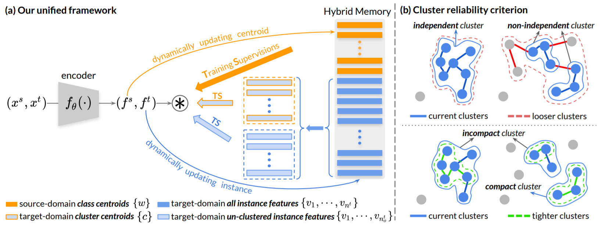
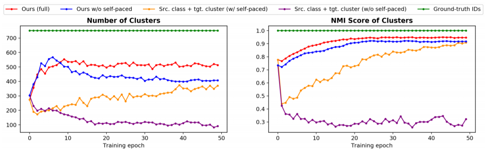
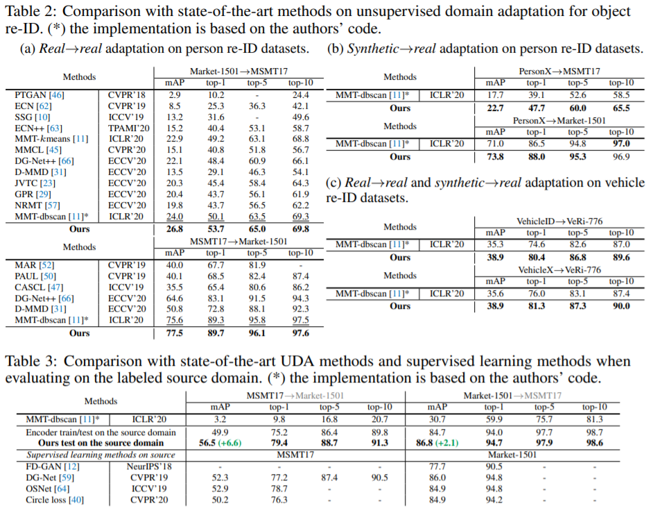
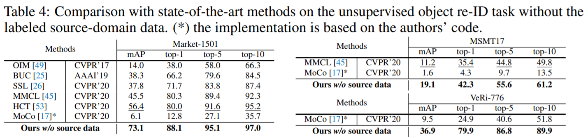

# 周报20201206

## 学习内容

<!-- 看了两篇论文： -->

- Self-paced Contrastive Learning with Hybrid Memory for Domain Adaptive Object Re-ID (NIPS2020)
<!-- - Learning to Generalize: Meta-Learning for Domain Generalization (AAAI2018) -->
<!-- - Episodic Training for Domain Generalization (ICCV2019) -->

## 学习收获

### Self-paced Contrastive Learning with Hybrid Memory for Domain Adaptive Object Re-ID (NIPS2020)

文章使用自步对比学习和混合记忆模型。Re-ID的任务是学习辨识性的特征，在多种条件变化下保持robustness。领域自适应方法在Re-ID中，两个domain的类别很难重合。文章提出两类问题，分别是领域自适应重识别和无监督重识别，两者区别在于领域自适应方法中有源域标签，而无监督方法中无源域标签。领域自适应的方法去掉源域pretrain的步骤之后，也可以应用在无监督任务上。

#### Proposal

领域自适应重识别方法可分成伪标签生成和域转换两类，使用基于聚类算法的伪标签方法效果较好，作为这篇文章的baseline。

常见聚类伪标签算法（SSG、MMT等）的训练分两步：

1. 源域上supervised learning作为pretrain model
2. 目标域上，使用目标域样本和聚类伪标签进行fine-tune

然而上述方法存在如下缺陷：

1. 目标域训练时忽略了源域标签
2. 在基于聚类的伪标签算法中，部分目标域无标签数据被当作了outlier，实际上没有分配伪标签，在传统做法中是将其丢弃不参与训练。

因此需要挖掘所有可用信息，文章提出在训练的时候使用全部的源域和目标域数据，才有混合记忆（hybrid memory）模型进行监督。对于目标域的聚类outlier，每张图被当作一个单独的类，论文中将源域标签，目标域聚类伪标签，和目标域离散值标签当作平等的类别。

#### Method

文章提出self-paced contrastive learning框架，包括一个encoder和一个hybrid memory。核心在于利用hybrid memory在动态变化的类别下提供连续有效的监督，使用unified contrastive loss进行参数更新，在encoder中引入domain-specific的batch norm来消除域差异。

模型的整体框架如下：

##### Unified Contrastive Loss

使用class centroid作为class prototype（感觉上就是类别特征的平均值），对于每一个batch，同时包含源域和目标域数据，与三种类别原型进行比较，提出如下的unified contrastive loss：

$$
\mathcal{L}_{f}=-\log \frac{\exp \left(\left\langle\boldsymbol{f}, \boldsymbol{z}^{+}\right\rangle / \tau\right)}{\sum_{k=1}^{n^{s}} \exp \left(\left\langle\boldsymbol{f}, \boldsymbol{w}_{k}\right\rangle / \tau\right)+\sum_{k=1}^{n_{c}^{t}} \exp \left(\left\langle\boldsymbol{f}, \boldsymbol{c}_{k}\right\rangle / \tau\right)+\sum_{k=1}^{n_{o}^{t}} \exp \left(\left\langle\boldsymbol{f}, \boldsymbol{v}_{k}\right\rangle / \tau\right)}$$

其中 $\boldsymbol{z}^{+}$ 表示相对于 $\boldsymbol{f}$ 的positive class prototype，即当 $\boldsymbol{f}$ 属于三种标签情况时，分别为对应的 prototype $\boldsymbol{w}_{k}$、$\boldsymbol{c}_{k}$、$\boldsymbol{v}_{k}$。prototype中 $\boldsymbol{w}_{k}$ 表示源域class centroid，$\boldsymbol{c}_{k}$ 表示目标域cluster centroid，$\boldsymbol{v}_{k}$ 表示目标域instance features（实例特征当作centroid）。符号 $\left\langle \cdot, \cdot \right\rangle$ 表示向量内积（数量积），来体现similarity。该loss目的是让每个训练样本靠近它属于的类别，远离其它类别。

##### Hybrid Memory

使用hybrid memory模型来维护prototype，使用momentum update的方法，文章中针对源域和目标域采取不同的动量更新算法，适应不同特性。

对于源域，以类为单位进行存储，将当前batch的源域feature按类别算均值，以动量更新方式累计到对应类别centroid上（与原先见过的方法一致）：

$$
\boldsymbol{w}_{k} \leftarrow m^{s} \boldsymbol{w}_{k}+\left(1-m^{s}\right) \cdot \frac{1}{\left|\mathcal{B}_{k}\right|} \sum_{\boldsymbol{f}_{i}^{s} \in \mathcal{B}_{k}} \boldsymbol{f}_{i}^{s}
$$

对于目标域，全部以实例为单位进行特征存储，使得目标域样本在聚类和非聚类离群值在不断变化的时候，也能在hybrid memory中持续更新。即对于每个实例，根据index来分别进行feature的动量更新，聚类伪标签和离群值标签的prototype则根据聚类ID求平均值得到（离群值的每个实例作为一个prototype）。

##### Self-pace Learning

聚类的可靠性对训练的影响至关重要，训练初期噪声较大，借鉴self-pace learning的思想，先从最可靠的聚类开始，再逐步增加聚类。文章提出一个可靠性标准（cluster reliability criterion），保留可靠聚类，将不可靠聚类拆散成离散值，标准分为聚类独立性和聚类紧凑型。

聚类独立性关注点在于一个可靠的聚类应当有良好的类间距离，如果放宽聚类标准，该聚类与其它聚类融合成了一个大聚类，或吸收了周围的离群值，则这不是一个好的聚类。文章使用一个IoU（Intersection over Union）来衡量聚类独立性：

$$
\mathcal{R}_{\text {indep }}\left(\boldsymbol{f}_{i}^{t}\right)=\frac{\left|\mathcal{I}\left(\boldsymbol{f}_{i}^{t}\right) \cap \mathcal{I}_{\text {loose }}\left(\boldsymbol{f}_{i}^{t}\right)\right|}{\left|\mathcal{I}\left(\boldsymbol{f}_{i}^{t}\right) \cup \mathcal{I}_{\text {loose }}\left(\boldsymbol{f}_{i}^{t}\right)\right|} \in[0,1]
$$

聚类紧凑型则说明一个可靠的聚类应当有较小的类内距离，如果缩减聚类标准，一个聚类被拆成了多个小聚类，或者拆除了一些离散值，则这不是一个好的聚类。紧凑型也同样使用一个IoU来衡量：

$$
\mathcal{R}_{\mathrm{comp}}\left(\boldsymbol{f}_{i}^{t}\right)=\frac{\left|\mathcal{I}\left(\boldsymbol{f}_{i}^{t}\right) \cap \mathcal{I}_{\mathrm{tight}}\left(\boldsymbol{f}_{i}^{t}\right)\right|}{\left|\mathcal{I}\left(\boldsymbol{f}_{i}^{t}\right) \cup \mathcal{I}_{\mathrm{tight}}\left(\boldsymbol{f}_{i}^{t}\right)\right|} \in[0,1]
$$

聚类可靠性标准的创新点在于：一个可靠的聚类，应当对于多个尺度的聚类标准保持稳定。下图可以说明该标准应用到聚类问题上是有效的：

##### 训练过程

初始化：encoder使用pretrained model，hybrid memory则使用初始encoder对所有样本进行一次forward

聚类和离群值筛选：在每个epoch前进行聚类，使用聚类标准进行筛选，仅保留可靠聚类，其余样本均视作离群值

网络训练和hybrid memory更新：每次迭代使用对比损失进行参数更新，然后用特征以动量方式更新hybrid memory

在无监督重识别中，只需要将hybrid memory和unified contrastive loss中有关源域的部分去掉，对比损失如下：

$$
\mathcal{L}_{f}=-\log \frac{\exp \left(\left\langle\boldsymbol{f}, \boldsymbol{z}^{+}\right\rangle / \tau\right)}{\sum_{k=1}^{n_{c}^{t}} \exp \left(\left\langle\boldsymbol{f}, \boldsymbol{c}_{k}\right\rangle / \tau\right)+\sum_{k=1}^{n} \exp \left(\left\langle\boldsymbol{f}, \boldsymbol{v}_{k}\right\rangle / \tau\right)}
$$

#### Experiments

文章中对比了领域适应目标重识别方法、无监督领域适应、监督学习和普通的目标重识别方法，结果显示所提出模型在目标重识别上有显著的效果提升。

#### 总结

文章提出了self-pace contrastive learning，主要贡献在于使用hybrid memory构建contrastive loss，并且提出cluster reliability criterion用于聚类可靠性的评价和筛选。

<!-- ### Learning to Generalize: Meta-Learning for Domain Generalization (AAAI2018) -->

## 启发/疑惑

1. 使用Domain-specific的batch norm可以消除域差异？
2. contrastive loss的目的与原先MSDA中的alignment loss相同，可以作为loss形式的参考
3. 基于实例的centroid更新比较有新意，在原先的方法中，是每个伪标签类来更新，基于实例的更新可以保留样本自身的信息
4. 自步学习的中拆散不可靠聚类的方法比较有启发性，聚类的两个标准可以应用到衡量伪标签可靠性中
