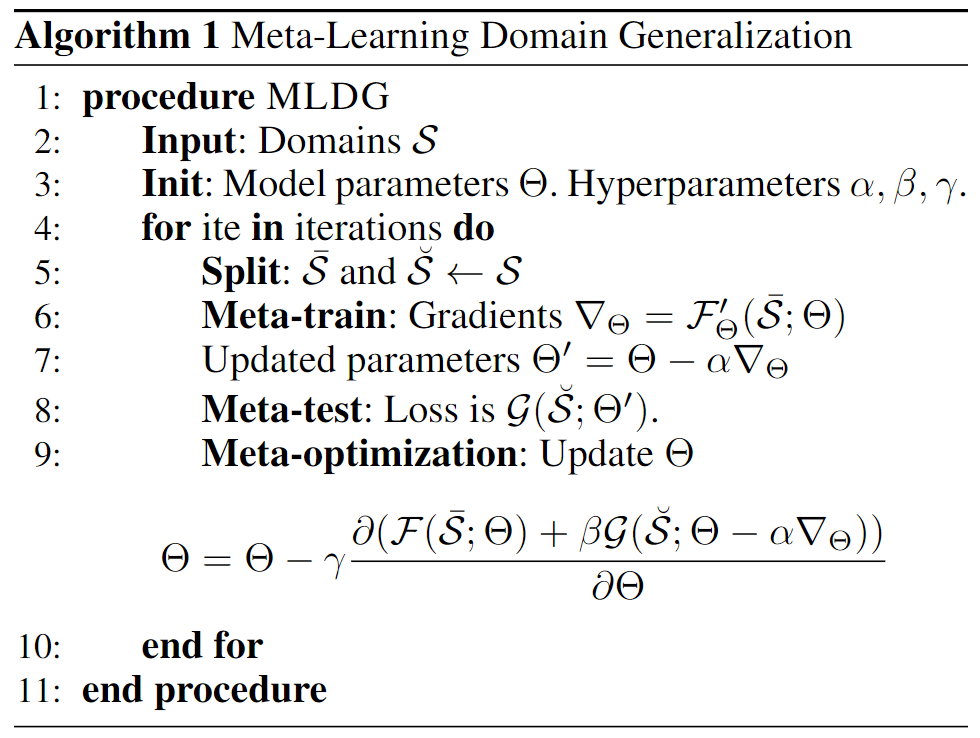
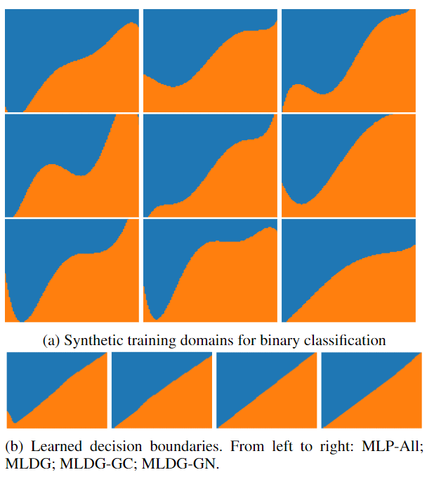
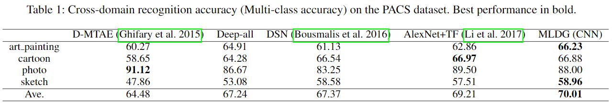
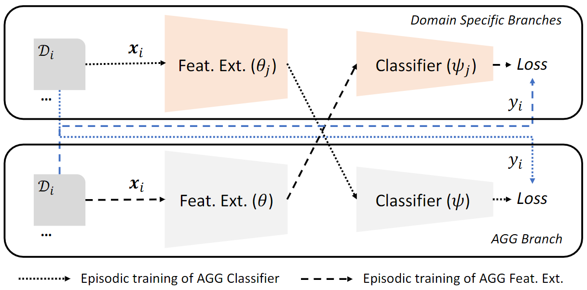
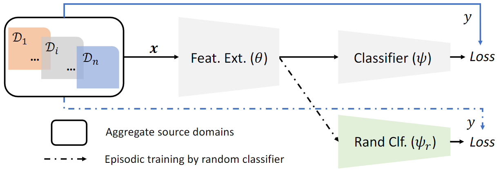
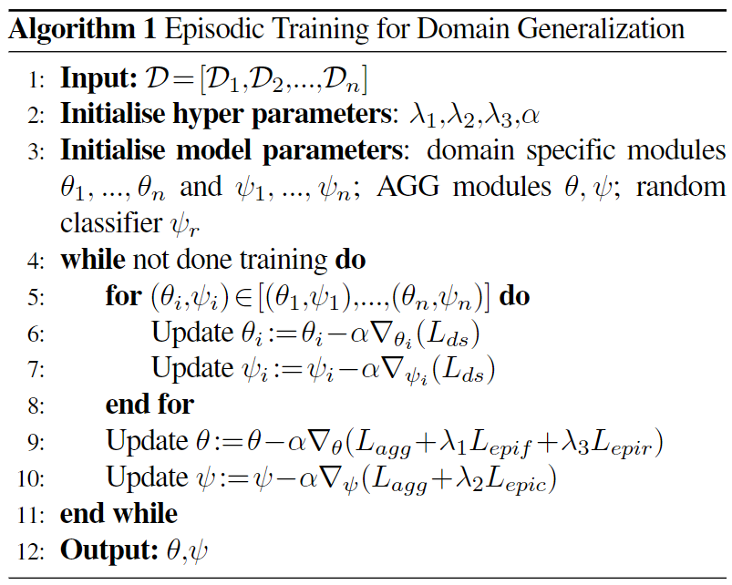
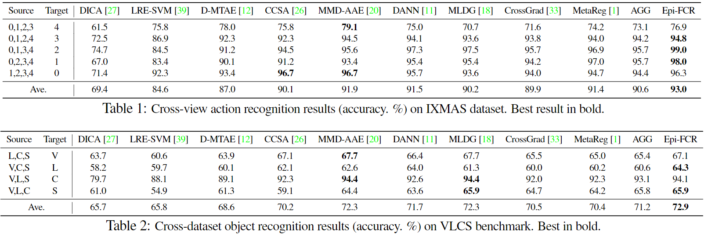
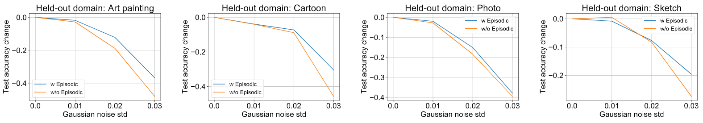

# 周报20201220

## 学习内容

看了两篇Domain Generalization的论文：

- Learning to Generalize: Meta-Learning for Domain Generalization (AAAI2018)
- Episodic Training for Domain Generalization (ICCV2019)

## 学习收获

### Learning to Generalize: Meta-Learning for Domain Generalization (AAAI2018)

<!-- 文章提到一篇MAML方法，使用的是meta learning for few-shot learning（后面看） -->

解决Domain Shift有两种approach，分别是Domain Adaptation和Domain Generalization，并且在DG上的研究相对较少。DA的研究目标在于利用unlabelled或sparsely labelled target data来进行model adaptation，而DG目标在于设计本身就适用于new domain的模型，并且没有target data。与DA相比，DG在训练后并不需要update，所以研究的问题在于如何提升模型在new domain上的表现（也就是泛化能力，generalize）。

DG上的传统方法通常在多个source domain上训练，然后提出一些机制来提取domain无关（agnostic）的representations，或者提出可以描述已知domains的共同方面（common aspects）的model，此类方法假设这些common factor在new domain上也能保持。

#### Proposal

这篇文章提出的是一种基于meta learning的训练算法MLDG，与模型无关，目的是提供一种更好的训练方式，使得现有模型对于domain shift更加robust。模型在每个mini batch中生成一些virtual的train/test domain用于optimization，没有超参数，并且对base learner的architecture没有限制，可以用于supervised和reinforcement learning（早先的一些DG模型限定了architecture并且只适用于supervised learning）。

#### Method

对于每一个batch，数据拆分成meta-train和meta-test两部分，模拟真实的train-test中的domain shift（从同一个domain中sample出来的train/test是否存在domain shift？）

对于supervised learning，针对meta-train和meta-test分别提出以下两个loss function：

$$
\mathcal{F}(\cdot)=\frac{1}{S-V} \sum_{i=1}^{S-V} \frac{1}{N_{i}} \sum_{j=1}^{N_{i}} \ell_{\Theta}\left(\hat{y}_{j}^{(i)}, y_{j}^{(i)}\right)
$$

$$
\mathcal{G}(\cdot)=\frac{1}{V} \sum_{i=1}^{V} \frac{1}{N_{i}} \sum_{j=1}^{N_{i}} \ell_{\Theta^{\prime}}\left(\hat{y}_{j}^{(i)}, y_{j}^{(i)}\right)
$$

其中 $\ell$ 表示cross entropy loss，meta-test与meta-train的更新方式差别在于，meta-test是在meta-train更新后的基础上再次更新，即 $\Theta'=\Theta-\alpha\nabla_{\Theta}$ （感觉上就相当于是在每个mini-batch中分别对meta-train和meta-test训练了一次，使用的也是常规的cross entropy，与DA的区别可能就是在mini-batch中重新拆分了train/test）。总体的objective function如下：

$$
\underset{\Theta}{\operatorname{argmin}} \mathcal{F}(\Theta)+\beta \mathcal{G}\left(\Theta-\alpha \mathcal{F}^{\prime}(\Theta)\right)
$$

经过一些数学形式上的推导，上式转化成如下形式：

$$
\underset{\Theta}{\operatorname{argmin}} \mathcal{F}(\Theta)+\beta \mathcal{G}(\Theta)-\beta \alpha\left(\mathcal{G}^{\prime}(\Theta) \cdot \mathcal{F}^{\prime}(\Theta)\right)
$$

相当于是对于meta-train和meta-test，要减小cross entropy，增大内积（内积反应的是梯度间的夹角，增大内积相当于是让两者梯度方向接近，从而参数更新能够协同进行）。最终的训练算法如下：

受前面推导的启发，文中还提出了MLDG的两个变种，分别是MLDG-GC和MLDG-GN：

$$
\underset{\Theta}{\operatorname{argmin}} \mathcal{F}(\Theta)+\beta \mathcal{G}(\Theta)-\beta \alpha \frac{\mathcal{F}^{\prime}(\Theta) \cdot \mathcal{G}^{\prime}(\Theta)}{\left\|\mathcal{F}^{\prime}(\Theta)\right\|_{2}\left\|\mathcal{G}^{\prime}(\Theta)\right\|_{2}}
$$

$$
\underset{\Theta}{\operatorname{argmin}} \mathcal{F}(\Theta)+\beta\left\|\mathcal{G}^{\prime}\left(\Theta-\alpha \mathcal{F}^{\prime}(\Theta)\right)\right\|_{2}^{2}
$$

其中MLDG-GC进行了一次normalize，MLDG-GN则是考虑到当meta-train收敛时，meta-test的梯度应当接近于0。

#### Experiments

文章在实验部分做的内容比较有意思，首先对比了一个baseline的MLP和MLDG及其变种在对角分界线上的差异，结果如下图所示：

前面的9张图表示生成的9个domain分界线，后面四张图分别表示MLP和MLDG及其变种在训练后产生的分界线，可以看到MLDG的分界线属于比较泛化的对角线，而MLP出现了overfit。

文章在PACS数据集上进行了图像识别的对比实验，结果如下：

从结果上可以看到MLDG在部分domain上有较好效果，但不是全部domain都有提升。

### Episodic Training for Domain Generalization (ICCV2019)

文章提出一种episodic training的方式达到模型泛化的效果，主要想法是把一个完整的network拆分成feature和classifier，对于这两个component分别使用一个badly tuned（或者说是未针对这个domain进行训练的）partner进行interact，以达到更加robust的效果，并且所提出的方法能够同时解决homogeneous和heterogeneous的问题。

#### Method

首先分析一些现有方法，包括普通的aggregation method和domain specific model，在aggregation method中，多个domain共用相同的feature extractor和classifier，domain specific model则对于每个domain使用特定的feature extractor和classifier。

在episodic training中，目标是得到一个统一的feature extractor和classifier，文章的思路是将feature extractor与mismatch的多个domain specific classifier一起训练，将classifier与mismatch的多个domain specific feature extractor一起训练。

对于feature extractor，与其它domain specific的classifier一起训练，其中classifiers的参数是固定的，不参与back prop：

$$
\underset{\theta}{\operatorname{argmin}} \mathbb{E}_{i, j \sim[1, n], i \neq j}\left[\mathbb{E}_{\left(\mathbf{x}_{i}, y_{i}\right) \sim \mathcal{D}_{i}}\left[\ell\left(y_{i}, \bar{\psi}_{j}\left(\theta\left(\mathbf{x}_{i}\right)\right)\right]\right]\right.
$$

对于classifier，与其它domain specific的feature extractor一起训练，其中feature extractors的参数是固定的，也不参与back prop：

$$
\underset{\psi}{\operatorname{argmin}} \mathbb{E}_{i, j \sim[1, n], i \neq j}\left[\mathbb{E}_{\left(\mathbf{x}_{i}, y_{i}\right) \sim \mathcal{D}_{i}}\left[\ell\left(y_{i}, \psi\left(\bar{\theta}_{j}\left(\mathbf{x}_{i}\right)\right)\right]\right]\right.
$$

上述方法只适用于homogeneous，因此文章又提出使用随机初始化并且固定参数的classifier与模型的feature extractor一起训练（为什么这样解决了heterogeneous？--因为每个domain都可以使用一个classifier？使用random的原因？）：

$$
\underset{\theta}{\operatorname{argmin}} \mathbb{E}_{\mathcal{D}_{i} \sim \mathcal{D}}\left[\mathbb{E}_{\left(\mathbf{x}_{i}, y_{i}\right) \sim \mathcal{D}_{i}}\left[\ell\left(y_{i}, \bar{\psi}_{r}\left(\theta\left(\mathbf{x}_{i}\right)\right)\right]\right]\right.
$$

Episodic training的算法如下：

#### Experiments

论文在IXMAS、VLCS、PACS和VD四个数据集上进行了实验，下面列出的是效果较好的两个：

可以看到，文章提出的episodic training在多个数据集上只有一部分domain有提升，某些domain上的效果要低于现有模型，但episodic training里将多个domain specific model参与到单个模型的训练过程具有一些参考价值。

文章对于模型robustness的分析，是在模型的参数上添加一个高斯噪声，随着标准差增大，模型正确率逐渐下降，且未使用episodic training的模型下降更快，说明episodic training确实可以提高robustness：

### 启发

1. DG的模型本身在训练后并不会微调，这样是否缺乏对target自身特性的考虑，也许可以在DG后利用DA的方法针对task/target进行adaptation以达到更好的效果（需要引入额外的target data，破坏DG的assumption）
2. 考虑DG与DA的交叉问题，可以提出一个在DG和DA上都取得良好效果的通用模型
3. Domain shift是客观存在的，并且表现在不同domain之间，将多个domain混合再拆分成train和test为什么能达到模拟domain shift的效果？
4. 在DA中，计算相似度大多数是基于特征的，即在feature map上进行loss计算，而meta learning这篇文章提出针对梯度计算的loss，使得划分出来的meta-train和meta-test在更新参数时能够协同一致
5. 生成对角线二分类的domain的实验方法可以用来衡量模型泛化能力，可以参考使用
6. 为什么randomly initialized classifier可以解决heterogeneous的问题？
7. 关于模型robustness的分析方法可以参考，即给模型参数不同程度的Gaussian noise，分析test accuracy下降程度随std的变化
