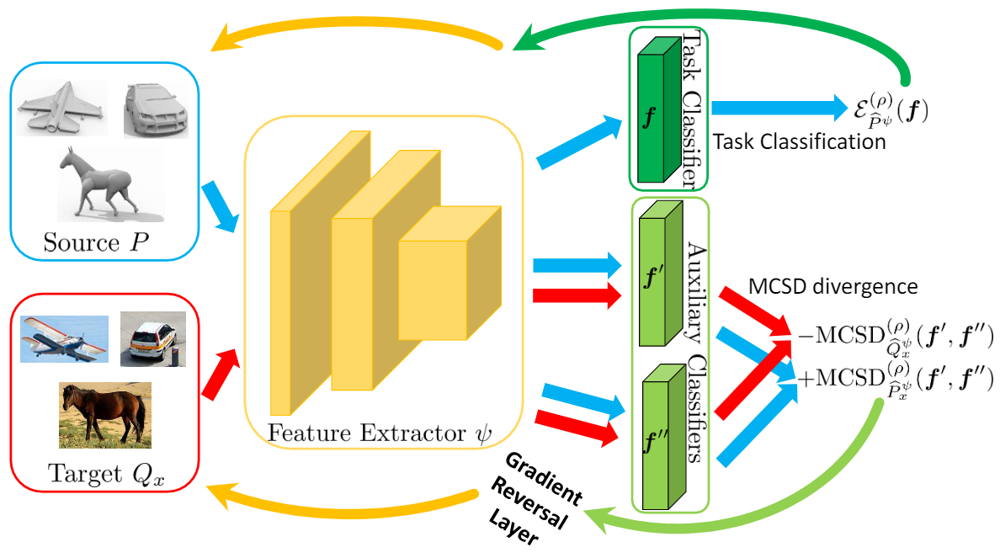
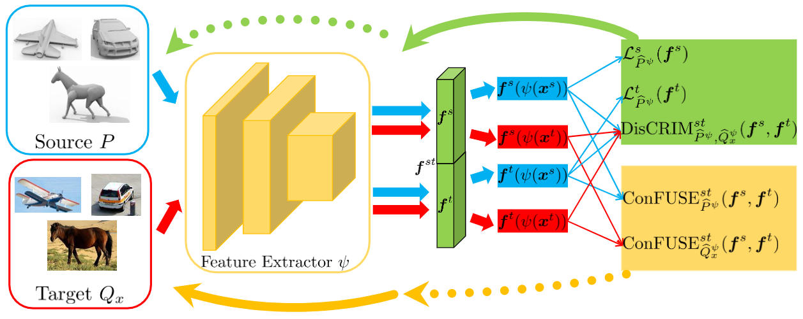
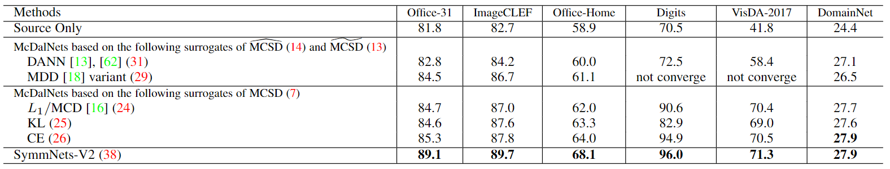
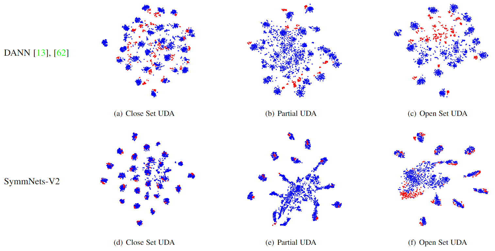
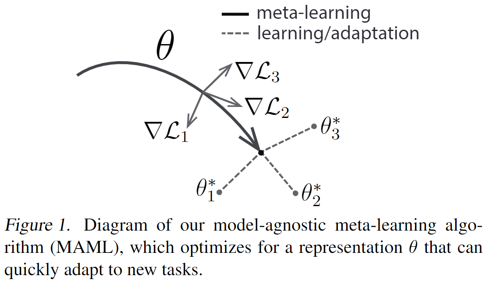
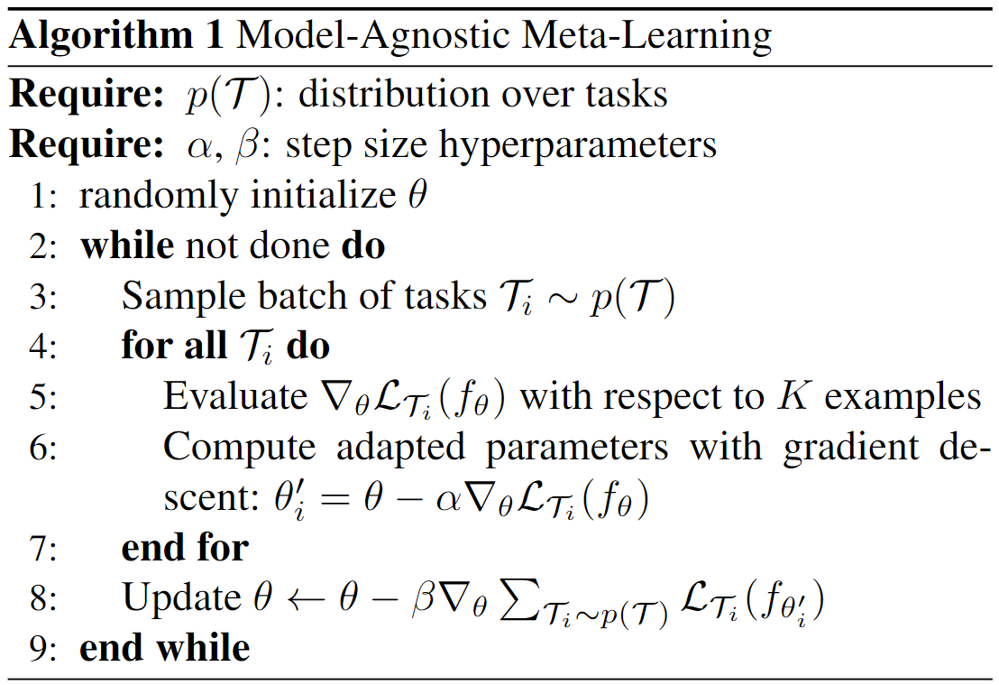
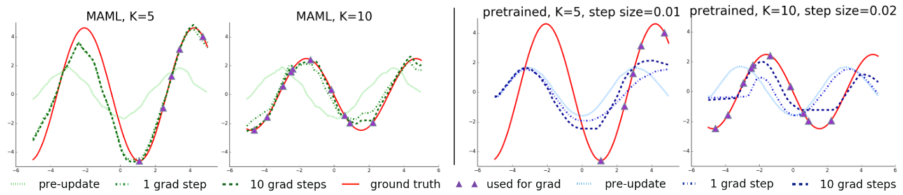
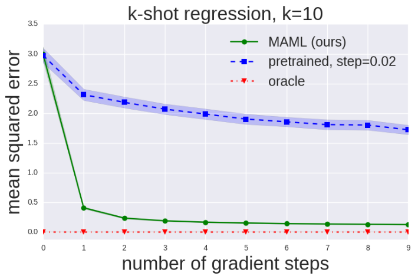
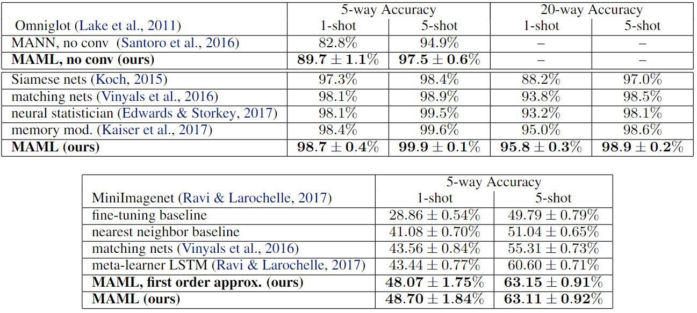

# 周报20210207

## 学习内容

- Unsupervised Multi-Class Domain Adaptation: Theory, Algorithms, and Practice (TPAMI2020)
- Model-Agnostic Meta-Learning for Fast Adaptation of Deep Networks (ICML2017)
<!-- - Minimum Class Confusion for Versatile Domain Adaptation (ECCV2020)
- Domain Separation Networks (NIPS2016) -->

## 学习收获

### Unsupervised Multi-Class Domain Adaptation: Theory, Algorithms, and Practice (TPAMI2020)

这篇文章从理论、算法和实践三个角度分析了无监督多类别领域适应的问题，从理论角度提出新的divergence度量方法，从算法角度基于理论提出新的算法框架，最后在实践方面进行多个数据集的验证。

#### Theory

领域适应的经典解决方法是找到一个特征空间，使得源域和目标域在特征空间上的数据分布尽可能小，从而源域上训练的模型可以在目标域上使用，因此需要设计衡量数据间分布差异的标准。

现有的一些基于对抗训练的分类器可以取得较好结果，但是与理论不是很匹配（但在我的理解里，对抗训练实际上是另一种形式的分布差异）。文章在DA的理论方面提出multi-class scoring disagreement (MCSD) divergence来衡量两个域之间的数据分布差异，MCSD可以衡量scoring hypothesis之间的差异（分类器的输出层差异？），并且基于MCSD divergence，文章提出了adaptation bound。

在一些经典DA分类任务中，域的差异常用loss均值的差异来衡量，在二分类中，有：

$$
d_{0-1}\left(P_{x}, Q_{x}\right):=\sup _{h, h^{\prime} \in \mathcal{H}^{\{0,1\}}}\left|\mathbb{E}_{Q_{x}} \mathbb{I}\left[h \neq h^{\prime}\right]-\mathbb{E}_{P_{x}} \mathbb{I}\left[h \neq h^{\prime}\right]\right|
$$

在多分类中，有：

$$
d_{L}\left(P_{x}, Q_{x}\right):=\sup _{h, h^{\prime} \in \mathcal{H}}\left|\mathbb{E}_{Q_{x}} L\left(h, h^{\prime}\right)-\mathbb{E}_{P_{x}} L\left(h, h^{\prime}\right)\right|
$$

而文章指出，这两种差异其实是特殊的形式，有更为general的表达，需要把hypothesis之间的disagreement也考虑进来（理解成分类器输出的差异？），作者表示需要对原有的loss进行extend，特别是marginal based的那些（？），所以文章提出了如下的MCSD（multi-class scoring disagreement在一个域上衡量两个hypothesis的差异）和MCSD divergence（衡量两个域之间的两分类器差异？）：

$$
\operatorname{MCSD}_{D}^{(\rho)}\left(\boldsymbol{f}^{\prime}, \boldsymbol{f}^{\prime \prime}\right):=\frac{1}{K} \mathbb{E}_{\boldsymbol{x} \sim D}\left\|\boldsymbol{M}^{(\rho)}\left(\boldsymbol{f}^{\prime}(\boldsymbol{x})\right)-\boldsymbol{M}^{(\rho)}\left(\boldsymbol{f}^{\prime \prime}(\boldsymbol{x})\right)\right\|_{1}
$$

$$
d_{M C S D}^{(\rho)}\left(P_{x}, Q_{x}\right) := \sup_{f^{\prime}, f^{\prime \prime} \in \mathcal{F}}\left[\operatorname{MCSD}_{Q_{x}}^{(\rho)}\left(f^{\prime}, f^{\prime \prime}\right)-\operatorname{MCSD}_{P_{x}}^{(\rho)}\left(f^{\prime}, f^{\prime \prime}\right)\right]
$$

其中 $\boldsymbol{M}_{i, j}^{(\rho)}(\boldsymbol{f}(\boldsymbol{x}))=\Phi_{\rho}\left(\mu_{i}(\boldsymbol{f}(\boldsymbol{x}), j)\right)$，使用了一个ramp loss去限制marginal violation（理解成误分类的时候获得较大的loss？）。MCSD考虑了scoring function的所有输出，所以可以更充分地衡量hypothesis的差异。

adaptation bound部分的推导没太看懂……论文给出了adaptation中target expected error的上限：

$$
\varepsilon_{Q}\left(h_{f}\right) \leq \varepsilon_{P}^{(p)}(f)+d_{\operatorname{MCSD}}^{(p)}\left(P_{x}, Q_{x}\right)+\lambda
$$

其中$\varepsilon_{Q}\left(h_{f}\right)$表示target error，$\varepsilon_{P}^{(p)}(f)$表示source error，因此可以通过减小上限来增强adaptation。

#### Algorithm

基于MCSD divergence，文章提出了两种DA算法，分别是McDalNet和SymmNet。

使用MCSD divergence，为了减小target error的上限，需要寻找合适的feature extractor和classifier以减小source error和MCSD divergence，因此可以得到以下objective function：

$$
\min _{\boldsymbol{f}, \psi} \mathcal{E}_{\widehat{P}^{\psi}}^{(\rho)}(\boldsymbol{f})+\left[\operatorname{MCSD}_{\widehat{Q}_{x}^{\psi}}^{(\rho)}\left(\boldsymbol{f}^{\prime}, \boldsymbol{f}^{\prime \prime}\right)-\operatorname{MCSD}_{\widehat{P}_{x}^{\psi}}^{(\rho)}\left(\boldsymbol{f}^{\prime}, \boldsymbol{f}^{\prime \prime}\right)\right]
$$

$$
\max _{\boldsymbol{f}^{\prime}, \boldsymbol{f}^{\prime \prime}}\left[\operatorname{MCSD}_{\widehat{Q}_{x}^{\psi}}^{(\rho)}\left(\boldsymbol{f}^{\prime}, \boldsymbol{f}^{\prime \prime}\right)-\operatorname{MCSD}_{\widehat{P}_{x}^{\psi}}^{(\rho)}\left(\boldsymbol{f}^{\prime}, \boldsymbol{f}^{\prime \prime}\right)\right]
$$

上式的形式与MCD很像，增大分类器的差异，减小分类error，可以使用对抗训练，文章称为McDalNet，结构如下：

文章指出ramp loss存在梯度消失的问题（存在常数值），所以使用了一些替代度量方法，替代度量需要保持与分类器输出差异的单调性相同，文中所使用的替代度量包括softmax，KL divergence和cross entropy。

除了McDalNet，文章还提出了SymmNet的新框架：

相比于McDalNet，SymmNet没有额外的task classifier（相当于是与source classifier合并了）。比较有特点的是，SymmNet将两个分类器的输出进行了拼接（用于域对齐等，不过文章好像没有对拼接后的$\boldsymbol{f}^{st}$进行进一步的讨论，loss也是把两个分类器拆开来设计的），两个classifier包含不同的domain信息，SymmNet的objective function如下：

$$
\min _{\psi} \operatorname{ConFUSE}_{\widehat{P}^{\psi}}^{s t}\left(\boldsymbol{f}^{s}, \boldsymbol{f}^{t}\right)+\lambda \operatorname{ConFUSE}_{\widehat{Q}_{x}^{\psi}}^{s t}\left(\boldsymbol{f}^{s}, \boldsymbol{f}^{t}\right)
$$

$$
\min _{\boldsymbol{f}^{s}, \boldsymbol{f}^{t}} \mathcal{L}_{\widehat{P}^{\psi}}^{s}\left(\boldsymbol{f}^{s}\right)+\mathcal{L}_{\widehat{P}^{\psi}}^{t}\left(\boldsymbol{f}^{t}\right)+\operatorname{DisCRIM}_{\widehat{P}^{\psi}, \widehat{Q}_{x}^{\psi}}^{s t}\left(\boldsymbol{f}^{s}, \boldsymbol{f}^{t}\right)
$$

其中$\mathcal{L}_{\widehat{P}^{\psi}}^{s}\left(\boldsymbol{f}^{s}\right)+\mathcal{L}_{\widehat{P}^{\psi}}^{t}\left(\boldsymbol{f}^{t}\right)$表示分类损失，可以给$\boldsymbol{f}^{s}, \boldsymbol{f}^{t}$赋予类别信息，$\operatorname{DisCRIM}_{\widehat{P}^{\psi}, \widehat{Q}_{x}^{\psi}}^{s t}\left(\boldsymbol{f}^{s}, \boldsymbol{f}^{t}\right)$用于增大$\boldsymbol{f}^{s}, \boldsymbol{f}^{t}$的差异，$\operatorname{ConFUSE}$则用来减小$\boldsymbol{f}^{s}, \boldsymbol{f}^{t}$在源域和目标域上的输出差异。（根据论文的写法，$\operatorname{DisCRIM}$和$\operatorname{ConFUSE}$实际上是两分类器输出之间的互信息，与DANN相似）

#### Practice

在close，partial和open set三种设定下进行McDalNet和SymmNet的实验。

在close set的设定中，源域和目标域共享相同的label space，在partial设定中，目标域的label space是源域的一个未知子集，在open set设定中，目标域也包含一些独有的类别。

对于partial set，引入一个class-wise average，用于给source的category加权，可以理解为是按照target分类的class均值来判断target有可能是哪些类。

对于open set，source分类器将source独有的class看作一个类，target分类器将target独有的class看作一个类，由于source独有的类样本数量很多（？），实际实验的时候sample了更多source独有的类（个人理解是为了避免共享类被误分类到独有类）。

在多个数据集上进行实验，得到的结果如下（还有很多与其它模型的对比实验，这里给出的是综合结果）：

可以看到SymmNet的提升比较大，其与DANN在三种设置下的feature embedding对比如下：

可以看到SymmNet得到的feature对齐程度比较好，并且在open set上也有较好的表现。

#### 总结

文章从理论、算法和实践三个方面总结并拓展了multi-class DA的问题研究，提出了MCSD作为新的分布差异，基于MCSD divergence提出了McDalNet和SymmNet两种DA算法（框架），在closed set，partial UDA和open set三种实验设置下进行了对比实验，取得了很好的结果。

### Model-Agnostic Meta-Learning for Fast Adaptation of Deep Networks (ICML2017)

在meta learning for DG的文章里引用了，来看看meta learning的基本思路。是一篇比较老的meta-learning文章，出自UCBerkeley，效果比较好，可以用来提高模型的泛化能力和确定较好的初始参数。文章的意义在于训练的过程与模型无关，可以应用到任何模型上，即也可以用在MSDA中。文章提出的MAML训练方式得到的模型具有比较好的泛化能力，并且可以快速进行fine-tune（比较像few-shot，即目标域具有少量带标签数据，只需要少量gradient update即可达到high performance）。

#### Model-Agnostic Meta-Learning (MAML)

MAML的问题设置与few-shot相似，文章首先给出了few-shot meta-learning的定义。由于需要达到model-agnostic，即需要完成classification、regression和reinforcement learning的任务，文章首先给出了learning task的general notation。对于一个task $\mathcal{T}=\left\{\mathcal{L}\left(\mathbf{x}_{1}, \mathbf{a}_{1}, \ldots, \mathbf{x}_{H}, \mathbf{a}_{H}\right), q\left(\mathbf{x}_{1}\right), q\left(\mathbf{x}_{t+1} \mid \mathbf{x}_{t}, \mathbf{a}_{t}\right), H\right\}$ ，可以包含一个loss function $\mathcal{L}$ 、一个初始观测的分布 $q\left(\mathbf{x}_{1}\right)$ 、一个转换的分布 $q\left(\mathbf{x}_{t+1} \mid \mathbf{x}_{t}, \mathbf{a}_{t}\right)$ 和一个事件长度 $H$ 。在supervised learning中，事件长度是1。在meta-learning中，所需要学习的其实是task的分布 $p(\mathcal{T})$ ，meta-training过程中，在 $p(\mathcal{T})$ 中 sample 一些 $\mathcal{T}_i$ 和对应的loss。对于一个 $\mathcal{T}_i$ ，选取 $K$ 个样本进行训练，其余样本用于测试。（个人的理解是，模型在一组task set上进行训练和测试，每个task set都有对应的loss和metric，用于meta-test的task set在meta-learning时不会出现）

文章提出MAML的训练方法，增强模型的泛化能力，在目标域上可以快速适应，也就是需要找到一个参数对task变化较为sensitive的model，即参数上的较小变化可以产生large improvements。（这里有点奇怪，loss的敏感度应该是用权重来设定的，模型变化实际上也影响了loss的表达形式，而loss本身就是用来衡量performance的）。直觉上看，可以认为一部分internal representation更为transferrable（即模型可以学习到适用于多个task的internal feature）。MAML的目的是找到一组广泛适用于多个task的模型参数，对于某个task，只需要进行参数上少量的update即可在loss上产生较大作用。

假设loss function在 $\theta$ 上是平滑的（可以gradient update），对于一个meta-learning后的模型参数 $\theta$，可以通过少量gradient update来适应task $\mathcal{T}_i$，假设进行了一次update：$\theta_{i}^{\prime}=\theta-\alpha \nabla_{\theta} \mathcal{L}_{\mathcal{T}_{i}}\left(f_{\theta}\right)$。这里的step size $\alpha$ 可以是设定的或者学习得到的。meta-learning的loss实际上是综合了各个task的loss：

$$
\min _{\theta} \sum_{\mathcal{T}_{i} \sim p(\mathcal{T})} \mathcal{L}_{\mathcal{T}_{i}}\left(f_{\theta_{i}^{\prime}}\right)=\sum_{\mathcal{T}_{i} \sim p(\mathcal{T})} \mathcal{L}_{\mathcal{T}_{i}}\left(f_{\theta-\alpha \nabla_{\theta} \mathcal{L}_{\mathcal{T}_{i}}\left(f_{\theta}\right)}\right)
$$

相当于是对于一个task，预先进行一次update，计算loss，再将所有task的结果相加作为总loss。meta-learning的参数更新则使用常规的SGD：

$$
\theta \leftarrow \theta-\beta \nabla_{\theta} \sum_{\mathcal{T}_{i} \sim p(\mathcal{T})} \mathcal{L}_{\mathcal{T}_{i}}\left(f_{\theta_{i}^{\prime}}\right)
$$

MAML的训练过程如下：

#### Experiments

实验主要围绕几个问题进行：

- 对于new task，MAML是否能fast learn
- MAML是否适用于多种类型的meta learning
- MAML训练后，再进行少量update是否仍有效果提升

##### Regression

生成一组振幅和相位不同的正弦波作为不同的regression task（按文章的说法，不改变频率是为了体现模型能够从不同task学习到周期性这个特征，并且自变量的取值范围只有半个周期），loss则是与真实值间的MSE。meta-learn时，设置一定的K和$\alpha$，预先计算一次gradient再计算loss，训练完成后，再取K个sample（按文章的意思，这K个sample与训练时的K个一致？）进行gradient descent，实验的baseline是使用test set训练的模型。

上图显示MAML训练的模型更为general，并且使用少量sample可以较好地fit。

上图则显示MAML训练后的模型可以通过少量gradient update快速收敛。

##### Classification

对于N分类任务，每个class中取K个sample进行训练（N-way K-shot），其余部分用于test，所得结果如下：

实验结果显示使用MAML训练在5-way和20-way以及1-shot和5-shot classification上都取得了较大的效果提升。

#### 总结

MAML的主要思路是对于每个task预先计算一次gradient和update，再minimize loss，最后得到的是离最终模型相差一次update的general model。

## 启发/疑问

- 在MCSD中，为什么要在一个域中引入两个hypothesis（或者说classifier）？
- MCSD关注的是classifier的差异，而以往的研究很少注意到这一点
- 可以尝试在每个域上使用两个classifier，这两个classifier之间的差异在不同domain之间是不同的，存在一个discrepancy，减小这个discrepancy也可以达到减小域差异的目的
- MCSD里的ramp loss和marginal discrepancy以前没有见过，进行loss设计的时候可以参考
- MCSD从理论角度解释了MCD的原理，说明在特征提取层面减小分类器差异，而分类器之间增大差异的对抗训练方法是有效的
- 两个分类器输出可以拼接起来作为新的分类器（经过一定的特征变换）
- 既然分类器可以拼接，是否也可以把分类器拆分来用于适应partial的场景？
- 可以使用meta learning的方式给MSDA模型寻找较好的初始参数，避免训练时间过长
- MAML的方法可以看作是针对一组loss的综合优化方法，在MSDA中，可以把不同成分的loss看作不同task（meta-learn），把adaptation相关的loss看作最终task（meta-learning之后进行update）
- 可以把传统的MSDA分成两个步骤：首先学习得到generalized model，再针对target细化（这样是否仍然能够保证end to end？）
