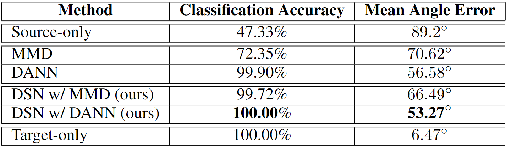

# 周报20210307

## 学习内容

- Domain Separation Networks (NIPS2016)

## 学习收获

### Domain Separation Networks (NIPS2016)

传统的监督学习需要大量的labeled data，人工标注非常费时费力，考虑使用合成的图像（synthetic）训练再使用DA进行迁移。现有的一些DA方法包括将一个domain representation映射到另一个domain或者提取一些domain无关的feature，文章认为寻找映射或者共享feature的方法忽略了域独有的特性，显式地对域自己的特点建模可以提升提取domain invariant feature的效果，因此文章考虑将image representation分成2个subspace（private和shared），并且使用partitioned representations去重建两个domain的image。

论文中定义了两种distribution difference，low-level包括噪声、解析度、亮度和颜色所造成的distribution difference，high-level则包括类别个数、物体种类和几何变换（如3D位置和姿势），并且论文假设source和target之间主要差异在low-level上，而在high-level上具有相似分布（但是个人认为在DA中，high-level的差异也是不能忽略的）。传统方法中，使用各种loss来减小source和target在shared representation上的差异，从而使得source上训练的classifier也可以对target feature正确分类，但是这样会引入一些shared noise（如背景），所以文章提取shared和private两部分feature（representation component）。

#### Method

模型对于source和target都产生两部分representation，分别为shared和private，使用增强两部分independence的loss和重建loss（确保private representation是所需要的，去除trivial solution）。文章指出这种情况下使用shared representation训练得到的classifier可以更好地generalize。

使用两个encoder分别得到shared和private representation，使用一个decoder进行image reconstruction，一个分类器用来进行task-specific的prediction，模型的整体结构如下：

在loss方面，每个domain里，shared和private之间存在difference loss，而两个domain的shared representation之间使用similarity loss去约束，总体objective如下：

$$
\mathcal{L}=\mathcal{L}_{\text {task }}+\alpha \mathcal{L}_{\text {recon }}+\beta \mathcal{L}_{\text {difference }}+\gamma \mathcal{L}_{\text {similarity }}
$$

task loss可以认为是cross entropy，reconstruction loss则使用的是scale-invariant MSE：

$$
\mathcal{L}_{\text {recon }}=\sum_{i=1}^{N_{s}} \mathcal{L}_{\text {si\_mse }}\left(\mathbf{x}_{i}^{s}, \hat{\mathbf{x}}_{i}^{s}\right)+\sum_{i=1}^{N_{t}} \mathcal{L}_{\text {si\_mse }}\left(\mathbf{x}_{i}^{t}, \hat{\mathbf{x}}_{i}^{t}\right)
$$

$$
\mathcal{L}_{\text {si\_mse }}(\mathbf{x}, \hat{\mathbf{x}})=\frac{1}{k}\|\mathbf{x}-\hat{\mathbf{x}}\|_{2}^{2}-\frac{1}{k^{2}}\left([\mathbf{x}-\hat{\mathbf{x}}] \cdot \mathbf{1}_{k}\right)^{2}
$$

使用scale-invariant MSE的好处是模型关注在reconstruct形状而不是色彩强度。

关于difference loss，期望shared feature和private feature是正交的（参考线性代数的线性无关），因此使用soft subspace orthogonality constraint：

$$
L_{\text {difference }}=\left\|\mathbf{H}_{c}^{s \top} \mathbf{H}_{p}^{s}\right\|_{F}^{2}+\left\|\mathbf{H}_{c}^{t^{\top}} \mathbf{H}_{p}^{t}\right\|_{F}^{2}
$$

其中$\mathbf{H}_{c}$每一行表示一个image的shared representation，$\mathbf{H}_{p}$每一行表示一个image的private representation。（其实是一个对向量组正交性的度量方法）

两个domain的shared representation上，需要使用similarity loss拉近domain feature的distribution（相当于传统的adaptation loss）。文章里使用的similarity metric包含DANN similarity和MMD similarity：

$$
\mathcal{L}_{\text {similarity }}^{\text {DANN }}=\sum_{i=0}^{N_{s}+N_{t}}\left\{d_{i} \log \hat{d}_{i}+\left(1-d_{i}\right) \log \left(1-\hat{d}_{i}\right)\right\}
$$

$$
\mathcal{L}_{\text {similarity }}^{\mathrm{MMD}}=\frac{1}{\left(N^{s}\right)^{2}} \sum_{i, j=0}^{N^{s}} \kappa\left(\mathbf{h}_{c i}^{s}, \mathbf{h}_{c j}^{s}\right)-\frac{2}{N^{s} N^{t}} \sum_{i, j=0}^{N^{s}, N^{t}} \kappa\left(\mathbf{h}_{c i}^{s}, \mathbf{h}_{c j}^{t}\right)+\frac{1}{\left(N^{t}\right)^{2}} \sum_{i, j=0}^{N^{t}} \kappa\left(\mathbf{h}_{c i}^{t}, \mathbf{h}_{c j}^{t}\right)
$$

其中$d_i$表示样本$i$的domain label，MMD loss则在source和target sample的shared encoding上计算，$\kappa(\cdot, \cdot)$为kernel function，在实验中文章使用了多个kernel $\kappa\left(x_{i}, x_{j}\right)=\sum_{n} \eta_{n} \exp \left\{-\frac{1}{2 \sigma_{n}}\left\|\mathbf{x}_{i}-\mathbf{x}_{j}\right\|^{2}\right\}$的linear combination作为总的MMD loss。

#### Experiment

在一组clean、synthetic的数据上训练，然后在real data上evaluate。在classification上使用的数据集包括MNIST、MNIST-M、GTSRB、SVHN，在3D pose estimation上使用数据集LINEMOD，以source only和target only分别作为accuracy的lower bound和upper bound。注意到文章没有使用Office数据集，说是Office数据集存在一些问题（可能是MSDA出现困难的原因）。

classification的实验结果如下：

3D pose estimation的实验结果如下：

## 启发/疑问

1. 仅仅使用shared feature是不够的，shared feature中可能存在一些不需要的shared noise，如图像的背景可能是多个domain共享但对分类不起作用，而private feature理论上不会包含shared信息，即可以过滤掉shared noise
