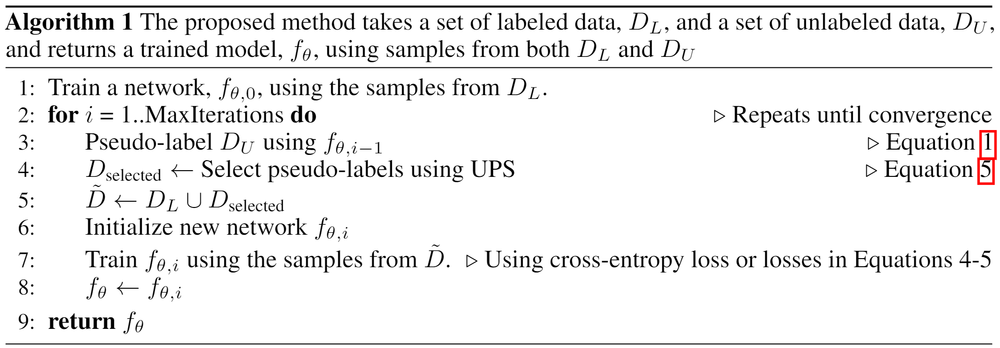
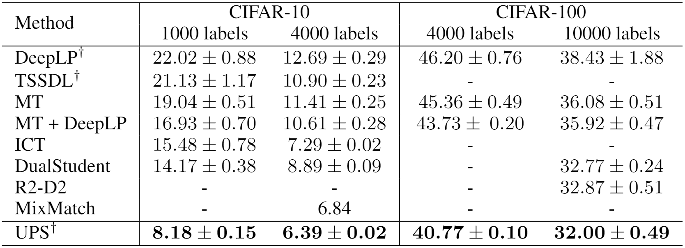
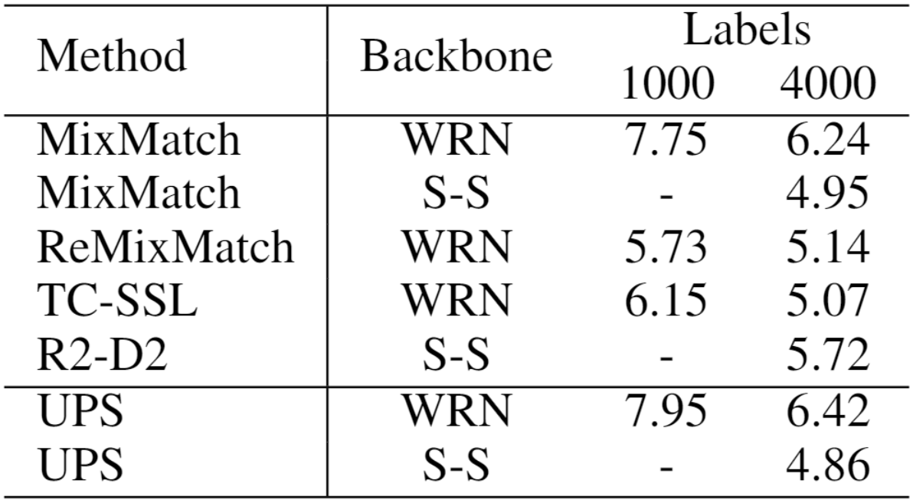
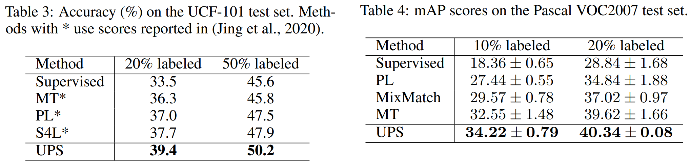
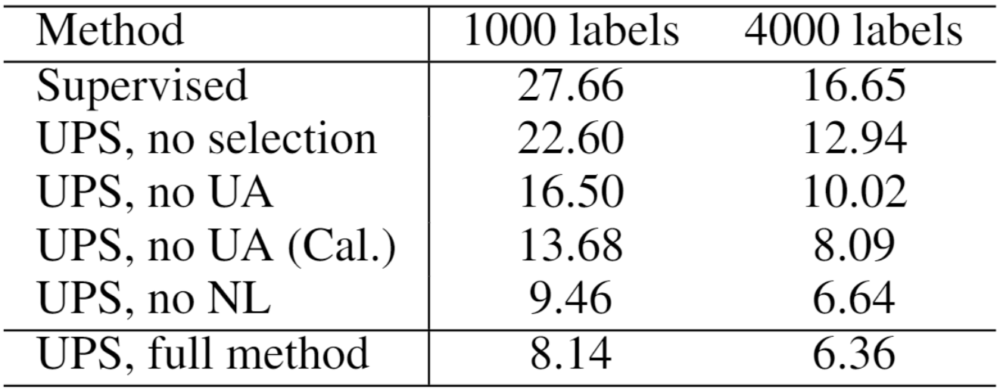
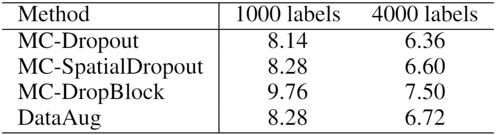

# 周报20210411

## 学习内容

- In Defense of Pseudo-Labeling: An Uncertainty-Aware Pseudo-Label Selection Framework for Semi-Supervised Learning (ICLR2021)

## 学习收获

### In Defense of Pseudo-Labeling: An Uncertainty-Aware Pseudo-Label Selection Framework for Semi-Supervised Learning (ICLR2021)

#### Motivation

在半监督图像分类任务里，有两个重要方法，分别是一致性正则化（consistency regularization）和伪标签（pseudo label）。在此前的半监督学习研究里，一致性正则化占据着主导地位，而其往往依赖于大量先导工作，如对于特定数据集的分类任务，需要花费大量精力去寻找域特化（domain specific）的数据增强措施，而这些data augmentation方法与数据集具有高度相关性，不同数据集需要采用不同的数据增强。更进一步的是，对于多模态的数据，如视频，数据增强的手段有限，一致性正则化的效果和泛化性就大打折扣。

而对于传统的伪标签方法，无论样本被贴上的伪标签是否是正确的，这些标签都被认为是真实（高置信度）的标签而参与训练，如果大量无标注的数据被打上错误的伪标签，将会给训练带来大量噪声样本，模型的性能收到严重影响。因此，对网络的输出进行校正是不可或缺的，并且仅仅凭借网络softmax层的输出的概率估计作为置信度的唯一依据是远远不够的，由以上几点出发，这篇文章参考深度网络不确定性估计的技术（MC dropout），将输出值的不确定性作为置信度的另一个依据，将其与softmax概率结合起来筛选可靠的伪标签。

文章的另一个贡献在于将negative learning的思路也应用在了伪标签筛选上，对于一个样本，尽管不能非常可靠地指出它属于哪一类，但却可以比较确定它不属于哪一类，可以利用这一信息降低伪标签的噪声，起到校正模型的作用。

作者提出了一个关注不确定性的伪标签选择框架（Uncertainty-Aware Pseudo-Label Selection Framework, UPS），结合了不确定性估计和negative learning技术，在传统的图像分类半监督学习上达到了一致性正则化方法所获得的SOTA，并且在视频的半监督分类和图片多标签半监督分类领域取得了比一致性正则化方法更好的效果。

#### Method

##### 结合positive learning和negative learning的伪标签筛选方法

传统的伪标签往往通过设定一个概率阈值，当分类概率超过这个阈值时，就给样本打上对应的伪标签用于训练，或者直接使用分类概率最大值所对应的类别作为伪标签来使用，数学形式如下：

$$
\tilde{y}_{c}^{(i)}=\mathbb{1}\left[p_{c}^{(i)} \geq \gamma\right]
$$

其中$\gamma$为所设定的伪标签概率阈值。

上述过程为positive learning的伪标签计算方法，考虑到既然可以用概率来预估样本属于某类（positive learning），那么也可以用概率来判断样本不属于某类（negative learning），因此文章提出以下的伪标签计算方法：

$$
g_{c}^{(i)}=\mathbb{1}\left[p_{c}^{(i)} \geq \tau_{p}\right]+\mathbb{1}\left[p_{c}^{(i)} \leq \tau_{n}\right]
$$

其中$\tau_p$和$\tau_n$分别为positive learning和negative learning的选择阈值（$\tau_p \geq \tau_n$），以此得到negative learning的pseudo label（但是从数学形式上看positive label和negative label是一样的，即没有机制告诉模型这个label到底是positive还是negative）。

对于单标签分类任务，可以仿照交叉熵，得到适用于negative learning pseudo label的交叉熵损失：

$$
L_{\mathrm{NCE}}\left(\tilde{\boldsymbol{y}}^{(i)}, \hat{\boldsymbol{y}}^{(i)}, \boldsymbol{g}^{(i)}\right)=-\frac{1}{s^{(i)}} \sum_{c=1}^{C} g_{c}^{(i)}\left(1-\tilde{y}_{c}^{(i)}\right) \log \left(1-\hat{y}_{c}^{(i)}\right)
$$

将其与传统的交叉熵损失组合起来，得到适用于positive pseudo label和negative pseudo label的损失函数，该损失函数同样适用于多标签分类任务（？）：

$$
L_{\mathrm{BCE}}\left(\tilde{\boldsymbol{y}}^{(i)}, \hat{\boldsymbol{y}}^{(i)}, \boldsymbol{g}^{(i)}\right)=-\frac{1}{s^{(i)}} \sum_{c=1}^{C} g_{c}^{(i)}\left[\tilde{y}_{c}^{(i)} \log \left(\hat{y}_{c}^{(i)}\right)+\left(1-\tilde{y}_{c}^{(i)}\right) \log \left(1-\hat{y}_{c}^{(i)}\right)\right]
$$

##### 基于不确定性估计的伪标签筛选方法

在伪标签筛选过程中，希望能利用网络模型预测的不确定性来给网络的输出进行校正（calibration），因此需要分析网络校正与模型对个体样本输出不确定性之间的关系。论文采用了expected calibration error (ECE)作为衡量网络校正的指标，其计算方法如下：

$$
E C E=\sum_{l=1}^{L} \frac{1}{|D|}\left|\sum_{x^{(i)} \in I_{l}} \max _{c} \hat{y}_{c}^{(i)}-\sum_{x^{(i)} \in I_{l}} \mathbb{1}\left[\arg \max _{c} \hat{y}_{c}^{(i)}=\underset{c}{\arg \max } \tilde{y}_{c}^{(i)}\right]\right|
$$

ECE的思想是将数据集$D$等分为$L$份，$I_l$是第$l$份中样本，每一份中的校正偏差（calibration gap），可以通过计算其平均置信度和平均准确率之间的差异来得到，计算各个等份的校正偏差的均值，作为平均校正偏差（ECE）。

文章使用MC dropout计算出网络输出的不确定性，通过分析得到不确定性与ECE是呈正相关的，即打伪标签时模型输出的不确定性越低，网络校正的误差就越小（感觉这一段分析是多余的，不确定性显然跟误差是呈正相关的，在后面的objective里貌似也没有用到ECE，不太明白文章这一部分的目的），也就是说可以通过计算网络输出的不确定性来判断所生成的伪标签是否可靠。

将上述思想融合进前面的损失函数里，使用不确定性的阈值来筛选伪标签，得到如下损失函数：

$$
g_{c}^{(i)}=\mathbb{1}\left[u\left(p_{c}^{(i)}\right) \leq \kappa_{p}\right] \mathbb{1}\left[p_{c}^{(i)} \geq \tau_{p}\right]+\mathbb{1}\left[u\left(p_{c}^{(i)}\right) \leq \kappa_{n}\right] \mathbb{1}\left[p_{c}^{(i)} \leq \tau_{n}\right]
$$

其中$u(p)$表示不确定性估计，$\kappa_p$和$\kappa_n$则表示不确定性的阈值。

根据上述损失函数，模型的训练过程如下：

注意到上述算法不是end-to-end trainable的。

#### Experiments

在传统的半监督图像分类任务上进行对比，其结果如下：

可以看到UPS在CIFAR-10和CIFAR-100上都取得了优于SOTA的性能。

使用不同的骨干网络（backbone）进行对比试验，UPS也显著优于其它方法：

如文章的motivation里所说，相比于依赖特定数据集的数据增强的一致性正则化方法，UPS更适合于视频分类任务，并且在多标签分类任务上也取得了SOTA的结果：

作者也进行了消融学习以说明模型各个模块的作用，结果如下：

消融的结果说明基于uncertainty的筛选方法实际上起到了关键的作用，相比而言negative learning的作用不是很明显。

文章还使用不同的uncertainty metric进行了实验，最终结果接近，以说明模型性能的提升不是因为uncertainty metric，而是UPS另外提出的筛选策略，实验结果如下：

#### 小结

这篇论文本质上是两篇文章方法的一个综合，分别是negative learning和MC dropout，我觉得亮点在于这两种方法在不同的方面提高了伪标签的可信度。negative learning从反面的角度过滤掉可能被误分类的噪声样本，MC dropout导出的不确定性估计则可以用来评价所生成的positive和negative pseudo label的可靠性，两种方法结合起来，再通过随机初始化的迭代训练，使得最终伪标签具有较高的可信度。

## 启发/疑问

1. 文章里的negative learning是一个比较新颖的做法（尽管从消融学习上看效果不明显），通过negative learning来增强伪标签可靠性的方法可以深入讨论，但是文章中的positive label没有和negative label区分开来，后续可以考虑在这上面挖掘
2. 把positive和negative label的思路推广，可以使用soft label作为threshold
3. 关于模型的不确定性估计，文章采用了MC dropout，这个在以前没有接触过，还有其它的uncertainty metric，可以用来提高pseudo label的可信度
