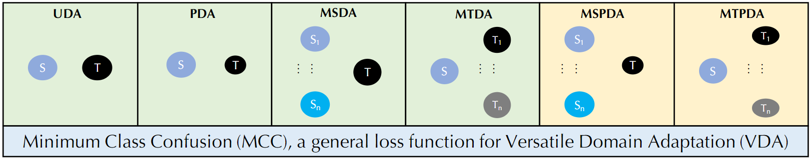
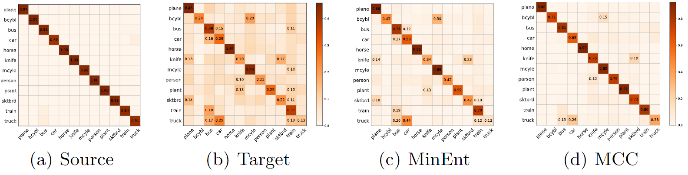
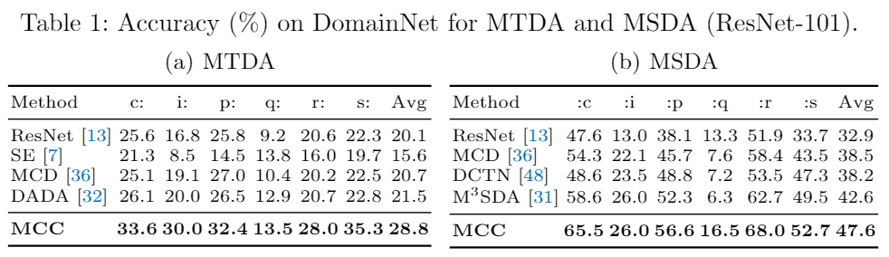
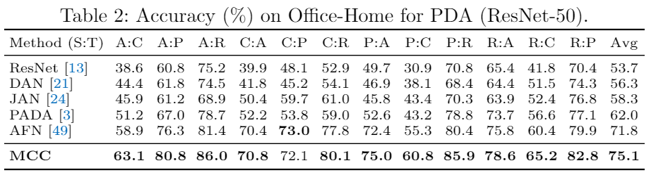
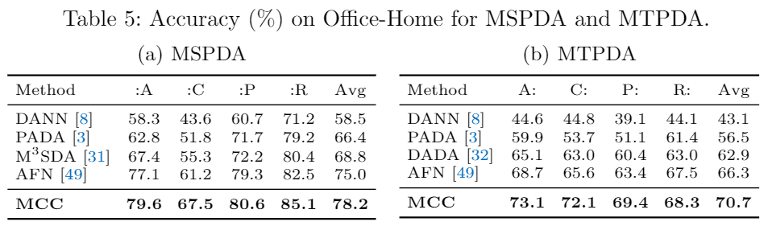
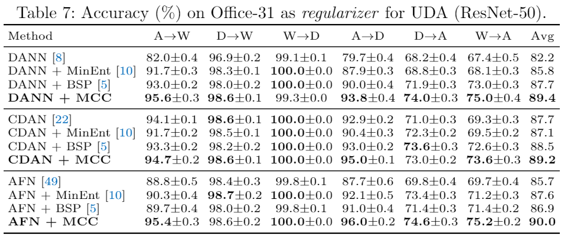
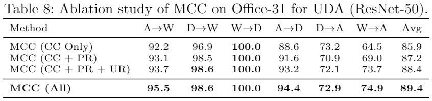
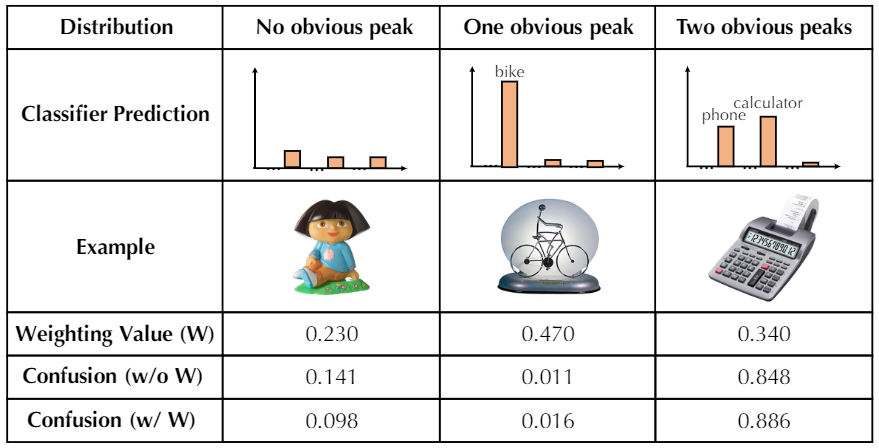

# 周报20210418

## 学习内容

- Minimum Class Confusion for Versatile Domain Adaptation (ECCV2020)

## 学习收获

### Minimum Class Confusion for Versatile Domain Adaptation (ECCV2020)

CVPR rebuttal的时候审稿人提到的important baseline，论文提出了一种versatile domain adaptation，可以适用于多种场景的DA问题，包括简化情况下的MSPDA。在以往的研究中，很少有关于类别迷惑性的工作，论文指出减小target的pair-wise class confusion可以有效提高DA的transfer gain，于是提出了一个通用的Minimum Class Confusion (MCC) loss作为VDA的损失函数。在versatile的设置中，模型不经修改就可以应用在多种情形：open set、partial set、multi-source、multi-target，以及更为复杂的MSPDA和MTPDA。

文章的出发点在于，传统方法没有在分类器的输出上设置metric，导致某些相似类别存在confuse的现象（即相似类别的图像容易被混淆），这个问题无论是在普通模型还是DA模型中都存在。因此文章设计了一种pair wise的confuse metric，用来判断分类器对于相似类别的辨别能力，以最小化class confusion（优化器将正确类别和相似类别弄混的趋势）作为优化目标。下图给出了在source上训练完的模型放到target上后产生的class confusion：

可以看到，尽管source上class confusion很小，但无论是没有DA的普通模型还是传统的DA模型，都在target上出现了较大的class confusion，而文章提出的MCC模型在target上的class confusion较小，并且文章指出更小的class confusion可以获得更大的transfer gain。

#### Method

DNN可能会产生overconfident的prediction，导致很难直接得到class confusion（？），因此使用了temperature rescaling，用来减小overconfident prediction的negative effect，由此得到第i个instance属于第j个类别的修正后（recalibrate）的概率为：

$$
\widehat{Y}_{i j}=\frac{\exp \left(Z_{i j} / T\right)}{\sum_{j^{\prime}=1}^{|\mathcal{C}|} \exp \left(Z_{i j^{\prime}} / T\right)}
$$

其中$Z_{i j}$是classifier的logit output，$T$表示用于rescaling的temperature超参，可以看到当$T$取1时，该公式可退化成softmax的形式。

$\widehat{Y}_{i j}$反映的其实是第$i$个样本与第$j$个class之间的联系，可以使用classifier的prediction与其的转置相乘得到class的correlation：

$$
\mathbf{C}_{j j^{\prime}}=\widehat{\mathbf{y}}_{\cdot j}^{\top} \widehat{\mathbf{y}}_{\cdot j^{\prime}}
$$

文章称这个只是class confusion的一个粗略的估计，这个class correlation描述的是分类器同时将$B$个样本分类到第$j$和第$j'$类的概率，高可信度的错误分类样本实际上不会影响correlation（因为被误分类的样本仍然是被当作正确样本，计算的confusion位于对角线上）。

由于不同的example的权重实际上是不同的（从衡量class confusion的角度去考虑），当预测的概率接近均匀分布（没有对于某一类的明显peak），我们认为分类器对于这类样本处于ignorant的状态（？），相对的，如果prediction出现了多个peak，说明分类器在这几个类别上进行的是模糊的分类（即不确定的分类）。显然，上述两种情况的样本是分类器需要额外注意的，因此需要引入一个基于不确定度的weighting mechanism，在这里，更高certainty的样本更适合用来计算class confusion，可以使用entropy来进行uncertainty的估计（这个方法比较常见），对于样本$i$，其不确定性定义如下：

$$
H\left(\widehat{\mathbf{y}}_{i} .\right)=-\sum_{j=1}^{|\mathcal{C}|} \widehat{Y}_{i j} \log \widehat{Y}_{i j}
$$

此外，作者还使用了一个softmax进行entropy的transformation（这里没看明白原因，是为了凸显概率分布的差异么？）：

$$
W_{i i}=\frac{B\left(1+\exp \left(-H\left(\widehat{\mathbf{y}}_{i} .\right)\right)\right)}{\sum_{i^{\prime}=1}^{B}\left(1+\exp \left(-H\left(\widehat{\mathbf{y}}_{i^{\prime}}\right)\right)\right)}
$$

其中$W_{i i}$表示的是第$i$个样本作为modelling class confusion的probability（大概指的是样本权重），而$W$是对应的对角（diagonal）矩阵，这里注意到文章使用的是entropy的opposite value（相反数）作为certainty，结果加1是为了获得更强（heavier-tailed）的权重分布，目的是highlight那些确定的样本，同时避免其它样本被过于penalized。为了获得好的scaling（每个样本的平均权重是1），使用rescale的方法使得在一个batch size $B$中的样本概率的总和恰好等于$B$。添加weighting mechanism后，class confusion的定义如下：

$$
\mathbf{C}_{j j^{\prime}}=\widehat{\mathbf{y}}_{\cdot j}^{\top} \mathbf{W} \widehat{\mathbf{y}}_{\cdot j^{\prime}}
$$

论文指出上面的方法只适用于mini-batch的SGD optimization，当类别数量很大时，在每个batch中会出现严重的class imbalance，因此文章采用了random walk中常用的一种类别均一化（category normalization）技巧：

$$
\widetilde{\mathbf{C}}_{j j^{\prime}}=\frac{\mathbf{C}_{j j^{\prime}}}{\sum_{j^{\prime \prime}=1}^{|\mathcal{C}|} \mathbf{C}_{j j^{\prime \prime}}}
$$

经过class normalization后，class confusion变得平滑（neat）了，因此当两个类具有较高的class confusion时，模型可以从一个class“行走”到另一个class（这样做是否会额外产生误分类？或者反过来想，当一个class可以walk到另一个class时，说明两者之间具有较高confusion？）。

根据以上推导，得到的class confusion metrix $\widetilde{\mathbf{C}}_{j j^{\prime}}$可以描述$j$和$j'$类之间的pair-wise class confusion，只需要优化不同类之间的confusion即可：

$$
L_{\mathrm{MCC}}\left(\widehat{\mathbf{Y}}_{t}\right)=\frac{1}{|\mathcal{C}|} \sum_{j=1}^{|\mathcal{C}|} \sum_{j^{\prime} \neq j}^{|\mathcal{C}|}\left|\widetilde{\mathbf{C}}_{j j^{\prime}}\right|
$$

由于上式是经过normalization的，消除类间confusion相当于最大化类内confusion，文章指出这个loss是general的，可以直接添加到现有方法中。

#### Versatile Domain Adaptation

文章讨论了在不同问题设置的情形下，MCC的通用objective function，其形式如下：

$$
\min _{F, G} \mathbb{E}_{\left(\mathbf{x}_{s}, \mathbf{y}_{s}\right) \in \mathcal{S}} L_{\mathrm{CE}}\left(\widehat{\mathbf{y}}_{s}, \mathbf{y}_{s}\right)+\mu \mathbb{E}_{\mathbf{X}_{t} \subset \mathcal{T}} L_{\mathrm{MCC}}\left(\widehat{\mathbf{Y}}_{t}\right)
$$

按照作者的意思，这篇文章里没有使用domain alignment，所以可以直接解决partial set中misalignment的问题。对于multi source和multi target的问题，MCC仅仅是将不同source domain或者target domain混合到了一起，论文的意思是这里不需要考虑misalignment和domain shift，因为所有的loss计算都基于class confusion。

此外，文章还提到了MCC的方法和现有方法是正交的，即MCC与现有方法形成互补的关系（这一点大概是文章最大的contribution），文章中选择了一种domain-adversarial training的loss作为与MCC搭配的基本模型。

#### Experiments

实验分为两个部分，MCC单独作为一个approach进行多种场景的VDA实验，以及MCC作为一个附加的结构，添加到其它approach上的实验。

在MTDA和MSDA实验中，如前所述，可以直接把domain进行merge，所得结果如下：

可以看到MCC无论是在MTDA还是MSDA，都取得了超过SOTA的结果。

在PDA的实验中，MCC也取得了非常明显的提升：

MSPDA和MTPDA的实验在文章里讨论较少，只给出了office-home数据集的实验结果（文章中没有指出所用的backbone是什么）：

在分析实验里，把MCC作为一个附加结构添加到其它approach里，对比的实验结果如下：

可以看到，添加了MCC之后，DANN、CDAN和AFN的方法都有了比较显著的效果提升，并且MCC比之前的一些与domain alignment无关的方法（entropy minimization，MinEnt和Batch Spectral Penalization，BSP）所产生的效果提升更为明显。

对于MCC的消融实验结果如下：

从消融的结果可以看出文章使用的Probability Re-scaling（PR）、Uncertainty Re-weighting（UR）都产生了一定的效果提升（但文章没有说明消融实验是否包括category normalization）。

关于uncertainty re-weighting，论文里也给出了比较清晰的解释：

图中的第一种情形是不适合作为class confusion的，第二种情况尽管是误分类，但产生的class confusion很小，不影响class confusion的计算，只有第三种情况（出现多个peak），才是class confusion所需要关注的地方，经过re-weighting后可以看到，第三种情况所导出的confusion更为明显了。

## 启发/疑问

1. 以往的方法一般在feature上进行similarity的分析，而很少在classifier的输出上分析class confusion，后续可以在classifier的output上设计loss
2. 关于class confusion，有之前没有注意到的细节的地方，如使用temperature rescaling的方法替代softmax作为概率输出、对分类概率再次进行uncertainty weighting、和对confusion matrix进行normalization的操作等，所给的代码里还使用了lr scheduling等训练的trick
3. 之前没有考虑到class imbalance的问题，为什么category normalization就能解决class imbalance？文章的解释是通过这个操作使得class distribution变成平滑的
4. 文章提到了一种称为random walk（随机行走）的算法，使用了其中的category normalization，而random walk问题本身感觉上和分类没有什么联系，这里需要再看一些资料
5. 如果考虑alignment的方法，有两个优化目标：鼓励正确分类，惩罚错误分类（confusion），正确分类的概率可以用目标域特征与源域特征之间的分类器soft label加权后的domain差异去衡量，错误分类则利用目标域的class之间的confusion，最终的objective形式应当是正确分类metric加上confusion matrix对角线上的元素再减去非对角线的元素
6. 目前较新的大多数方法都关注在class上，即classification的问题，而DA的最终目的是减小域差异，跟特定的任务不应该有过多联系，感觉传统的MMD和CORAL等loss才是更为general的approach，MCC只是做到了classification任务里不同模型结构和问题设置的versatile
7. 考虑多个数据集（domain）之间的cross training（或者说domain confusion？），当MSDA训练收敛时，多个source domain应该在feature map上被映射成一个domain，此时应该最小化domain之间的confusion，或者考虑让G和C对抗训练来优化模型弄混domain的可能性
8. 更进一步的，在训练的后期（多个source domain融合后，可以设置一个阈值来判断）就在一个batch中，将多个domain混在一起训练，以提高模型对不同domain的泛化能力
9. 在调参实验的时候，文章提到了一个deep embedded validation的方法，也公开了代码，可以参考
