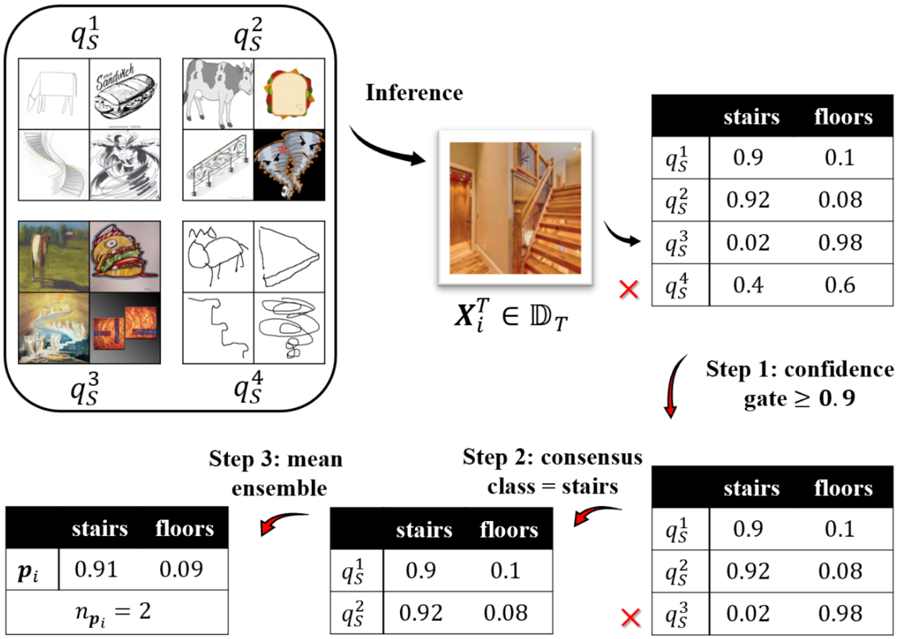

# 周报20210425

## 学习内容

- Unsupervised Multi-Source Decentralized Domain Adaptation via Knowledge Distillation (ICML2021)
<!-- - Instance-Invariant Domain Adaptive Object Detection via Progressive Disentanglement (TPAMI2021) -->

## 学习收获

### Unsupervised Multi-Source Decentralized Domain Adaptation via Knowledge Distillation (ICML2021)

这篇文章研究的是MSDA中去中心化（decentralized）的情况，按文章意思是多个source并不能directly地获得到，说是会忽略privacy-preserving policy（隐私保护政策？？），这个问题具有如下三个challenge：

1. 最小化domain差异需要使用source和target之间的pair-wise distance，而此时source data是unavailable的（？）
2. 由于通信的cost和privacy security上的限制，现有的MSDA方法很难应用在这个情况中，如domain adversarial training
3. 由于user不能确保数据的质量，一些不相关和带有恶意的数据有可能会出现，产生negative transfer

上面的意思大概是说在数据量非常大并且不同数据集之间存在隐私保护的情况下，不能把所有数据都收集到一起进行集中训练（centralized），而只能单独对每个domain进行分析（decentralized），在这个假设下，将无法计算pair-wise的domain distance，大多数DA方法也就不能使用了，所以文章提出了一种基于知识蒸馏的去中心化领域适应模型（Knowledge Distillation based Decentralized Domain Adaptation, KD3A）。所提出的KD3A模型对于negative transfer有更好的鲁棒性，并且极大地降低了communication cost（与其它decentralized MSDA方法相比）。

#### Method

KD3A包含三个部分，分别是knowledge vote（获得high-quality domain consensus），consensus focus（用于动态赋权，识别不相关和恶意的source domain），batchnorm MMD（decentralized优化函数）。

##### Consensus Knowledge

Consensus Knowledge可以利用不同source domain的分类器输出的平均值来得到：$\mathbf{p}_{i}=\frac{1}{K} \sum_{k=1}^{K} q_{S}^{k}\left(\mathbf{X}_{i}^{T}\right)$，由此利用共享的知识构成一个新的domain：

$$
\mathbb{D}_{S}^{K+1}=\left\{\left(\mathbf{X}_{i}^{T}, \mathbf{p}_{i}\right)\right\}_{i=1}^{N_{T}}
$$

其中$K$表示原始source domain的个数，这个domain的risk（或者理解为error rate）如下：

$$
\epsilon_{\mathbb{D}_{S}^{K+1}}(h)=\underset{(\mathbf{X}, \mathbf{p}) \sim \mathbb{D}_{S}^{K+1}}{\operatorname{Pr}}\left[h(\mathbf{X}) \neq \arg _{c} \max \mathbf{p}_{c}\right]
$$

上面consensus knowledge的提取过程如下图所示（其实就是把classifier的输出做了下平均，文中称为ensemble集成）：

利用这个新的source domain，就可以使用knowledge distilling的loss进行训练了：

$$
L^{\mathrm{kd}}\left(\mathbf{X}_{i}^{T}, q_{S}^{K+1}\right)=D_{\mathrm{KL}}\left(\mathbf{p}_{i} \| q_{S}^{K+1}\left(\mathbf{X}_{i}^{T}\right)\right)
$$

这里的$q_S^{K+1}$的意思应该是新的source domain也有自己的classifier，这个是新domain的classifier输出，将其与其它source domain的预测均值计算的KL divergence作为knowledge distillation的loss。

##### Knowledge Vote：获得好的consensus

如果一个consensus knowledge被更多的source domain以较高的confidence（如0.9以上）支持，说明这个更有可能是true label，可以基于这个想法对consensus knowledge中的平均预测概率进行筛选，称为knowledge vote，包括三个步骤，其方法如下图所示：

confidence gate中，设置一个概率阈值，只保留预测概率高于这个阈值的source domain，根据保留的source domain，对图像的类别进行vote，与vote结果不同的source domain再一次被过滤掉，对于剩下的这些domain，求分类概率的平均值作为ensemble的模型（即新的source domain），同时记录support这个ensemble的domain个数，记为$n_{\mathbf{p}_{i}}$，作为样本的权重。

对于在confidence gate中就被完全过滤的样本（即所有source domain都没有预测出超过阈值的概率），直接进行mean ensemble，并对其设置一个很小的权重，如$0.001$。

经过上述knowledge vote，可以获得一个新的domain（较好的consensus knowledge）：$\mathbb{D}_{S}^{K+1}=\left\{\left(\mathbf{X}_{i}^{T}, \mathbf{p}_{i}, n_{\mathbf{p}_{i}}\right)\right\}_{i=1}^{N_{T}}$，其中$n_{\mathbf{p}_{i}}$是样本的权重，对应的knowledge distillation loss如下：

$$
L^{\mathrm{kv}}\left(\mathbf{X}_{i}^{T}, q\right)=n_{\mathbf{p}_{i}} \cdot D_{\mathrm{KL}}\left(\mathbf{p}_{i} \| q\left(\mathbf{X}_{i}^{T}\right)\right)
$$

与普通的ensemble对比，knowledge vote的方法对于high confidence并且有多个domain support的样本赋予了较高的权重，得到的是high quality的consensus knowledge。

##### Consensus Focus：减小negative transfer

显然，不同的数据集（source domain）对于task的重要性是不同的，如果样本的重要性相同，那么domain的权重应当与数据量成正比，如果重要性不同，可以考虑使用如下基于H-divergence的方式来给domain重新赋权：

$$
\boldsymbol{\alpha}_{k}=\frac{N_{k} e^{-d_{\mathcal{H}}\left(\mathbb{D}_{S}^{k}, \mathbb{D}_{T}\right)}}{\sum_{k} N_{k} e^{-d_{\mathcal{H}}\left(\mathbb{D}_{S}^{k}, \mathbb{D}_{T}\right)}}
$$

而这篇文章讨论的是decentralization的情况，上面的式子需要对source data的direct access，不适合文章所讨论的情况，并且H-divergence只描述了input space上的domain similarity，却没有利用label information，并且对于恶意的domain没有辨识能力（尽管我觉得在knowledge vote的时候，这些malicious domain就不会被选上，当然也可能出现只有malicious domain超过阈值的情况），因此文章提出consensus focus的方法来对那些能够提取到高质量consensus的domain赋予较高的权重，对于提取到bad consensus的domain则进行penalize，为完成上述目的，首先需要定义一个consensus的好坏程度（quality）。

对于一组source domain $\mathcal{S}$（domain的集合），我们希望估计部分source domain组合$\mathcal{S^{\prime}}$（取其中几个source domain）产生的consensus的quality，可以想到的是，当一个consensus被多个domain以较高概率support时，这个consensus quality是好的，对于每个目标域的样本$\mathbf{X}_{i}^{T} \in \mathbb{D}_{T}$所得到的consensus knowledge $\left(\mathbf{p}_{i}\left(\mathcal{S}^{\prime}\right), n_{\mathbf{p}_{i}}\left(\mathcal{S}^{\prime}\right)\right)$，可以定义consensus的quality为$n_{\mathbf{p}_{i}}\left(\mathcal{S}^{\prime}\right) \cdot \max \mathbf{p}_{i}\left(\mathcal{S}^{\prime}\right)$，对应总的consensus quality如下：

$$
Q\left(\mathcal{S}^{\prime}\right)=\sum_{\mathbf{X}_{i}^{T} \in \mathbb{D}_{T}} n_{\mathbf{p}_{i}}\left(\mathcal{S}^{\prime}\right) \cdot \max \mathbf{p}_{i}\left(\mathcal{S}^{\prime}\right)
$$

接着计算各个domain对这个quality的贡献程度，借助consensus quality，将consensus focus定义为（用于衡量某一个source domain对这个quality的贡献）：

$$
\mathrm{CF}\left(\mathbb{D}_{S}^{k}\right)=Q(\mathcal{S})-Q\left(\mathcal{S} \backslash\left\{\mathbb{D}_{S}^{k}\right\}\right)
$$

对于所生成的consensus source domain，可以利用数据量的大小来设置权重：

$$
\boldsymbol{\alpha}_{K+1}=\frac{N_{T}}{\sum_{k=1}^{K} N_{k}+N_{T}}
$$

而对于原先的source domain，则使用CF来进行加权：

$$
\boldsymbol{\alpha}_{k}^{\mathrm{CF}}=\left(1-\boldsymbol{\alpha}_{K+1}\right) \cdot \frac{N_{k} \cdot \mathrm{CF}\left(\mathbb{D}_{S}^{k}\right)}{\sum_{k=1}^{K} N_{k} \cdot \mathrm{CF}\left(\mathbb{D}_{S}^{k}\right)}
$$

##### BatchNorm MMD：去中心化的$\mathcal{H}$-divergence优化策略

原先的centralized方法利用FC层提取得到特征，并在source和target的feature map上计算MMD来优化域差异，在decentralized的问题里，sample不能直接获得，并且文章指出直接使用high-level的feature有可能会损失细节上的2D信息（如果使用的是CNN，应该能保留图像信息，没太明白这里的意思），因此文章提出使用每一个BatchNorm层的mean和variance参数在不使用data的情况下来优化H-divergence。

对于一个feature map $\boldsymbol{}{\pi}$，BatchNorm层可以表示成如下形式：

$$
\mathrm{BN}(\boldsymbol{\pi})=\gamma \cdot \frac{\boldsymbol{\pi}-\mathbb{E}(\boldsymbol{\pi})}{\sqrt{\operatorname{Var}(\boldsymbol{\pi})}}+\beta
$$

其中$(\mathbb{E}(\boldsymbol{\pi}), \operatorname{Var}(\boldsymbol{\pi}))$在训练的过程中被确定。假设模型包含$L$个BatchNorm层，第$l$层的feature表示为$\boldsymbol{}{\pi}_l$，考虑一个二次型（quadratic）的kernel $\kappa\left(\mathbf{X}^{S}, \mathbf{X}^{T}\right)=\left(\left\langle\boldsymbol{\pi}_{l}^{S}, \boldsymbol{\pi}_{l}^{T}\right\rangle+\frac{1}{2}\right)^{2}$，其MMD距离可表示为如下形式（？）：

$$
\begin{aligned}
d_{\mathrm{MMD}}^{\kappa}\left(\mathbb{D}_{S}^{k}, \mathbb{D}_{T}\right) &=\left\|\mathbb{E}\left(\boldsymbol{\pi}_{l}^{k}\right)-\mathbb{E}\left(\boldsymbol{\pi}_{l}^{T}\right)\right\|_{2}^{2} \\
&+\left\|\mathbb{E}\left[\boldsymbol{\pi}_{l}^{k}\right]^{2}-\mathbb{E}\left[\boldsymbol{\pi}_{l}^{T}\right]^{2}\right\|_{2}^{2}
\end{aligned}
$$

计算上面的loss所需要的数据均可通过BatchNorm的mean和variance参数得到，因此实现了decentralize，训练的loss如下：

$$
\sum_{l=1}^{L} \sum_{k=1}^{K+1} \boldsymbol{\alpha}_{k}\left(\left\|\mu\left(\boldsymbol{\pi}_{l}^{T}\right)-\mathbb{E}\left(\boldsymbol{\pi}_{l}^{k}\right)\right\|_{2}^{2}+\left\|\mu\left[\boldsymbol{\pi}_{l}^{T}\right]^{2}-\mathbb{E}\left[\boldsymbol{\pi}_{l}^{k}\right]^{2}\right\|_{2}^{2}\right)
$$

其中$\left(\boldsymbol{\pi}_{1}^{T}, \ldots, \boldsymbol{\pi}_{L}^{T}\right)$表示target model中BatchNorm层的feature，训练过程中，使用每个batch的平均值$\mu$来估计数学期望$\mathbb{E}$。

模型的训练过程如下：

#### Experiments

对于MSDA问题，文章在Digit Five，Office-Caltech10和DomainNet上进行了实验，其结果分别如下：

可以看到KD3A在DomainNet上的表现非常突出，部分原因在于DomainNet上存在quickdraw这种domain shift非常大的domain，在KD3A中，这个domain可以被认为是malicious的，KD3A可以通过减小这个domain的权重来减轻negative transfer。

消融学习的结果如下：

可以看到，knowledge vote起到了较为主要的作用，说明使用vote的方法生成consensus可以较好地进行knowledge distillation。

论文其余的实验关注点在于poisoning attack、communication cost和privacy security，这不是MSDA关注的重点，所以这里不过多描述。

#### 小结

这篇文章提出了一种利用知识蒸馏实现去中心化的MSDA的模型KD3A，包含三个主要模块，分别是knowledge vote（用于产生较好的consensus knowledge）、consensus focus（识别malicious domain，减小negative transfer）和BatchNorm MMD（去中心化的MMD）。对于普通的MSDA问题而言，knowledge vote和consensus focus能够极大地提升领域适应的效果，而BatchNorm MMD主要考虑的是decentralization的问题，不是MSDA所关注的内容。

<!-- ### Instance-Invariant Domain Adaptive Object Detection via Progressive Disentanglement (TPAMI2021) -->

## 启发/疑问

1. 感觉privacy leakage等decentralization的问题并不是MSDA研究的重点，未来研究的方向还是应该放在centralized training上
2. 对于数据量不同的domain，需要考虑不同的权重，对于数据可靠性不同的domain，也需要考虑使用不同的权重来避免negative transfer
3. 使用knowledge vote或者knowledge distilling的方法可以获得一个生成的domain，这个domain实际上反映了多个source domain对于target sample的共识
4. KD3A中对不同domain根据consensus quality进行赋权的方式可以参考，consensus focus的方式很有新意
