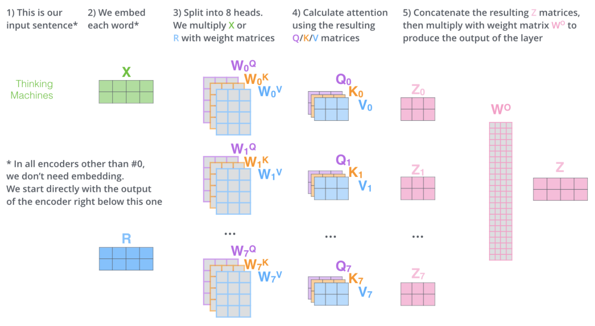
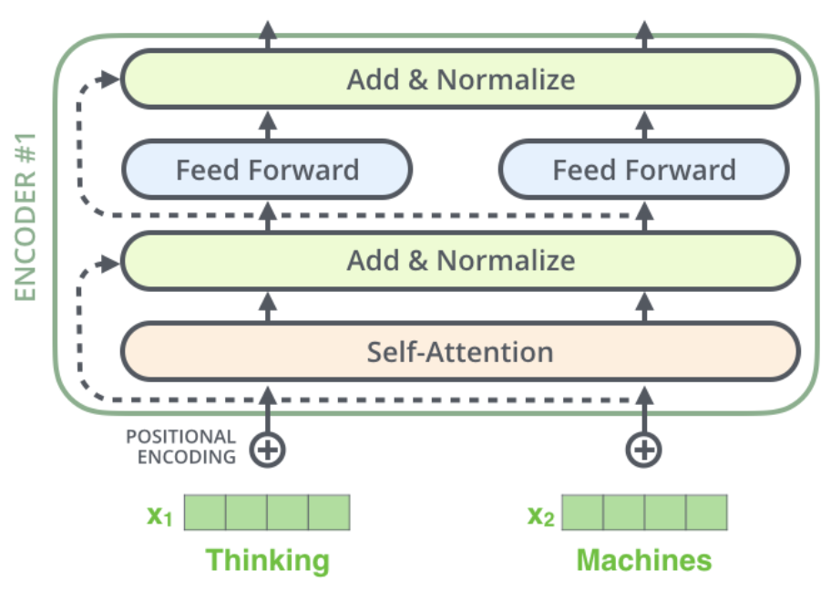
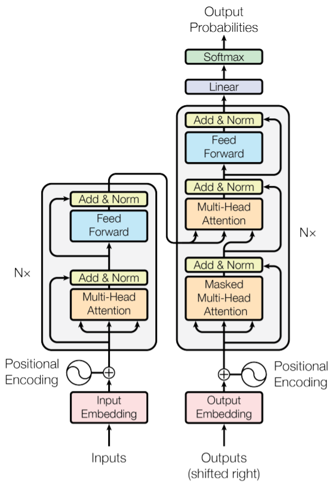
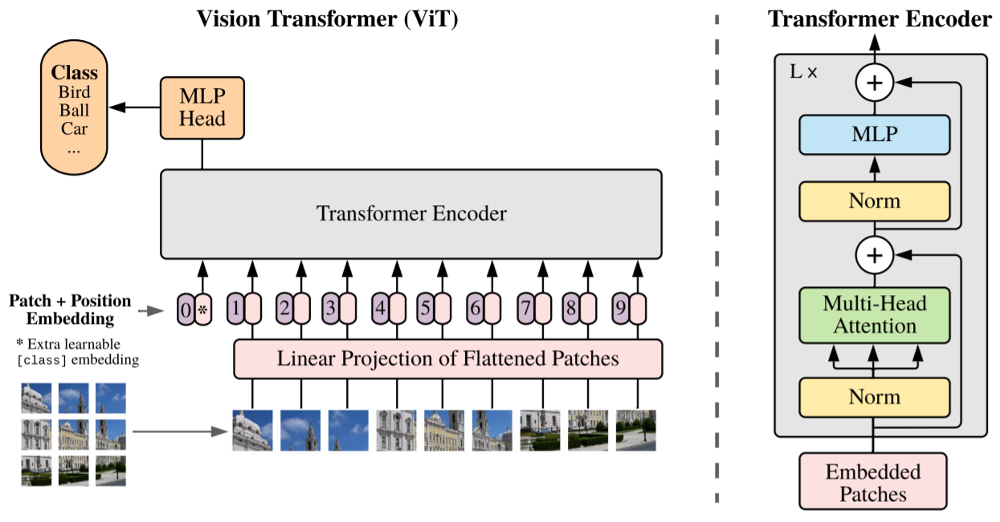
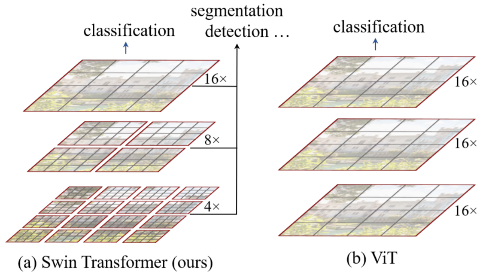
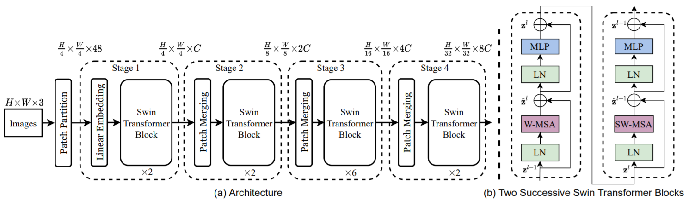
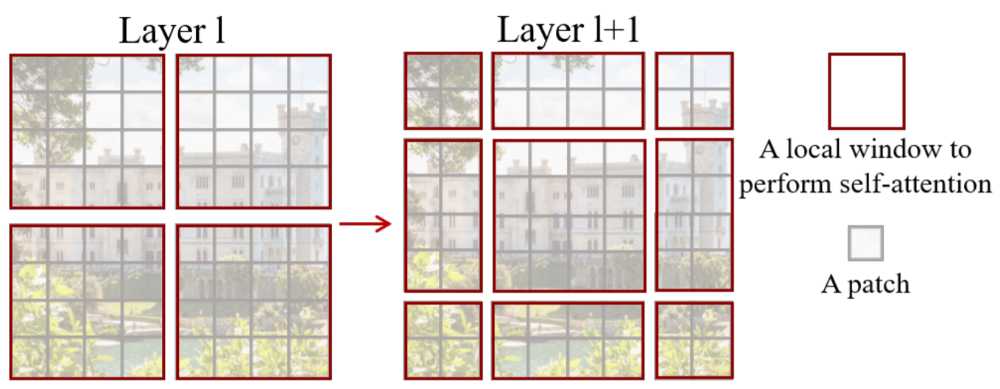
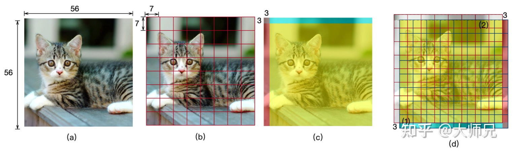
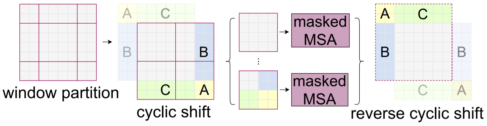

# 周报20210502

## 学习内容

最近有一些将transformer应用到图像处理的方法，文章里说可以获得比CNN特征更好的结果，想看一看transformer是否可以作为辅助的特征来加强DA的效果，包括以下这些transformer：

- Transformer
- Vision Transformer
- Swin Transformer

## 学习收获

### 传统Transformer（文本处理）

Transformer最先在`Attention is All You Need`中提出，用于文本特征提取的BERT模型使用了transformer的结构，抛弃了传统的CNN和RNN，整个网络结构使用Attention构成（Self-Attention和Feed Forward Neural Network），其本质上是一个Encoder-Decoder结构。

#### Self-Attention

Self-Attention的计算方式如下：

$$
\text { Attention }(Q, K, V)=\operatorname{softmax}\left(\frac{Q K^{T}}{\sqrt{d_{k}}}\right) V
$$

其中$Q, K, V$分别表示query向量、key向量和value向量，$d_k$表示key向量的维度，可以分别使用三个不同的权重矩阵（这个矩阵怎么获得？比如直接使用FC？）与嵌入词向量相乘得到这三个向量。

理解：$QK^T$是使用点乘的方式（$T$表示转置）计算query和key之间的相似程度，除以$\sqrt{d_k}$是为了保持梯度稳定（？），然后利用这个相似度经过softmax后与$V$点乘，相当于是给$V$进行了加权。Self-Attention描述的是当前翻译和已经翻译的前文之间的联系。

另外，Self-Attention还借鉴了ResNet的short-cut思想，解决深度学习中的退化问题。

将$h$个不同的self-attention进行ensemble，就构成了multi-head attention，这个ensemble采用的是将不同self-attention按列拼接起来，再使用一个FC层获得输出，其过程如下所示：



#### Feed Forward Neural Network (FFN)

FFN包括两层全连接层，中间使用ReLU作为激活函数：

$$
\operatorname{FFN}(Z)=\max \left(0, Z W_{1}+b_{1}\right) W_{2}+b_{2}
$$

这个结构放在Self-Attention的后面，两个结构合起来作为Encoder，FFN的输出可以理解成对下一个词向量的预测（或者新的特征向量）。

Encoder的结构如下：



#### Encoder-Decoder Attention

这个结构仅使用在Decoder中，并且位于Self-Attention和FFN的中间，得到的是当前翻译和编码的特征向量之间的关系。

在Encoder-Decoder Attention中，Q来自于decoder的上一个输出，K和V则来自于encoder的输出，计算方式与self-attention相同。

在机器翻译过程中，decode的过程是一个顺序操作的过程，当decode第$k$个特征向量时，只能看到第$k-1$及之前的decode结果，这种情况下的multi-head attention在论文中称为masked multi-head attention。

原文中给出的transformer完整结构如下



完整的可训练模型使用多个encoder和decoder堆叠。

#### 位置编码（position embedding）

前面的transformer模型没有考虑序列的顺序关系，在NLP中，需要引入位置编码（position embedding）的特征，即在词向量中加入单词的位置信息，用于区分不同位置的单词。

位置信息的编码可以根据数据学习或者人为设定，文章使用的是人为设计的位置编码。通常情况下，位置编码是长度为$d_{model}$的特征向量，便于和词向量进行单位加的操作，论文给出的位置编码公式如下（这么设计的原因和目的？）：

$$
\begin{array}{c}
P E(p o s, 2 i)=\sin \left(\frac{p o s}{10000^{\frac{2 i}{d_{\text {model }}}}}\right) \\
P E(p o s, 2 i+1)=\cos \left(\frac{\text { pos }}{10000^{\frac{2 i}{d_{\text {model }}}}}\right)
\end{array}
$$

其中$pos$表示单词的位置，$i$表示单词的维度（？）。

### Vision Transformer

在视觉处理任务上使用transformer的结构（主要是transformer encoder用作特征提取），主要包括图像分块和位置编码两个步骤。

#### 图像patch

为了将连续的图片转化为类似NLP任务中的token，采用图像分块的方式，即将一张图片切分成多个patch，在扩大输入的时候（即对于高分辨率的图片），增加块的数量而不是增大块的大小。这样可以将一张图片转化为一个图片序列，图像的size变化为$B, C, H, W \Rightarrow B, N, P^2C$，其中$N = \frac{HW}{P^2}$，具体的代码实现可以使用einops库：

```python
x = einops.rearrange(img, 'b c (h p1) (w p2) -> b (h w) (p1 p2 c)', p1 = p, p2 = p)
```

#### 位置编码

与原transformer不同，vision transformer使用的是随机初始化的pos embedding，利用训练过程自动学习得到：

```python
self.pos_embedding = nn.Parameter(torch.randn(1, num_patches + 1, dim))
x += self.pos_embedding[:, :(n + 1)]
```

#### class token

在BERT模型中，有一个trick，即在encoder的第一个位置添加了一个class token，将这个位置encode得到的特征作为分类特征输入给分类器（感觉这个class token并没有包含图像的信息？），vision transformer也延续了这一思想，在整个框架第一个位置添加一个可学习的cls-token，将这个token经过encoder得到的结果作为图像特征，代码如下：

```python
self.cls_token = nn.Parameter(torch.randn(1, 1, dim))
cls_tokens = repeat(self.cls_token, '() n d -> b n d', b = b)
x = torch.cat((cls_tokens, x), dim=1)
```

Vision Transformer的模型结构如下：



#### Vision Transformer缺点

1. 训练计算量比CNN大
2. 容易过拟合
3. 需要在大数据集上pre-train才能获得较好效果，但train的速度很慢

### Swin (Shifted Windows) Transformer

由MSRA提出的层次化视觉transformer，可以作为CV的通用backbone，传统的transformer不好应用在视觉领域上，主要有以下两个原因：

1. CV和NLP两个领域的scale不同，NLP的scale是固定的，而CV的scale变化范围很大
2. CV比起NLP需要更大的分辨率，使得在CV上使用transformer的复杂度非常大

针对上述两个难点，swin transformer在vision transformer的基础上进行了两个改进：

1. 引入CNN常用的层次化构建方法实现层次化的transformer
2. 引入locality的思想，即对互相不重合的window进行self-attention的计算

相比于vision transformer，swin transformer的计算复杂度大幅降低，随着深度加深，swin transformer逐渐合并图像块来构建层次化transformer，可以作为通用的视觉backbone。

Swin Transformer与Vision Transformer的对比如下：



swin transformer的结构与CNN相似，构建4个stage，每个stage是相似的重复单元，与ViT类似，将图片进行patch partition（文中以4x4作为一个patch）。在stage 1中，先使用linear embedding将patch的特征维度变成C，送入swin transformer block，stage 2-4的操作相同，通过patch merging（将2x2的相邻patch合并）之后送入swin transformer block，Swin Transformer的整体结构如下：



与ViT类似，Swin Transformer也是先确定patch的大小，再确定patch的数量，不同的是随着网络加深ViT的patch数量不变，而Swin Transformer的patch数量会减少，并且每个patch的感知范围扩大，这样设计的目的是方便swin transformer的层级构建，并且适应视觉任务的多尺度。

在swin transformer block中，包含两部分，区别在于中间的multi-head self attention，其余的LayerNorm（LN）和MLP部分相同，在每个MSA和MLP后使用残差连接。W-MSA将输入图片划分成不重合的window，在不同的window内进行self-attention的计算，可以降低计算复杂度，而W-MSA的不重合window之间缺乏信息交流，因此文章进一步引入shifted window partition（SW-MSA）来解决不同window间的信息交流问题（其设计的目的是为了引入一种与W-MSA不同的划分window的方式）。



在SW-MSA中，将图像循环上移和循环左移半个窗口的大小，原图像的第一行和第一列（以半个窗口大小划分）分别被移到了最后一行和最后一列，然后在这个移位的基础上使用W-MSA进行划分即可获得与原先W-MSA不同的window划分结果，这个shift的过程可以使用pytorch的roll函数实现：

```python
class CyclicShift(nn.Module):
    def __init__(self, displacement):
        super().__init__()
        self.displacement = displacement

    def forward(self, x):
        return torch.roll(x, shifts=(self.displacement, self.displacement), dims=(1, 2))
```

其中`displacement`为半个窗口大小。



另外，图像移位会引入新的问题，即循环移动过去的像素点并不需要与原始的图片边界像素点进行attention的计算（只需要计算移位前后两图像重合的部分以及被移位的部分与自己的attention），文章使用了mask来解决这个问题（这部分没看懂）。



## 启发/疑问

1. 看了transformer的相关内容之后发现PFSA中的选择结构与带short cut的attention有些相似，只是获取similarity的方式不同
2. 在CV方面，缺少一个像CNN一样即插即用的Attention结构（感觉很多模型其实有类似attention的思想？），Attention的过程既可以认为是为分类任务提取更相关的特征，也可以根据DA的需求关注图像的不同地方
3. vision transformer里面，对图像进行patch是否会造成处在分块边界线的物体信息被遗漏或者具有不同权重？
4. 能否根据attention机制重新对图像切分再训练？
5. 考虑在特征层面上使用attention/transformer实现DA？
6. SW-MSA中的mask是如何操作的？（实际上想把swin transformer当作特征提取器来用，这部分细节感觉不是特别重要）
