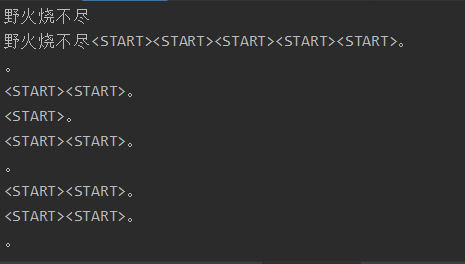
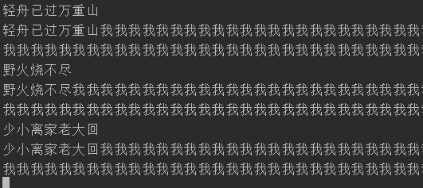
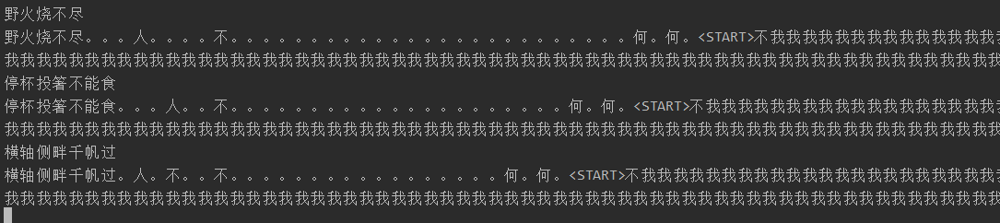
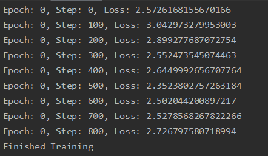
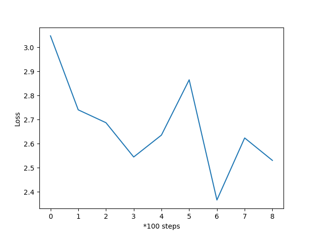
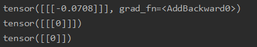

# 第11周周报

## 本周计划

- 测试上周出现问题的模型

## 实验内容

### 将Encoder的output作为context vector（接上周）

Encoder的output的size为(seq_len, batch_size, hidden_dim)，而Decoder所输入的size为(seq_len, batch_size)

通过一个Linear层将hidden_dim压缩到1维（可能是冒险的做法，但目前还没想到其它的方式）

上周的测试结果并不好，输入诗句之后，输出只有`<START>`和`<EOP>`，考虑到可能是训练的Epoch太少，这次多训练几个Epoch再进行测试。

测试的结果如下：

2个Epoch



与上次相比，这次能生成`<START>`和`。`，但是句号的生成没有规律，而且不能生成文字。

3个Epoch



经过3个Epoch后，不再生成`<START>`，能生成文字但是是固定的，不能自动生成`<EOP>`。

4个Epoch



尽管能生成超过一种文字和句号，结果仍然没有诗句的样子。

训练过程中的Loss如下：





在训练过程中，Loss并没有发生太大的变化，基本上是在2-3之间来回摆动，可能是因为把hidden_dim压缩到1维的做法使得信息丢失，训练失败。

将训练过程中的context打印出来：

```python
output = self.fc(output)
print(output)
output = output.long()
# output: [seq_len, batch_size, 1]
print(output)
output = output[:, :, 0]
print(output)
```

输出如下：



经过Linear得到的output几乎不会发生变化，并且在其转化为long之后几乎全为0，因此Decoder的输入几乎全为0，无法提取出有效的信息，训练也就几乎没有效果。

## 当前问题/疑惑

1. 不知道是否存在其它的将Encoder的output转化为context的方式
2. output的hidden_dim被压缩到1维后，信息丢失，结果几乎不会变化，这种获得context vector的方式可能是错误的
