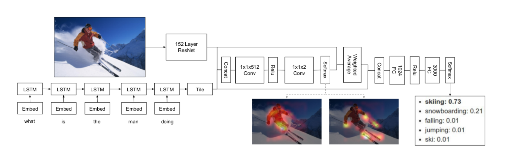

# 第20周周报

## 学习内容

- Image Caption代码分析
- SSH复习
- Visual Question Answering

## 学习收获

### Image Caption

#### 代码分析（接上周）

##### eval.py

通过beam search计算BLEU-4 score

将beam size看作batch size，batch中的第一个元素全部设置为`<START>`

每当一个caption sentence生成完之后，就把beam size减一，保证最终留下来的完整句子个数为beam size

##### caption.py

用于通过beam search生成caption，以及让attention可视化

生成caption的过程在eval里面已经实现了，下面分析一下attention的可视化处理

可视化的思想很简单，用循环执行每个time step，对于每个time step都会输出一个attention weight ( $\alpha$ )，只需要用weight与image相乘再显示加权后的图像即可

#### 小结

Image Caption使用的是Encoder-Decoder结构，Encoder采用已经训练好的ResNet（包含多层CNN和FC，可fine-tune），去掉最后用于分类的两层FC，添加新的FC层用于训练提取图像的feature vector，Decoder采用多层RNN/LSTM，将Encoder输出的feature vector进行线性变换后作为Decoder的initial hidden。

将词语数字化，建立word2idx字典和idx2word字典，相当于是给所有出现频率高于预定值的词语分配index

Decoder将以`<start>`作为开始，每个time step生成一个单词，直到生成`<end>`或达到长度限制，于此同时，当前的hidden将与Encoder的output共同构成attention weight，作为下一个time step的其中一个输入。

### SSH

尽管之前有学过ssh的操作，但是现在有些遗忘，所以稍微复习一下

登陆方法

```shell
# user为登陆用户名，host为主机地址，-p为登陆端口号（可选参数，默认22）
ssh -p 2333 user@host
```

远程主机的公钥会保存在`$HOME/.ssh/known_hosts`中

可以使用`ssh-keygen`生成key，免去登陆密码

```shell
ssh-keygen
ssh-copy-id user@host
```

在云端运行本地文件

```shell
# 单个文件
ssh user@host python3 < hello.py

# 多个文件，先上传后运行
scp {main, func}.py user@host:~/
ssh user@host "python3 main.py"
# 将运算结果复制到本地
scp user@host:~/output.out ~/result
```

PS：bash以及vim的使用前面也有学过，不过内容比较多，等具体用到的时候再查询手册和文档。

PPS：直接用`vimtutor`可以比较快地掌握/回忆vim基本操作

### VQA

参考论文：

1. [Show, Ask, Attend, and Answer: A Strong Baseline For Visual Question Answering](https://arxiv.org/abs/1704.03162)
2. [Visual Question Answering](https://arxiv.org/pdf/1505.00468.pdf)

#### Concept

给model一个image和一个question，让model生成一个自然语言描述的answer

VQA中所需要处理的信息比普通Image Caption要多，也更能体现model是否提取出了image中的重要信息，一般用CV的方法提取图像信息，用NLP的方法处理问句和答句的语意信息

按照论文1中的说法，使用LSTM进行question的encoding，用deep ResNet计算image feature，将VQA问题看作分类问题
$$
\hat{a} = \arg\max_a P(a, | I, q)
$$
Loss Function
$$
L = \frac{1}{K}\sum_{k=1}^K-\log P(a_k|I, q)
$$
用训练好的CNN处理image得到high level representation，用LSTM处理question，得到final hidden state来表示问题的embedding，整个模型的architecture如下



#### 代码分析

##### utils.py

实现了一些辅助的函数和类

batch_accuracy用于计算一个batch的正确率，论文中所给计算方法如下
$$
Acc(a) = \frac{1}{K} \sum_{k = 1}^{K} \min(\frac{\sum_{1 \leq j \leq K ,\ j \neq k}\mathbb{1}(a = a_j)}{3}, 1)
$$
而为了计算方便，代码中做了一些简化

```python
_, predicted_index = predicted.max(dim=1, keepdim=True)
agreeing = true.gather(dim=1, index=predicted_index)
acc = (agreeing * 0.3).clamp(max=1)
```

path_for用于获取对应数据的位置（train，val，test等）

Tracker类用于追踪训练的results

get_transform返回一个特定的transform（除了放缩以外是预先写死的），用于将image放缩，裁剪，转化成tensor和标准化

##### config.py

没什么特别的，只是将一些常量放在一起当作全局常量使用，包括preprocess的设置，hyper parameters和path等

##### data.py

读取dataset，实现data loader

get_loader返回对应train，val和test的data loader

collate_fn将一个batch的question按照长度从大到小排序，以便于使用pack padding

VQA类将数据读取进来，分别放在不同的成员变量中，并且提供了一些函数进行word到index的转化

##### model.py

与Image Caption不同，VQA需要处理两部分数据，分别是image和question

代码中将VQA的model分成三部分来实现：TextProcessor，Classifier，Attention

使用xavier_uniform作为init

###### TextProcessor

1. embedding
2. 用tanh作为activation
3. 用pack_padded_sentence进行padding
4. 经过lstm得到question的final state（为什么使用的是cell state而不是hidden state？）

###### Classifier

跟普通的classifier类似，使用两层Linear，用relu进行激活，加上dropout以防overfitting

###### Attention

- 对image使用CNN
- 对TextProcessor处理后的question使用Linear
- 将image和question合并（tile_2d_over_nd，合并的方式有点没看懂）
- 将合并后的tensor通过CNN得到 $\alpha$

最后是整个model，将上面三个部分拼接起来

- 使用TextProcessor得到question的representation
- 对image进行normalization
- 两者通过Attention得到 $\alpha$
- 使用 $\alpha$ 对image加权，得到weighted image
- 将question representation和weighted image拼接，放入classifier得到answer

#### VQA小结

VQA处理image的方式与Image Caption类似，都是使用pretrained CNN（VQA中貌似没有去掉ResNet的最后两层Linear？），VQA中另外使用了LSTM来进行question的embedding。在输出方面，Image Caption通过LSTM输出，结果是生成的语句，而在VQA中，按照论文的说法，answer貌似是从现有的一些answer中选出来的，而不是机器自动生成的（论文将VQA当作分类问题处理）。

## 疑问和困难

1. 尽管看代码的时候觉得写的很有道理，但是自己实现的时候很难想到合适的方法
2. 可能由于本地的python库与代码的版本略有不同，某些操作没有找到对应的替代方案（如scipy.misc中的imread和imresize，在新版本中被移除了，网上资料中作为替代的函数原型有些不同，新版本的pytorch已经去掉了Variable）
3. 在处理词语库的时候，出现频率低的词语直接被标记为`<unk>`了，这样是否会影响语句本身的含义（可能因为此类数据的数量很少不予考虑）
4. 有一部分数据处理的代码没弄明白，涉及到一些以前没怎么接触过的python包（如json，collections，itertools，re，h5py等）

