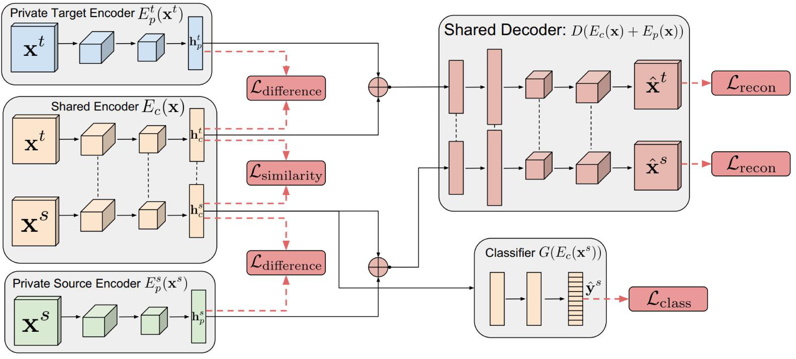

# 第24周周报

## 学习内容

- 迁移学习与领域自适应基础理论

## 学习收获

### 领域自适应的目标

把分布不同的源域和目标域的数据，映射到同一个特征空间，使其在特征空间的距离尽可能地进，以至于在源域的特征空间上训练的模型可以迁移到目标域上，重点在于设计特征空间上源域和目标域的差异函数

### 几种常见的距离

#### 1. 欧氏距离

欧几里得距离，差的平方和再开方

$$
d_{Euclidean} = \sqrt{(\bold{x} - \bold{y})^T(\bold{x} - \bold{y})}
$$

#### 2. 闵可夫斯基距离

把欧式距离推广一下，指数改为 $p$

$$
d_{Minkowski} = (||(\bold{x} - \bold{y})||^p)^{\frac{1}{p}}
$$

#### 3. 马氏距离

马氏距离也是对欧式距离的推广，考虑了协方差

$$
d_{Mahalanobis} = \sqrt{(\bold{x} - \bold{y})^T\Sigma^{-1}(\bold{x} - \bold{y})}
$$

其中 $\Sigma$ 是协方差矩阵，当 $\Sigma = \bold{I}$ 时，马氏距离退化成欧几里得距离

### 相似度

#### 1. 余弦相似度

计算两个多维向量在高维空间中夹角的余弦值，可以体现相似性

$$
\cos(\bold{x}, \bold{y}) = \frac{\bold{x}\cdot\bold{y}}{|\bold{x}|\cdot|\bold{y}|}
$$

夹角越小，余弦值越接近1，两向量相似度越高

#### 2. 互信息

计算两个概率分布 $X, Y$ 的相似度

设 $x \in X, y \in Y$，互信息为：

$$
I(X;Y) = \sum_{x \in X}\sum_{y \in Y}p(x, y)\log\frac{p(x, y)}{p(x)p(y)}
$$

相似度越高，互信息越大

#### 3. Pearson相关系数

用概率论中的相关系数反应概率分布的相关性（相似性），协方差除以标准差之积

$$
\rho_{X, Y} = \frac{Cov(X, Y)}{\sigma_X\sigma_Y}
$$

$\rho$ 的范围在 $[-1, 1]$ ，绝对值越接近1，相关性越大

#### 4. Jaccard相关系数

用集合的方式评价相关性

$$
J = \frac{X \cap Y}{X \cup Y}
$$

Jaccard距离：$1 - J$

（实际上如何操作？）

#### 5. KL散度与JS距离

##### KL散度

Kullback–Leibler Divergence，也称为相对熵，衡量两个概率分布 $P(x), P(y)$ 的距离

$$
D_{KL}(P||Q) = \sum_{i=1}P(x)\log\frac{P(x)}{Q(x)}
$$

KL散度并不对称：$D_{KL}(P||Q) \neq D_{KL}(Q||P)$

##### JS距离

Jensen–Shannon Divergence，由KL散度发展而来，是对称的

$$
JSD(P||Q) = \frac{1}{2}D_{KL}(P||M) + \frac{1}{2}D_{KL}(Q||M)
$$

其中 $M = \frac{1}{2}(P + Q)$

#### 6. 最大均值差异（MMD）

前面有看过MMD，是计算特征空间上的均值差异，很常用

$$
MMD^2(X, Y) = \left\| {\frac{1}{M}\sum\limits_{i = 1}^M {\phi ({\rm{x}}_i) - } \frac{1}{N}\sum\limits_{j = 1}^N {\phi ({\rm{y}}_j)} } \right\|_\mathcal{H}^2
$$

#### 7. A-distance

用来评估不同分布之间的差异，首先在源域和目标域上训练一个二分类器 $h$ 用于区分样本来自哪个域，用 $err(h)$ 来表示分类器的损失，$\mathcal{A}-distance$ 定义为：

$$
\mathcal{A}(\mathcal{D_s}, \mathcal{D_t}) = 2(1 - 2err(h))
$$

### 领域自适应方法

领域自适应是基于特征的迁移学习方法，通过特征变换的方式对源域和目标域相互迁移，减小源域和目标域在特征上的差异（通过多层变换将两个概率分布拉近）

首先要假设源域和目标域之间有交叉的特征

若边缘分布不同，则数据整体不相似，若边缘分布相同，而条件分布不同，则数据整体相似，具体到每个类就不相似了

根据数据的分布特性，自适应方法可以分成以下几类：

- 边缘分布自适应
- 条件分布自适应
- 联合分布自适应

#### TCA

减小源域和目标域边缘分布的距离

$$
d(\mathcal{D_s}, \mathcal{D_t}) \approx \|P(\bold{x_s}) - P(\bold{x_t})\|
$$

使用迁移成份分析(Transfer Component Analysis, TCA)

常用MMD作为衡量距离的指标：

$$
MMD(\mathcal{D_s}, \mathcal{D_t}) = \left\| {\frac{1}{n_1}\sum\limits_{i = 1}^{n_1} {\phi ({\rm{x}}_i) - } \frac{1}{n_2}\sum\limits_{j = 1}^{n_2} {\phi ({\rm{y}}_j)} } \right\|_\mathcal{H}
$$

关键在于寻找合适的 $\phi$

用降维的方式，提取出源域和目标域的特征

引入核矩阵 $\bold{K}$ 和MMD矩阵 $\bold{L}$

$$
\bold{K} =
\begin{bmatrix}
\bold{K_{s, s}} & \bold{K_{s, t}}\\
\bold{K_{t, s}} & \bold{K_{t, t}}
\end{bmatrix}
$$

$\bold{L}$ 的各元素为：

$$
l_{ij} =
\begin{cases}
\frac{1}{n_1^2}\qquad \bold{x_i}, \bold{x_j} \in \mathcal{D_s}\\
\frac{1}{n_2^2}\qquad \bold{x_i}, \bold{x_j} \in \mathcal{D_t}\\
-\frac{1}{n_1 n_2}\quad \text{otherwise}
\end{cases}
$$

上述MMD距离转化为：

$$
\text{tr}(\bold{KL}) - \lambda\text{tr}(\bold{K})
$$

再使用一个比 $\bold{K}$ 更低维的矩阵 $\bold{W}$ 对 $\mathcal{D}$ 进行降维（减小计算量），通过求矩阵特征值的方式得到特征

#### 深度迁移学习

使用自适应方法解决源域和目标域分布不同的问题（添加自适应层 Adaptation Layer）

自适应前需要思考的问题：

1. 哪些层可以自适应，决定网络的学习程度
2. 采用什么样的自适应方法（度量规则），决定网络的泛化能力

重点在于Loss的定义，普遍采用的Loss定义方法如下：

$$
\ell = \ell_c(\mathcal{D_s}, \bold{y_s}) + \lambda \ell_A(\mathcal{D_s}, \mathcal{D_t})
$$

$\ell$ 为总Loss，$\ell_c(\mathcal{D_s}, \bold{y_s})$ 表示网络在有标签的数据（大部分是源域）上的常规分类损失，$\ell_A(\mathcal{D_s}, \mathcal{D_t})$ 表示网络的自适应损失。

设计深度迁移网络的基本准则：决定自适应层，加入自适应度量，最后对网络进行fine-tune

##### Domain Adaptation Neural Network

参考论文：[Domain Adaptive Neural Networks for Object Recognition](https://arxiv.org/abs/1409.6041v1)

由两层神经元组成：特征层和分类器层。在特征层后加入了一个MMD适应层，用来计算源域和目标域的距离，并将其加入网络的损失中进行训练。

##### Deep Domain Confusion

参考论文：[Deep Domain Confusion: Maximizing for Domain Invariance](https://arxiv.org/abs/1412.3474)

在DaNN的基础上，使用更深的网络AlexNet，固定前7层，在第8层（分类器前一层）添加了MMD

$$
\ell = \ell_c(\mathcal{D_s}, \bold{y_s}) + \lambda MMD^2(\mathcal{D_s}, \mathcal{D_t})
$$

##### Deep Adaptation Networks

参考论文：[Learning Transferable Features with Deep Adaptation Networks](https://arxiv.org/abs/1502.02791)

在DDC的基础上，使用多层适应层，在AlexNet的后三层都添加了适应层，采用多核MMD作为差异函数

$$
\mathcal{K} \triangleq \left\{ k = \sum_{u=1}^m \beta_u k_u : \beta_u \geq 0, \forall u \right\}
$$

DAN的优化目标为：

$$
\min_\Theta \frac{1}{n_a}\sum_{i=1}^{n_a}J(\theta(\bold{x}_i^a, y_i^a)) + \lambda\sum_{\ell=\ell_1}^{\ell_2} d_k^2(\mathcal{D_s^l}, \mathcal{D_t^l})
$$

$\Theta$ 是网络中的所有weight和bias，$\ell_1, \ell_2$ 分别是6和8层，$\bold{x_a}, n_a$ 表示源域和目标域中所有带标签的数据集合，$J(\cdot)$ 是Loss，一般使用Cross-Entropy

#### 深度对抗方法

##### 基本思路

网络包括两部分，生成器和判别器，用对抗的方式训练

在领域自适应中，特征提取的过程当作生成过程，通常将目标域的特征当作是生成的样本，通过对抗性训练使得判别器无法判断提取出的特征属于源域还是目标域

通常用 $G_f$ 表示特征提取器，$G_d$ 表示判别器

网络训练的Loss：

$$
\ell = \ell_c(\mathcal{D_s}, \bold{y_s}) + \lambda \ell_d(\mathcal{D_s}, \mathcal{D_t})
$$

##### DANN

参考论文：[Unsupervised Domain Adaptation by Backpropagation](https://arxiv.org/abs/1409.7495)

生成的特征尽可能区分两个领域的特征，而判别器无法对两个领域的差异进行判别

Loss Function：

$$
E(\theta_f, \theta_y, \theta_d) = \sum_{i=1\dots N,\ d_i=0}L_y^i(\theta_f, \theta_y) - \lambda \sum_{i=1\dots N}L_d^i(\theta_f, \theta_d)
$$

其中 $\theta_f,\ \theta_y,\ \theta_d$ 分别为特征提取器，分类器，判别器的参数

##### DSN

参考论文：[Domain Separation Networks](https://arxiv.org/abs/1608.06019)

对DANN进行扩展，考虑到源域和目标域都有公共和私有两部分，公共部分可以通过学习得到公共特征，而私有部分用于保持领域内独立的特性，进一步定义了Loss

$$
\ell = \ell_{task} + \alpha\ell_{recon} + \beta\ell_{difference} + \gamma\ell_{similarity}
$$

各部分的含义：

- $\ell_{recon}$ ：重构损失，确保私有的部分对学习目标仍有作用
- $\ell_{difference}$ ：公共部分与私有部分的差异损失
- $\ell_{similarity}$ ：源域和目标域公共部分的相似性损失

##### SAN

参考论文：[Partial Transfer Learning with Selective Adversarial Networks](https://arxiv.org/abs/1707.07901)

大多数情况下，源域的数据比目标域的数据多很多，种类也更丰富，那些源域中有而目标域没有的类别可能会造成负迁移，因此只对源域中和目标域相关的样本进行迁移

将原先的一个判别器分成 $\mathcal{C_s}$ 个，每一个子判别器 $G_d^k$ 都对其所在的第k个类进行判别

## 疑问和困难

1. 不同论文中使用的符号貌似并不统一，即便是同一个概念，不同论文中的说法和公式也不一样
2. 关于多核MMD的概念有些模糊，按照先前的理解，这个核是通过神经网络学出来的，所以当时当作黑盒子处理了，但是在一些论文里，这个核貌似是把不同层的MMD组合起来的方式（也就是一种数学方法）
