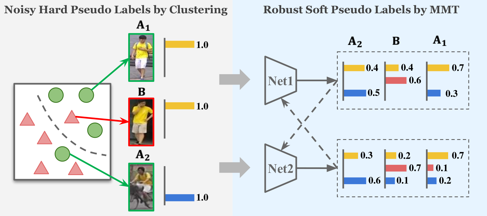
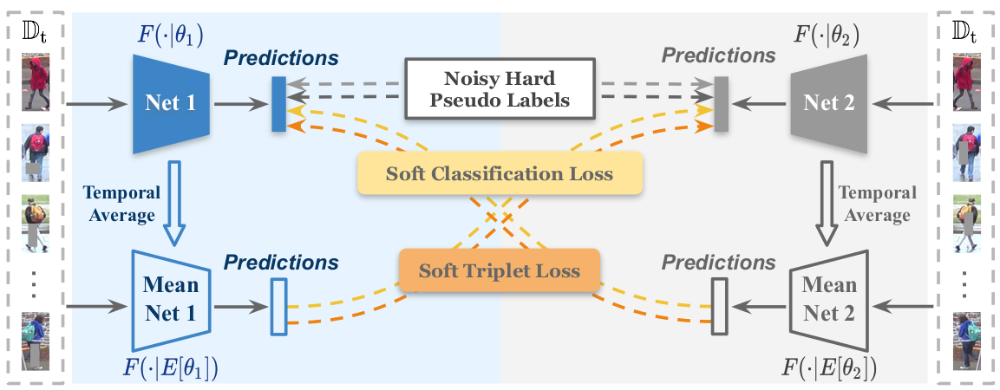
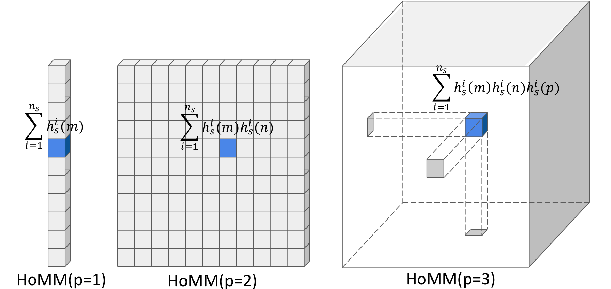

# 第26周周报

## 学习内容

- 领域自适应论文阅读

## 学习收获

### Mutual Mean-Teaching: Pseudo Label Refinery for Unsupervised Domain Adaptation on Person Re-identification (ICLR2020)

#### 任务描述

文章主要处理的是行人重识别的问题，在跨相机下搜索出特定行人的图像，在应用到新的监控系统上时，领域差异很大，精度下降，而人工标注耗时耗力，不现实。

文章提出一种新的无监督学习的方法，用于处理开放数据集（即目标域的类别未知，通常与源域没有重复）

#### 动机

由论文所述，现有的一些UDA行人重识别方法主要分为以下几种：

- 基于聚类的伪标签法
- 领域转换法
- 基于图像或特征相似性的伪标签法

基于聚类的方法：

1. 使用聚类算法，对无标签的目标域图像特征进行聚类，生成伪标签
2. 使用生成的伪标签在目标域上训练
3. 重复上述步骤直到模型效果达到标准

论文以基于聚类的伪标签法作为切入点，考虑到伪标签本身的噪声会对结果产生影响，在初始情况下，伪标签噪声很大，训练可能会出问题

#### 解决思路

为了解决上述伪标签噪声的问题，文章将原先方法得出的伪标签称为硬标签，即置信度为100%的标签，而论文提出的“同步平均教学（MMT）”方法产生的伪标签则称为软标签，即置信度小于100%的标签（个人的理解感觉是去掉了predict的过程，直接把softmax得出的类别的概率分布当作伪标签）

论文指出，网络具备学习数据分布的能力，网络的输出本身可以用作监督，而为了避免过拟合，提出同步训练对称的网络，让对称的网络互相监督，采用“平均模型”，提供更为可信和稳定的软标签

文章主要想法如下：

- 提出同步平均教学（MMT），为无监督领域自适应提供更可信和稳定的软标签
- 针对triplet设计合理的伪标签和Loss，以用于MMT的训练

论文提出的MMT使用离线优化的硬标签和在线优化的软标签联合训练，硬标签由聚类算法生成，在每个epoch前单独更新（离线更新），软标签由协同训练的网络生成（在线更新），重点在于两个对称网络的互补性

增强互补性的措施：

- 对两个网络Net 1和Net 2使用不同的初始参数
- 随机产生不同的干扰
- 训练Net 1和Net 2时采用不同的软监督（软标签来自对方网络的“平均模型”）
- 采用Mean-Net 1/2而不是Net 1/2进行相互监督

平均网络的参数 $E[\theta]$ 是对应网络参数 $\theta$ 的累计平均值（不通过反向传播更新，而在每次反向传播后，通过网络参数进行加权平均，即Net的参数的累计平均值）
$$
E^{(T)}[\theta_1] = \alpha E^{(T-1)}[\theta_1] + (1 - \alpha)\theta_1\\
E^{(T)}[\theta_2] = \alpha E^{(T-1)}[\theta_2] + (1 - \alpha)\theta_2
$$
其中 $T$ 表示迭代次数，初始化时，$E^{(0)}[\theta_1] = \theta_1, E^{(0)}[\theta_2] = \theta_2$

以上平均网络的设计出发点在于，累计平均参数受噪声的扰动较小，不容易出现参数跳动或者不稳定的情况，而且平均网络不需要进行反向传播，因此不会在原来的基础上增加时间复杂度

#### Loss设计

在行人重识别任务中，通常使用分类损失与三元损失联合训练，分类损失作用与分类器的预测，三元损失作用于图像特征

##### 符号约定

用 $F(\cdot|\theta)$ 表示encoder，$C$ 表示分类器，每个Net都由一个encoder和一个分类器组成，用角标1，2区分Net 1和Net 2，源域图像及其标签表示为 $D_s = \{(x_i^s, y_i^s)|_{i=1}^{N_s}\}$ ，目标域无标签的图像表示为 $D_t = \{x_i^t|_{i=1}^{N_t}\}$

##### 软分类损失

在原本的硬伪标签的情况时，分类损失一般使用交叉熵 $\ell_{ce}$：
$$
\mathcal L_{id}^t(\theta) = \frac{1}{N_t}\sum_{i=1}^{N_t}\ell_{ce}(C^t(F(x_i^t|\theta)), \tilde y_i^t)
$$
上式中 $\tilde y_i^t$ 为目标域图像 $x_i^t$ 的硬伪标签，由聚类算法生成

应用到软标签的Loss上，对原交叉熵稍作修改（类似二元交叉熵）：
$$
\mathcal L_{sid}^t(\theta_1|\theta_2) = -\frac{1}{N_t}\sum_{i=1}^{N_t}\left(C_2^t(F({x'}_i^t|E^{(T)}[\theta_2]))\cdot \log C_1^t(F(x_i^t|\theta_1))\right)\\
\mathcal L_{sid}^t(\theta_2|\theta_1) = -\frac{1}{N_t}\sum_{i=1}^{N_t}\left(C_1^t(F(x_i^t|E^{(T)}[\theta_1]))\cdot \log C_2^t(F({x'}_i^t|\theta_2))\right)
$$
上式中 $x$ 和 $x'$ 表示同一张图像经过不同的随机数据增强方式得到的数据，这么设计是为了让Net 1的分类预测接近Mean-Net 2，让Net 2的分类预测接近Mean-Net 1，因为上述式子衡量的其实是Net 1和Mean-Net 2的差异以及Net 2和Mean-Net 1的差异

##### 软三元损失

传统三元（anchor, positive, negative）损失如下（形似SVM Loss？）：
$$
\mathcal L_{tri}^t(\theta) = \frac{1}{N_t}\sum_{i=1}^{N_t}\max\left(0, \|F(x_i^t|\theta) - F(x_{i, p}^t|\theta)\| + m - \|F(x_i^t|\theta) - F(x_{i, n}^t|\theta)\| \right)
$$
其中 $\|\cdot\|$ 为欧几里得距离，$x_{i, p}^t$ 和 $x_{i, n}^t$ 分别表示 $x_i^t$ 的正样本和负样本，$m$ 是余量超参

这里正负样本由聚类产生的伪标签判断，所以传统三元损失可用于硬标签的训练，但不能用于软标签的训练

对于软标签，论文中提出使用softmax-triplet来表示三元组内特征间的关系：
$$
\mathcal T_i(\theta) = \frac{\exp(\|F(x_i^t|\theta) - F(x_{i, n}^t|\theta)\|)}{\exp(\|F(x_i^t|\theta) - F(x_{i, p}^t|\theta)\|) + \exp(\|F(x_i^t|\theta) - F(x_{i, n}^t|\theta)\|)}
$$
可以看出，softmax-triplet的取值范围是 $[0, 1)$ ，替换掉传统的三元损失，当使用硬标签进行监督时，可以看作二分类问题，使用二元交叉熵：
$$
\ell_{bce}(p, q) = -q\log p - (1-q)\log(1-p)\\
\mathcal L_{tri}^t(\theta) = \frac{1}{N_t}\sum_{i=1}^{N_t}\ell_{bce}(\mathcal T_i(\theta), 1)
$$
这里的“1”的含义在于，每个样本与其负样本的欧几里得距离应远大于与正样本的欧几里得距离

而硬标签存在噪声，考虑软化三元组的监督，即使用平均网络的特征距离来代替硬标签“1”，软化后的标签取值范围在 $[0, 1)$ ，在MMT的框架中，软三元Loss为：
$$
\mathcal L_{stri}^t(\theta_1|\theta_2) = \frac{1}{N_t}\sum_{i=1}^{N_t}\ell_{bce}\left(\mathcal T_i(\theta_1), \mathcal T_i\left(E^{(T)}[\theta_2]\right)\right)\\
\mathcal L_{stri}^t(\theta_2|\theta_1) = \frac{1}{N_t}\sum_{i=1}^{N_t}\ell_{bce}\left(\mathcal T_i(\theta_2), \mathcal T_i\left(E^{(T)}[\theta_1]\right)\right)
$$
与软分类损失的设计类似，这里的软三元损失的设计目的在于让Net 1与Mean-Net 2接近，而Net 2与Mean-Net 1接近

#### 算法

在论文算法的每一个迭代中，执行以下三步：

1. 通过平均网络计算分类预测和三元组特征的软标签
2. 通过Loss反向传播更新Net 1和Net 2
3. 通过参数加权平均，更新Mean-Net 1和Mean-Net 2

#### 小结

论文的主要思想是引入了软标签和同步平均教学的概念，设计对应软标签训练的Loss，着重考虑硬标签带来的噪声问题，从而使模型的训练更稳定

### HoMM: Higher-order Moment Matching for Unsupervised Domain Adaptation (AAAI2020)

这是一篇基于差异方法处理无监督领域自适应的文章，现有的一些差异模型一般是最小化源域和目标域在特征空间上的分布差异，通常只使用了二阶或更低的统计学参量（矩？），而这对于非高斯分布的情况处理能力有限。在论文中，使用了更高阶（三阶、四阶）的矩来进行domain matching，文章提出了一个HoMM（Higher-order Moment Matching）方法，并应用在希尔伯特再生成核空间（RKHS）（？）中，总体上可以认为HoMM是对MMD和CORAL进行了更高阶的推广

#### 基本思路

更高阶的矩张量可以更精确地捕获样本的细节

通过一阶矩（均值）所导出的差异函数为MMD

通过二阶矩（方差）所导出的差异函数为CORAL

上述两个差异函数的计算大多建立在高斯分布上（二阶特性已经能比较好地描述高斯分布）

而在实际应用中，特征的分布一般是一个比高斯分布更为复杂的分布，于是论文提出使用更高阶的矩来讨论差异函数（HoMM）

#### 方法

论文讨论非监督领域自适应问题上的HoMM

用 $\mathcal D_s = \{x_s^i, y_s^i\}_{i=1}^{n_s}$ 表示带标签的源域，$\mathcal D_t = \{x_t^i\}_{i=1}^{n_t}$ 表示不带标签的目标域

在源域和目标域的并集上训练一个跨域的CNN分类器 $f_{\theta}(x)$ ，最小化一个任务的risk $\epsilon_t = \mathbb E_{x\in \mathcal D_t}[f_{\theta}(x) \neq y_t]$

网络对源域和目标域的数据分开处理，但是网络是共用参数的，仅在最后一层FC才进行domain alignment

对于一个基本的领域自适应训练，loss至少包括源域loss和域差异loss：
$$
\mathcal{L}(\theta|\mathbf{X}_s,\mathbf{Y}_s,\mathbf{X}_t)=\mathcal{L}_s+\lambda_{d}\mathcal{L}_{d}\\
\mathcal{L}_s=\dfrac{1}{n_s}\sum\limits_{i=1}^{n_s}J(f_{\theta}(x_i^s), y_i^s)
$$
其中 $\mathcal L_s$ 表示源域上的分类损失，$J(\cdot, \cdot)$ 表示交叉熵损失，$\mathcal L_d$ 表示域差异损失，$\lambda_d$ 是用于折衷的参数

下面对域差异进行展开

为了进行细粒度的domain alignment，文章提出的域差异如下：
$$
\mathcal{L}_d=\frac{1}{L^p}\Vert\frac{1}{n_s}\sum\limits_{i=1}^{n_s}\phi_{\theta}({x}_s^i)^{\otimes p}-\frac{1}{n_t}\sum\limits_{i=1}^{n_t}\phi_{\theta}({x}_t^i)^{\otimes p}\Vert_F^2
$$
其中 $n_s = n_t = b$ （ $b$ 是batch size），$\phi_{\theta}(x)$ 表示适应层的activation output，$h^i = \phi_{\theta}(x^i) = [h^i(1), h^i(2),\dots, h^i(L)] \in \mathbb R^L$ 表示第 $i$ 个样本的activation output，$L$ 是适应层中隐藏神经元的个数，这里的 $u^{\otimes p}$ 表示向量 $u\in \mathbb R^c$ 的 $p$ 阶张量指数（p-level tensor power）
$$
u^{\otimes p} = u \otimes u \cdots \otimes u \in \mathbb R^{c^p}
$$
理解：$T = u^{\otimes p}$ 是一个 $p$ 阶张量，$T[i, j, \cdots, k] = u_i u_j \cdots u_k$

低阶情况的图示如下

可以证明，当 $p$ 分别为1和2是，上式（HoMM）分别与MMD和CORAL等价

#### 优化

论文指出，如果直接使用前面的公式计算HoMM，其时间复杂度是非常大的，在实际应用场景中几乎无法支持如此巨量的计算，于是进行了一些优化

##### Group Moment Matching

可以想到，如果把训练的数据进行分组，在每个组间进行HoMM的计算，将可以很好地减小计算量

将适应层的 $L$ 个神经元分成 $n_g$ 组，每组 $L/n_g$ 个神经元，对每个组分别计算HoMM：
$$
\mathcal{L}_d=\frac{1}{b^2\lfloor L/n_g\rfloor^p}\sum\limits_{k=1}^{n_g}\Vert\sum\limits_{i=1}^{b}{h}_{s,k}^i{^{\otimes p}}-\sum\limits_{i=1}^{b}{h}_{t,k}^i{^{\otimes p}}\Vert_F^2
$$
其中 $h_{:, k}^i \in \mathbb R^{\lfloor L/n_g \rfloor}$ 是第 $k$ 组的activation output

##### Random Sampling Matching

另一种方法是使用随机采样的方法，在一个高维张量中，仅随机挑选 $N$ 个分量进行计算

#### 再生核的希尔伯特空间（RKHS）

类似KMMD，文章也将HoMM泛化到了多核，称为HoMM in RKHS
$$
\mathcal{L}_d=\frac{1}{L^p}\Vert\frac{1}{b}\sum\limits_{i=1}^{b}\psi({h}_s^i{^{\otimes p}})-\frac{1}{b}\sum\limits_{i=1}^{b}\psi({h}_t^i{^{\otimes p}})\Vert_F^2
$$
其中 $\psi({h_s^i}^{\otimes p})$ 表示第 $i$ 个源样本在RKHS中的特征representation（个人理解是encode之后的feature vector）

再结合上述随机取样的方法，用取样的结果预估 ${h_s^i}^{\otimes p}, {h_t^i}^{\otimes p}$ 的实际值（参考多核MMD，个人理解这里的两层求和号表示的是矩阵乘法，使用的是之前看过的kernel trick）：
$$
\mathcal{L}_d =\frac{1}{b^2}\sum\limits_{i=1}^{b}\sum\limits_{j=1}^{b}k({h}_{sp}^i,{h}_{sp}^j)-\frac{2}{b^2}\sum\limits_{i=1}^{b}\sum\limits_{j=1}^{b}k({h}_{sp}^i,{h}_{tp}^j) + \frac{1}{b^2}\sum\limits_{i=1}^{b}\sum\limits_{j=1}^{b}k({h}_{tp}^i,{h}_{tp}^j)
$$
其中 $k(x, y) = \exp(-\gamma\|x-y\|_2)$ ，是RBF核函数，当 $p=1$ 时，KHoMM化简到KMMD

#### Discriminative Clustering

定义了多核HoMM的Loss之后，对聚类网络的Loss进行一些修改，聚类的Loss一般时如下形式（为了避免数据的边界落入数据密集的地方）：
$$
\mathcal{L}_{ent}=\frac{1}{n_t}\sum_{i=1}^{n_t}\sum_{j=1}^{c}-p_j\log p_j
$$
其中 $c$ 表示类的个数，$p_j$ 是第 $j$ 个结点的softmax输出

文章指出，采用这种Loss可能导致训练的初期标签不确定性太大，因为网络对自己的输出“过于自信”（采用了softmax拉大类间概率差距），而过于相信可能错误的输出

这里给出的解决方案是，设置一个阈值 $\eta$ ，只有预测概率大于阈值的目标域样本预测值才会被当成正确的标签，对于不正确的标签，参与Loss的计算，于是discriminative clustering的Loss定义如下：
$$
\mathcal{L}_{dc}=\frac{1}{n_t}\sum_{i=1}^{n_t}\Vert{h}_t^i-{c}_{\hat{y}_t^i}\Vert_2^2
$$
其中 $\hat y_t^i$ 是被认为正确的 $x_t^i$ 的预测标签，$c_{\hat y_t^i} \in \mathbb R^L$ 表示预估的类的“中心”，为了使中心的预估更准确，在一次迭代之后用类似累计平均值的方法得到中心：
$$
\mathbf{c}_j^{t+1}=\alpha\mathbf{c}_j^t+(1-\alpha)\Delta\mathbf{c}_j^t\\
\Delta\mathbf{c}_j=\dfrac{\sum_{i=1}^b\delta(\hat{y}_i=j){h}_t^i}{1+\sum_{i=1}^b\delta(\hat{y}_t^i=j)}
$$
上式中 $\alpha$ 是center的learning rate，$c_j^i$ 是第 $j$ 个类在第 $i$ 次迭代时的中心，当 $x_t^i$ 属于第 $j$ 类时，$\delta(\hat y_t^i = j) = 1$ ，否则等于0

综上，综合了讨论的所有Loss之后，最终的Loss如下：
$$
\mathcal L = \mathcal L_s + \lambda_d\mathcal L_d + \lambda_{dc}\mathcal L_{dc}
$$
值得注意的是，为了获得可靠的伪标签，在训练的初期，将 $\lambda_{dc}$ 设置为0，在总Loss趋向稳定的时候再开始使用聚类（区分不同类别，即discriminative）的Loss

## 疑问/困难

1. 关于第一篇论文，结合线代的知识，提出一个设想：将目标域的各个类别看作源域的各个类别的线性组合，即由源域的类别的概率通过加权相加之后可以得到目标域的类别概率分布，这是一个类似线性变换的过程，而变换矩阵可以通过神经网络学习得到（一个不恰当的例子：骡子=0.5马+0.5驴）